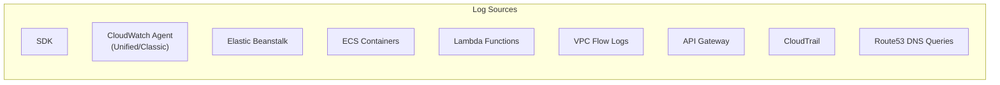
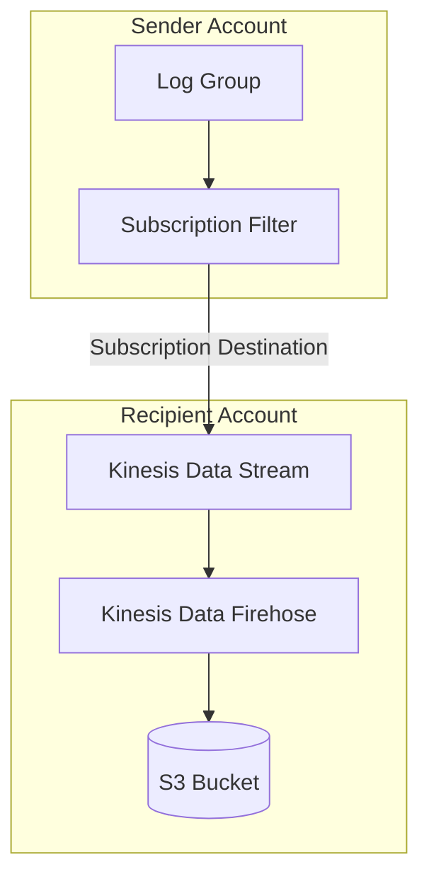
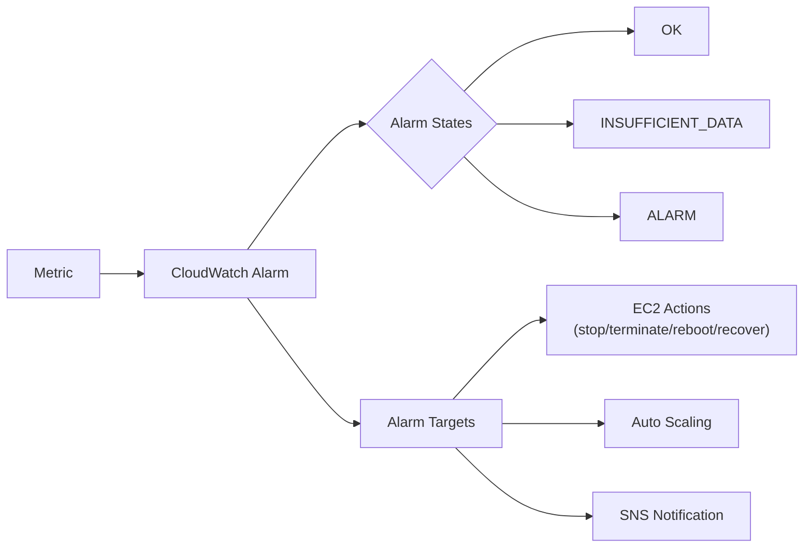
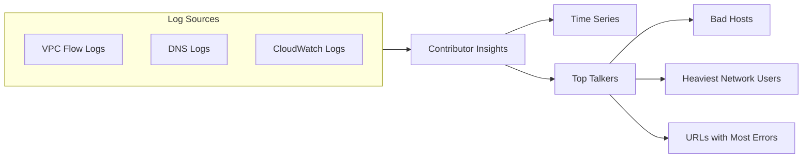

# Amazon CloudWatch Logs

## Overview
**Amazon CloudWatch Logs** is a centralized logging service that allows you to monitor, store, and access log files from **Amazon EC2** instances, **AWS CloudTrail**, **Route 53**, and other sources. It provides a highly scalable and durable environment for application and system logs.

## Key Concepts
- **Log Group**: A collection of log streams that share the same retention, monitoring, and access control settings (typically one per application).
- **Log Stream**: A sequence of log events that share the same source (e.g., a specific EC2 instance or container).
- **Retention**: Configurable from 1 day to 10 years, or indefinite.
- **Log Insights**: An interactive query engine for searching and analyzing log data.

## Detailed Notes

### 1. Log Sources & Management
| Source | Description |
|--------|-------------|
| **SDK** | Send logs directly via API calls. |
| **Unified Agent** | Best practice for EC2 and On-Premises logging. |
| **Lambda** | Automatically sends function execution logs. |
| **VPC Flow Logs** | Captures metadata about IP traffic in the VPC. |
| **API Gateway** | Logs request metadata and execution details. |

#### Encryption
- Logs are encrypted by default using AWS-managed keys.
- **CMK Support**: You can use your own **KMS Customer Managed Key (CMK)** for enhanced control.

### 2. Querying & Analysis (Logs Insights)
**CloudWatch Logs Insights** provides a purpose-built query language to analyze historical data.
- **Visualization**: Results can be visualized as charts and added to Dashboards.
- **Cross-Account**: Supports querying multiple log groups across different accounts.
- **Field Discovery**: Automatically detects fields from log data (JSON or semi-structured).

> **Exam Tip**: CloudWatch Logs Insights is **not real-time**. It queries historical data when the query is executed.

### 3. Data Export & Streaming

#### Batch Export (S3)
- Use the `CreateExportTask` API.
- **Latency**: Can take up to **12 hours** to complete.
- **Use Case**: Long-term archival or offline big data analysis.

#### Real-Time Streaming (Subscriptions)
- **Kinesis Data Streams / Firehose**: For processing or moving logs to S3/OpenSearch in near real-time.
- **Lambda**: For custom real-time processing or alerting.

## Architecture / Flow

### Cross-Account Log Aggregation
To centralize logs from multiple accounts:
1. Create a **Destination** (e.g., Kinesis Data Stream) in the recipient account.
2. Attach a **Resource Policy** to the destination allowing the sender account.
3. Create a **Subscription Filter** in the sender account targeting the destination.

---

# CloudWatch Alarms

## Overview
**CloudWatch Alarms** monitor a single metric over a specified time period and perform one or more actions based on the value of the metric relative to a threshold.

## Detailed Notes

### 1. Alarm States
- **OK**: The metric is within the defined threshold.
- **ALARM**: The metric has exceeded the threshold.
- **INSUFFICIENT_DATA**: Not enough data is available to determine the state.

### 2. Resolution & Period
- **Period**: The length of time to evaluate the metric.
- **High Resolution**: Custom metrics can be reported at 1-second, 10-second, or 30-second intervals.

### 3. Composite Alarms
Composite alarms monitor the state of multiple other alarms using logical **AND** or **OR** conditions.
- **Benefit**: Reduces "alarm noise" by only triggering when a combination of conditions is met (e.g., CPU is High **AND** Network is High).

### 4. EC2 Instance Recovery
Alarms can be configured to automatically recover an EC2 instance if a system status check fails.
- **Maintains**: Private/Public IP, Elastic IP, Metadata, and Placement Group.

---

# CloudWatch Contributor Insights

## Overview
**Contributor Insights** analyzes log data to create time series that display contributor data. This helps you identify "Top Talkers"—the entities impacting system performance the most.

## Security Relevance
- **Threat Detection**: Identify malicious IP addresses causing failed login attempts (via VPC Flow Logs).
- **Availability Monitoring**: Identify specific API calls or URLs causing the majority of 5XX errors.

## Summary
Amazon CloudWatch is the foundation of AWS detection and monitoring. Logs provide the history, Alarms provide the triggers for automated response, and Contributor Insights provides the "who" behind performance or security anomalies.

## Quick Review Checklist
- [ ] **Log Groups** represent applications; **Log Streams** represent sources.
- [ ] **Subscription Filters** are for real-time streaming; **S3 Exports** are for batch (12hr latency).
- [ ] **Composite Alarms** help reduce alert fatigue via logical conditions.
- [ ] **Contributor Insights** identifies "Top Talkers" in log data.
- [ ] **EC2 Recovery** preserves IP addresses and metadata.
