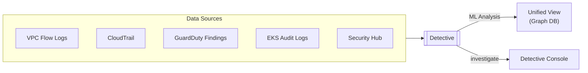
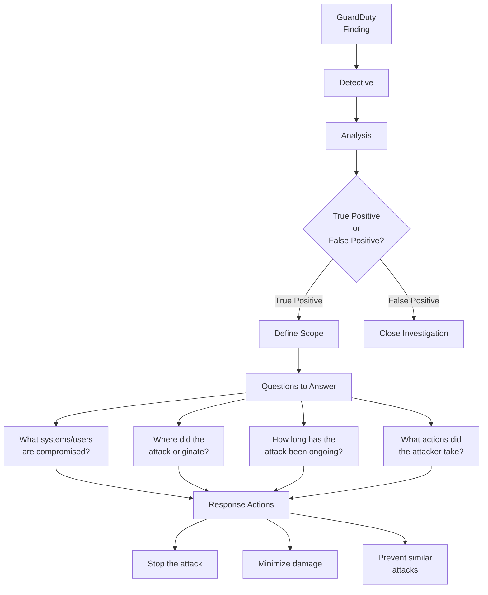
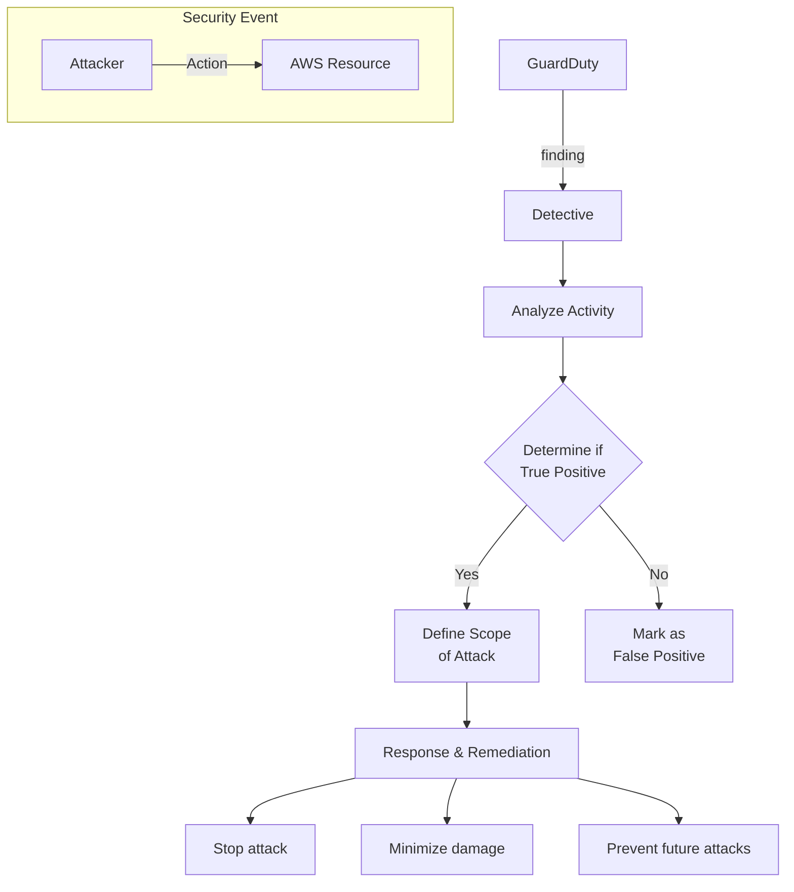

# Amazon Detective

## Overview
**Amazon Detective** makes it easy to analyze, investigate, and quickly identify the root cause of potential security issues or suspicious activities. It automatically collects log data from your AWS resources and uses machine learning, statistical analysis, and graph theory to build a linked set of data that enables you to easily conduct faster and more efficient security investigations.

## Key Concepts
- **Behavior Graph**: A linked set of data generated from logs that shows relationships between resources and identities.
- **Root Cause Analysis**: Helps answer "How did it happen?", "What was affected?", and "What actions did the attacker take?".
- **Historical Analysis**: Maintains up to **1 year** of aggregated data for investigations.
- **30-Day Free Trial**: Available for every account to evaluate the service.

## Detailed Notes

### 1. Data Collection
Amazon Detective automatically ingests and processes events from:
- **Required**: **VPC Flow Logs**, **CloudTrail**, and **GuardDuty** findings.
- **Optional**: **EKS audit logs** and **Security Hub** findings.

### 2. Investigation Process
Detective helps investigate **IAM users** and **roles** to determine if a principal was involved in a security event (e.g., were compromised credentials used maliciously?).

#### Investigation Workflow

## Architecture / Flow

### Example: Security Event Investigation
This flow demonstrates how Detective helps transition from a high-level finding to a detailed response.

## Security Relevance
- **Detective Control**: Detective is a core part of the "Investigation" phase of incident response.
- **Visibility**: Provides a unified timeline of events that spans multiple accounts and regions, which is often difficult to piece together manually from raw logs.

## Operational / Real-World Context
- **Security Operations Center (SOC)**: Analysts use the Detective console to visualize "API Call" spikes or "Unusual IP" logins associated with a GuardDuty finding.
- **Incident Response**: When a high-severity finding appears in Security Hub, Detective is often the next stop for the responder to understand the "blast radius."

## Common Pitfalls / Misconfigurations
- **Delayed Activation**: If Detective is not enabled before an incident, it cannot retroactively build the behavior graph for the time preceding its activation (it needs time to ingest logs).
- **Missing Logs**: If **CloudTrail** is disabled in a region, Detective will have a blind spot for that region's activity.

## Exam / Review Notes
- **Graph Theory**: Detective uses **graph theory** to link data.
- **Data Retention**: **1 year**.
- **Primary Sources**: **VPC Flow Logs**, **CloudTrail**, **GuardDuty**.
- **Investigation**: It is used for *investigating* findings, not for generating new alerts (that's GuardDuty's job).

## Summary
Amazon Detective is an investigation tool that transforms raw logs into a visual, searchable graph of activity. It is used to determine the scope and root cause of security findings generated by services like GuardDuty and Security Hub.

## Quick Review Checklist
- [ ] Automatically processes **VPC Flow Logs**, **CloudTrail**, and **GuardDuty**.
- [ ] Retains **1 year** of investigative data.
- [ ] Used for root cause analysis and blast radius determination.
- [ ] Integrates with **Security Hub** for seamless investigation workflows.
