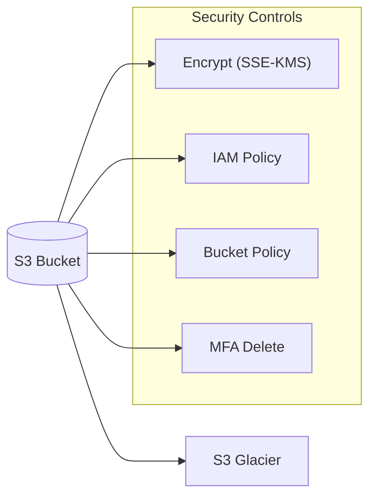
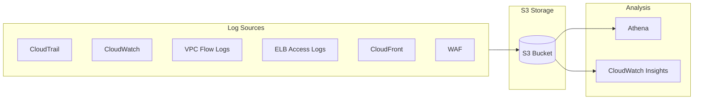

# Logging in AWS for Security and Compliance

## Overview
Comprehensive logging is the foundation of a robust security posture and is mandatory for most compliance frameworks. AWS provides native logging capabilities across nearly all services, enabling deep visibility into API calls, network traffic, and resource configurations.

## Key Concepts
- **API Traceability**: Capturing who did what and when via CloudTrail.
- **Network Visibility**: Monitoring traffic patterns and potential exfiltration via VPC Flow Logs.
- **Log Centralization**: Moving logs from distributed sources into a single, secure location (usually Amazon S3 or CloudWatch Logs).
- **Immutable Storage**: Protecting logs from tampering or accidental deletion using S3 Versioning and MFA Delete.

## Detailed Notes

### 1. AWS Service Logs Overview
| Service | Log Type | Description |
|---------|----------|-------------|
| **CloudTrail** | API Calls | Records every management and data event (API call) in the account. |
| **AWS Config** | Configuration | Tracks the state and history of resource configurations over time. |
| **CloudWatch Logs** | Application/OS | Captures logs from EC2, Lambda, and custom applications. |
| **VPC Flow Logs** | Network | Captures metadata about IP traffic to/from network interfaces. |
| **ELB Access Logs** | Load Balancer | Records metadata for all requests sent to your load balancers. |
| **CloudFront Logs** | Distribution | Logs every user request that CloudFront receives. |
| **AWS WAF Logs** | Web Firewall | Full logging of all requests analyzed by WAF rules. |

### 2. S3 Log Security & Lifecycle
When using Amazon S3 as a centralized logging repository, specific security controls must be implemented:
- **Encryption**: Enforce server-side encryption (SSE-S3 or SSE-KMS).
- **Integrity**: Enable **Versioning** and **MFA Delete** to prevent log tampering.
- **Retention**: Use **Lifecycle Policies** to move logs from S3 Standard to S3 Glacier for cost-effective long-term archival.

## Architecture / Flow

### Log Storage and Analysis Pipeline

## Security Relevance
- **Corrective Control**: Logs are essential for identifying what happened during a security incident and determining the required remediation steps.
- **Compliance**: Proof of logging is a "Pass/Fail" requirement for audits like PCI-DSS, HIPAA, and SOC2.

## Operational / Real-World Context
- **AWS Athena**: Frequently used to query logs directly in S3 without the need for complex ETL processes or expensive log management software.
- **Cross-Account Logging**: Organizations typically designate a single "Security" account to hold logs for the entire AWS Organization to prevent account owners from deleting evidence of their own actions.

## Common Pitfalls / Misconfigurations
- **Logging to the same bucket**: Creating a "logging loop" where the act of writing a log generates another log event (e.g., S3 access logging to the same bucket).
- **Unencrypted Logs**: Storing sensitive PII or security metadata in unencrypted buckets.
- **Lack of Archival**: Paying S3 Standard prices for 5-year-old logs that could be in Glacier Deep Archive.

## Exam / Review Notes
- **Athena + S3**: The standard answer for "How to analyze massive amounts of logs stored in S3."
- **Glacier**: The answer for "Cost-effective log retention for compliance."
- **Integrity**: MFA Delete and Versioning are the keys to log immutability.

## Summary
Logging provides the visibility needed to detect, investigate, and remediate security threats. By centralizing logs in S3 and securing them with encryption and lifecycle policies, organizations can meet compliance requirements while maintaining an audit-ready infrastructure.

## Quick Review Checklist
- [ ] Centralize all logs in a dedicated Security account.
- [ ] Use S3 Lifecycle rules to manage costs.
- [ ] Enforce SSE-KMS for all log buckets.
- [ ] Use Athena for interactive log analysis.
- [ ] Enable Versioning and Object Lock for compliance-grade immutability.
