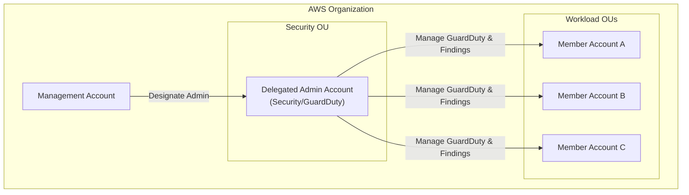
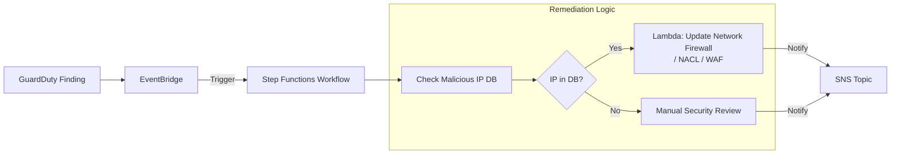
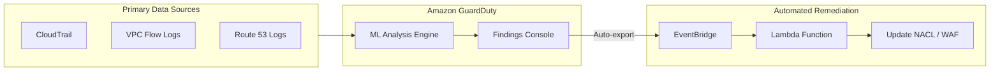

# Amazon GuardDuty

## Overview
**Amazon GuardDuty** is an intelligent threat detection service that continuously monitors for malicious activity and unauthorized behavior to protect your AWS accounts, workloads, and data. It uses machine learning, anomaly detection, and integrated threat intelligence to identify and prioritize potential security risks.

## Key Concepts
- **Threat Detection**: Identifies activities like crypto-mining, data exfiltration, and compromised credentials.
- **Data Sources**: Automatically analyzes metadata from:
    - **CloudTrail Management Events**: Analyzes API calls for unusual activity.
    - **VPC Flow Logs**: Monitors for anomalous network traffic.
    - **Route 53 DNS Query Logs**: Detects communication with malicious domains.
- **Severity Levels**:
    - **High (7.0 - 8.9)**: Resource is compromised (e.g., crypto-mining).
    - **Medium (4.0 - 6.9)**: Suspicious activity (e.g., large data transfer).
    - **Low (0.1 - 3.9)**: Suspicious but likely harmless (e.g., unusual API call).

## Detailed Notes

### 1. Protection Plans (Optional Features)
GuardDuty can be extended to protect specific AWS resources:
- **S3 Protection**: Monitors object-level API operations to detect threats.
- **EKS Protection**: Analyzes Kubernetes audit logs.
- **Malware Protection**: Automatically scans **EBS volumes** of EC2 instances/containers when a finding suggests malware.
- **RDS Protection**: Analyzes login activity for Aurora/RDS to detect brute force and access threats.
- **Lambda Protection**: Monitors network activity logs from Lambda functions.
- **Runtime Monitoring**: Monitors OS-level events (file access, process execution) on EC2, ECS, and EKS.

### 2. Findings and Automations
Findings are generated in the GuardDuty console and automatically sent to **Amazon EventBridge**.
- **Automated Response**: Use EventBridge to trigger actions:
    - **AWS Lambda**: Isolate an EC2 instance or update a NACL/WAF rule.
    - **Amazon SNS**: Notify security operators via email or Slack.
    - **Step Functions**: Complex remediation workflows (e.g., cross-referencing an IP before blocking).

### 3. Multi-Account Strategy
- **AWS Organizations Integration**: Manage GuardDuty across multiple accounts.
- **Delegated Administrator**: Designate a specific member account as the GuardDuty administrator.
- **Finding Management**: The administrator account can view and manage findings from all member accounts in a central console.

### 4. Advanced Configuration
- **Trusted IP List**: A whitelist of IPs/CIDRs that GuardDuty will not generate findings for (e.g., internal penetration testing tools).
- **Threat IP List**: A blacklist of known malicious IPs. GuardDuty generates findings when resources interact with these IPs.
- **Suppression Rules**: Automatically archive findings that match specific criteria (e.g., suppressing port scans on a specific instance).

## Architecture / Flow

### 1. Multi-Account Strategy (AWS Organizations)
A delegated administrator account can manage GuardDuty for all member accounts within an organization.

### 2. Complex Remediation Workflow (Step Functions)
For advanced remediation, such as blocking an IP across multiple VPCs or checking a threat database before acting.

### 3. Basic Finding Remediation Flow
Simple, direct automation for high-severity findings.

## Security Relevance
- **Detective Control**: GuardDuty is a primary detective control for identifying post-compromise activity (e.g., an attacker already in the network).
- **No Performance Impact**: Analyzing log metadata happens outside of the network path, so there is no impact on workload performance.
- **Malware Discovery**: Scans for malware on EBS volumes without needing agents installed on the instances.

## Operational / Real-World Context
- **Global Deployment**: GuardDuty should be enabled in **all regions** to detect unauthorized activity in unused regions.
- **Log Retention**: Findings are stored for **90 days** in the GuardDuty console. For longer retention, export them to S3.
- **DNS Resolver**: DNS findings *only* work if the **VPC DNS Resolver (Route 53 Resolver)** is used.

## Common Pitfalls / Misconfigurations
- **Disabled Regions**: Attackers often spin up resources in regions the customer doesn't monitor.
- **Missing DS Records**: (Context: Route 53) Forgetting to add DS records at the registrar level.
- **Trusted IP List Overhead**: Maintaining an outdated trusted IP list can create blind spots.

## Exam / Review Notes
- **Out-of-the-box Sources**: Remember CloudTrail, VPC Flow Logs, and Route 53 DNS Logs are monitored by default (once enabled).
- **Finding API Detail**: You can see the specific API call that triggered a finding directly in the GuardDuty console.
- **Centralization**: Use AWS Organizations for multi-account management.
- **Sandbox/Trial**: GuardDuty offers a 30-day free trial.

## Summary
Amazon GuardDuty provides a "set it and forget it" intelligent threat detection layer for AWS. By analyzing logs with ML, it identifies threats that static rules might miss, making it a cornerstone of the Detection domain for the SCS-C03 exam.

## Quick Review Checklist
- [ ] GuardDuty enabled in all regions?
- [ ] Delegated administrator configured in Organizations?
- [ ] Malware protection for EC2/EKS enabled?
- [ ] EventBridge rules set up for high-severity findings?
- [ ] Trusted IP lists uploaded for internal scanners?
