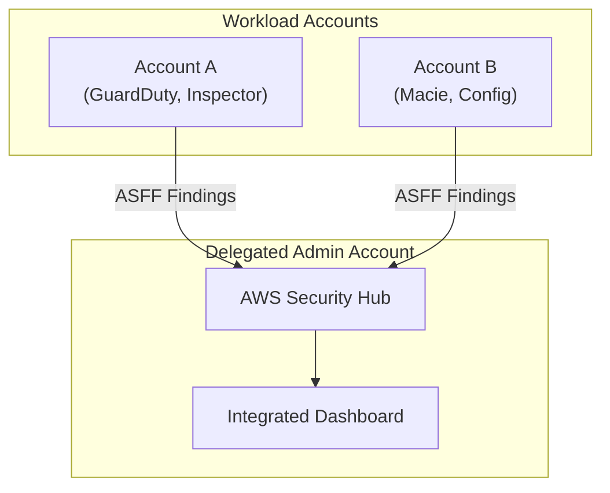
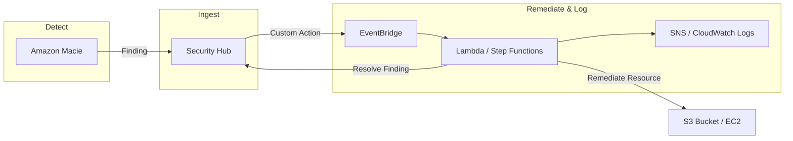

# AWS Security Hub

## Overview
**AWS Security Hub** is a cloud security posture management (CSPM) service that performs security best practice checks, aggregates alerts, and enables automated remediation. It provides a comprehensive view of your security state across multiple AWS accounts by centralizing findings from various AWS services and third-party partner products.

## Key Concepts
- **Findings**: Individual security issues or alerts generated by integrated services (e.g., a GuardDuty finding about a brute-force attack).
- **Insights**: A collection of related findings that identify specific areas requiring attention (e.g., "S3 buckets with public read access").
- **Security Standards**: Sets of controls that Security Hub evaluates your resources against (e.g., **CIS AWS Foundations**, **PCI DSS**, and **AWS Foundational Security Best Practices**).
- **ASFF (AWS Security Finding Format)**: The standard JSON format used by Security Hub to consume and produce findings, ensuring consistency across different providers.
- **Custom Actions**: Mechanisms to send specific findings to **Amazon EventBridge** for custom remediation or notification workflows.

## Detailed Notes

### 1. Findings Aggregation
Security Hub aggregates findings from:
- **AWS Services**: GuardDuty, Inspector, Macie, IAM Access Analyzer, Systems Manager (Patch Manager/OpsCenter), Firewall Manager, and AWS Health.
- **Third-Party Partners**: Intrusion detection systems, endpoint security, and network forensics tools.
- **AWS Config**: **Crucial Dependency.** Security Hub requires AWS Config to be enabled in all accounts and regions for many of its automated checks to function.

### 2. Multi-Account and Multi-Region
- **AWS Organizations**: Supports a delegated administrator model where one account manages Security Hub for the entire organization.
- **Cross-Region Aggregation**: You can designate an "aggregator region" to centralize findings from all other enabled regions into a single dashboard.

### 3. Integration with GuardDuty
- Integration is automatic but can be managed manually.
- Findings are converted to **ASFF** and sent to Security Hub (typically within 5 minutes).
- **Note**: Archiving a finding in GuardDuty does **not** automatically archive it in Security Hub; they must be managed separately.

### 4. Custom Actions and Automation
Users can manually trigger "Custom Actions" on a finding to initiate remediation.
- The action sends an event to **Amazon EventBridge**.
- EventBridge triggers a target (e.g., **Lambda**, **Step Functions**, or **SSM Automation**) to resolve the issue.

## Architecture / Flow

### 1. Centralized Security Management

### 2. Detection to Remediation Workflow

## Security Relevance
- **Visibility**: Provides a "single pane of glass" for the entire organization's security posture.
- **Compliance**: Continuously monitors adherence to industry standards (PCI DSS, CIS).
- **Reduced Noise**: Insights group findings to help security teams prioritize high-impact issues.

## Operational / Real-World Context
- **30-Day Free Trial**: Available for new accounts to evaluate the service.
- **Cost Drivers**: Pricing is based on the number of security checks performed and the number of finding ingestions.
- **Data Retention**: Findings are automatically deleted after **90 days** if no updates are received.

## Common Pitfalls / Misconfigurations
- **AWS Config Disabled**: Security Hub will fail to perform many automated checks if Config is not enabled globally.
- **Ignoring ASFF**: When building custom integrations, ensure the payload matches the AWS Security Finding Format.
- **Regional Silos**: Forgetting to enable cross-region aggregation leads to fragmented visibility.

## Exam / Review Notes
- **Config Requirement**: Always remember that Security Hub depends on **AWS Config**.
- **ASFF**: This is the mandatory format for findings within the Hub.
- **Custom Actions**: These are the bridge between Security Hub findings and **EventBridge** for remediation.
- **Organizations**: Know the Delegated Administrator setup.
- **Archive Isolation**: Archiving in the source service (like GuardDuty) does not archive in Security Hub.

## Summary
AWS Security Hub is the central nervous system for AWS security. By aggregating findings into a single format (ASFF) and providing automated compliance checks, it allows security teams to move from reactive alerting to proactive, automated security posture management.

## Quick Review Checklist
- [ ] AWS Config enabled in all accounts/regions?
- [ ] Delegated administrator assigned via AWS Organizations?
- [ ] Cross-region aggregation configured to a primary region?
- [ ] Security standards (CIS, PCI DSS) enabled?
- [ ] Custom actions created for common remediation scenarios?
