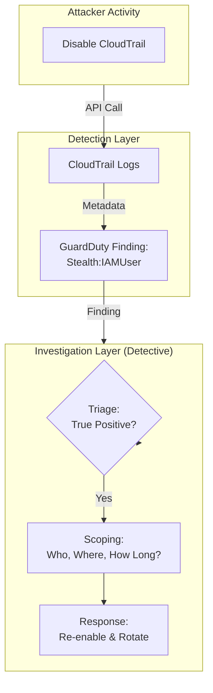
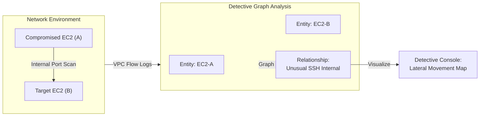
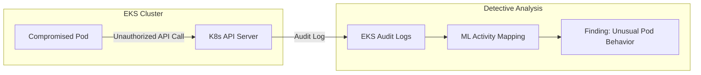

# Amazon Detective

## Overview
**Amazon Detective** is a security service that makes it easy to analyze, investigate, and quickly identify the root cause of potential security issues or suspicious activities. It automatically collects log data from your AWS resources and uses machine learning, statistical analysis, and graph theory to build a linked set of data that enables you to conduct faster and more efficient security investigations.

## Key Concepts
- **Graph Theory**: Detective uses graph-based modeling to visualize relationships between entities (e.g., IP addresses, EC2 instances, IAM roles) and their activities over time.
- **Entities & Relationships**: Automatically identifies resources and how they interact, allowing you to see the scope of an attack.
- **Investigation Triage**: The process of determining if a finding is a **True Positive** (real threat) or a **False Positive** (benign activity).
- **Retention**: Aggregates and analyzes up to **one year** of historical data to identify long-term trends or persistent threats.

## Detailed Notes

### 1. Data Sources
Detective automatically processes metadata from:
- **Default Sources**: AWS CloudTrail (Management Events), VPC Flow Logs, and Amazon GuardDuty findings.
- **Optional Sources**: Amazon EKS Audit Logs and AWS Security Hub findings.
- **Note**: Detective does not store the raw logs; it creates a unified graph based on the metadata from these logs.

### 2. Investigation Capabilities
- **Root Cause Analysis**: Answers "How did this happen?" by tracing the chain of events.
- **Scoping**: Answers "What else is affected?" by identifying lateral movement or other compromised resources.
- **IAM Investigation**: Specifically analyzes IAM users and roles to detect credential compromise and privilege escalation.
- **Activity Mapping**: Visualizes login attempts, API calls, and network traffic patterns to establish a baseline of "normal" behavior.

## Architecture / Flow

### 1. IAM Compromise Investigation (Stealth:IAMUser/CloudTrailLoggingDisabled)
This architecture shows how Detective helps investigate an attempt to cover tracks by disabling logging.

### 2. Lateral Movement & Network Breach Analysis
This flow illustrates how Detective uses VPC Flow Logs and GuardDuty to visualize an attacker moving from one instance to another.

### 3. EKS Container Escape & Audit Log Analysis
Investigating an EKS cluster where a pod has been compromised to access the underlying node or API.

## Security Relevance
- **Detective Control**: Serves as a deep-dive investigative tool following a detection from GuardDuty or Security Hub.
- **Operational Efficiency**: Reduces the time security analysts spend manually parsing through millions of log lines.
- **Visibility**: Provides a 1-year lookback, essential for detecting "low and slow" persistent threats.

## Operational / Real-World Context
- **Enablement**: Should be enabled *before* an incident occurs to ensure a historical baseline is available.
- **Multi-Account**: Supports AWS Organizations for centralized investigation across the entire fleet.
- **Complementary**: Often used alongside **Amazon Athena** (for raw log queries) and **Security Hub** (for alert aggregation).

## Common Pitfalls / Misconfigurations
- **Not Enabling Data Sources**: If VPC Flow Logs or CloudTrail are disabled, Detective has no data to build its graph.
- **Late Enablement**: Enabling Detective *after* a breach significantly limits its effectiveness due to a lack of historical baseline data.
- **Ignoring Low Severity**: Low-severity findings in Detective often provide the "discovery" phase metadata that leads to identifying a larger attack.

## Exam / Review Notes
- **Purpose**: Detective is for **Investigation/Root Cause**, while GuardDuty is for **Detection**.
- **Data Sources**: Know the big three (CloudTrail, VPC Flow Logs, GuardDuty) and the optional EKS logs.
- **Retention**: 1 year is the key number to remember.
- **Graph Theory**: If an exam question mentions "visualizing relationships between entities," the answer is likely Amazon Detective.

## Summary
Amazon Detective is the "detective's notebook" for AWS security. It automates the complex task of linking disparate logs together into a coherent story, allowing security teams to quickly understand the scope, impact, and root cause of security incidents.

## Quick Review Checklist
- [ ] Detective enabled in all active accounts and regions?
- [ ] CloudTrail, VPC Flow Logs, and GuardDuty active?
- [ ] Optional EKS Audit Logs enabled for container workloads?
- [ ] Security analysts trained on using the Graph visualization?
- [ ] Delegated administrator set up for cross-account visibility?
