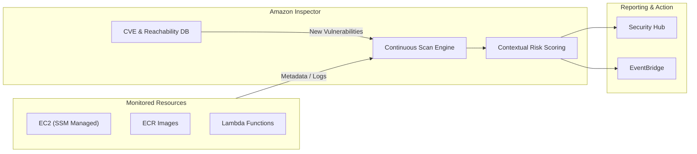
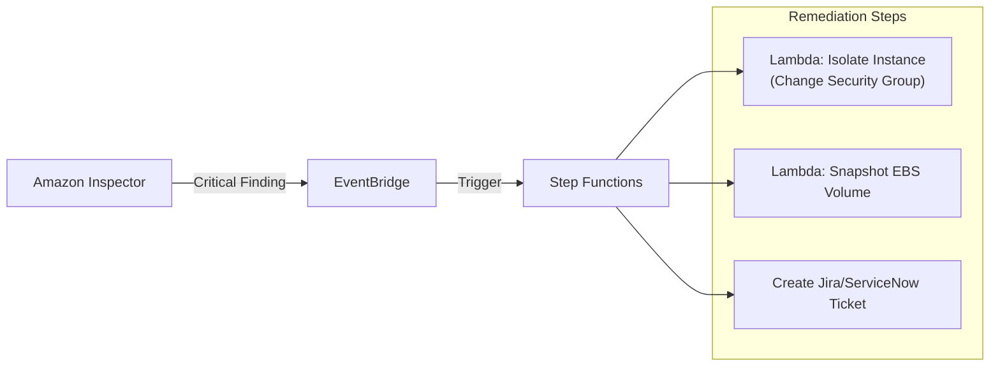

# Amazon Inspector

## Overview
**Amazon Inspector** is an automated vulnerability management service that continually scans AWS workloads for software vulnerabilities and unintended network exposure. It centralizes vulnerability data for **Amazon EC2 instances**, **Amazon ECR container images**, and **AWS Lambda functions**, providing a prioritized risk score for each finding.

## Key Concepts
- **Continuous Scanning**: Unlike point-in-time scanners, Inspector automatically rescans resources in response to changes, such as a new CVE (Common Vulnerabilities and Exposures) being added to the database or a change in the resource configuration.
- **SSM Agent Dependency**: For EC2 host scanning, the **AWS Systems Manager (SSM) Agent** must be installed, and the instance must be a "Managed Instance" in SSM.
- **Inspector Risk Score**: A highly contextualized score (Critical, High, Medium, Low) that considers the vulnerability's severity and the environmental context (e.g., if an instance is reachable from the internet).
- **Network Reachability**: Analyzes the VPC configuration (Security Groups, ACLs, IGWs) to determine if ports on EC2 instances are reachable from outside the VPC.

## Detailed Notes

### 1. Scanned Resources
- **Amazon EC2**: Scans for software vulnerabilities in the operating system and package dependencies, as well as network reachability issues.
- **Amazon ECR**: Scans container images upon push and can be configured for continuous scanning of images stored in the registry.
- **AWS Lambda**: Analyzes function code and package dependencies for vulnerabilities at the time of deployment and during updates.

### 2. Finding Management & Integration
- **Security Hub**: Findings are automatically pushed to Security Hub for centralized security posture management.
- **Amazon EventBridge**: All finding events are sent to EventBridge, enabling automated remediation (e.g., triggering a Lambda to isolate an instance).
- **CVE Database**: Inspector uses an internal database updated with the latest security advisories (CVE, GitHub Advisory Database, etc.).

### 3. Troubleshooting "Unmanaged" Instances
If an EC2 instance is not being scanned, it is often due to SSM connectivity issues:
- **IAM Role**: The instance needs an IAM role with `AmazonSSMManagedInstanceCore` permissions.
- **SSM Agent**: Must be installed and running (pre-installed on Amazon Linux 2/2023).
- **Network Connectivity**: The instance must have a route to the SSM service endpoints (via IGW, NAT Gateway, or VPC Endpoints).

## Architecture / Flow

### 1. Continuous Vulnerability Management Pipeline

### 2. Automated Remediation Workflow

## Security Relevance
- **Detective Control**: Identifies flaws in software and configurations after deployment.
- **Context-Aware**: The risk score helps security teams focus on "actually reachable" vulnerabilities rather than just theoretical ones.
- **Zero-Touch**: Once enabled, it requires no manual scheduling; scanning is event-driven.

## Operational / Real-World Context
- **15-Day Free Trial**: Available for new accounts to assess the impact and cost.
- **SSM Quick Setup**: Recommended for ensuring all EC2 instances are properly managed and visible to Inspector.
- **Pricing**: Billed per instance-scan per month and per container image scan.

## Common Pitfalls / Misconfigurations
- **Missing SSM Agent**: The most common reason for 0% EC2 coverage.
- **Inadequate IAM Permissions**: Not providing the EC2 instance with the necessary SSM role.
- **Restricted Network Reachability**: If an instance cannot reach SSM endpoints, it remains "Unmanaged" and unscanned.
- **Ignoring ECR Rescans**: Only scanning on "push" can leave old images vulnerable to newly discovered CVEs.

## Exam / Review Notes
- **Services Covered**: EC2, ECR, and Lambda. (Note: It does *not* scan S3 or RDS).
- **SSM Agent**: Essential for EC2 OS-level scans.
- **Network Reachability**: Does not require an agent; it analyzes the VPC control plane/metadata.
- **Integration**: Findings go to Security Hub and EventBridge.

## Summary
Amazon Inspector is a cornerstone of the AWS Detection domain, providing a fully managed, continuous, and context-aware vulnerability scanning solution. Its integration with SSM and ECR ensures that both legacy virtual machine workloads and modern containerized/serverless applications are continuously audited for security flaws.

## Quick Review Checklist
- [ ] Inspector enabled in all production regions?
- [ ] SSM Agent active on all EC2 instances?
- [ ] IAM Instance Profile `AmazonSSMManagedInstanceCore` attached?
- [ ] ECR repositories configured for "scan on push" or continuous scanning?
- [ ] EventBridge rules created for Critical/High findings?
