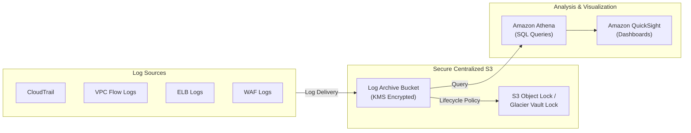

# Logging in AWS for Security and Compliance

## Overview
Logging is a fundamental component of the **Detection** domain in AWS. It provides the audit trail necessary for compliance, incident response, and security analysis. AWS offers a wide array of logging services that capture activity at the network, application, and API levels.

## Key Concepts
- **Audit Logs**: Records of "who did what" (e.g., CloudTrail).
- **Network Logs**: Records of traffic flow (e.g., VPC Flow Logs).
- **Access Logs**: Records of requests to specific services (e.g., ELB, CloudFront, S3).
- **Log Aggregation**: Centralizing logs into a single **Amazon S3** bucket for analysis.
- **Log Analysis**: Using **Amazon Athena** to query logs stored in S3 using standard SQL.

## Detailed Notes

### 1. Core Security & Compliance Logs
- **AWS CloudTrail**: Traces all API calls made in the account. Essential for "who, what, when, where."
- **AWS Config**: Tracks configuration changes and compliance against rules over time.
- **VPC Flow Logs**: Captures information about IP traffic going to and from network interfaces in your VPC.
- **Amazon CloudWatch Logs**: Central repository for application logs, custom logs, and OS-level logs (via the CloudWatch Agent).

### 2. Service-Specific Access Logs
- **ELB Access Logs**: Metadata for requests made to your Load Balancers (ALB/NLB/CLB).
- **Amazon CloudFront Logs**: Detailed access logs for every request delivered through the CDN.
- **AWS WAF Logs**: Comprehensive logs of all requests analyzed by WAF, including which rules were triggered.
- **Amazon S3 Access Logs**: Records of requests made to an S3 bucket.

### 3. Analysis & Storage Pattern (The "Exam Winner")
The most common architecture for log analysis in AWS:
1.  **Generate**: Services generate logs.
2.  **Store**: Logs are delivered to a centralized **Amazon S3** bucket (often in a dedicated Security/Log Archive account).
3.  **Secure**: Encrypt logs with **AWS KMS**, restrict access with **Bucket Policies**, and enable **MFA Delete** or **S3 Object Lock**.
4.  **Analyze**: Point **Amazon Athena** at the S3 bucket to run SQL queries for specific security events.
5.  **Visualize**: Optionally use **Amazon QuickSight** for dashboards.

### 4. Long-Term Retention & Compliance
- **Amazon S3 Glacier**: Move logs to Glacier classes for cost-effective long-term storage (7-10 years for compliance).
- **Glacier Vault Lock**: Use a "Write Once Read Many" (WORM) policy to ensure logs cannot be deleted or modified for a specific period (e.g., 7 years for financial data).

## Architecture / Flow

### Centralized Log Analysis Pipeline

## Security Relevance
- **Non-Repudiation**: Ensures that a user cannot deny having performed an action (CloudTrail).
- **Incident Response**: Logs are the primary evidence used during a post-mortem to determine the extent of a breach.
- **Forensics**: VPC Flow Logs help reconstruct network movements during an attack.

## Operational / Real-World Context
- **Cross-Account Logging**: Best practice is to have all member accounts send logs to a single S3 bucket in a "Log Archive" account.
- **Cost Management**: VPC Flow Logs and WAF logs can be voluminous. Use S3 Lifecycle policies and consider what level of logging is truly necessary for non-critical environments.

## Common Pitfalls / Misconfigurations
- **Logs Not Encrypted**: Security logs often contain sensitive metadata; they must be encrypted at rest.
- **Permissive Bucket Policies**: Allowing broad access to the log bucket can lead to attackers deleting the audit trail to hide their tracks.
- **Missing Retention Policy**: Keeping logs in S3 Standard forever is expensive. Not keeping them long enough can lead to compliance failures.

## Exam / Review Notes
- **Athena + S3 + [Log Type]**: This is the standard answer for "How do I analyze logs?"
- **Glacier Vault Lock**: The keyword for "Immutable" or "Compliance" storage requirements.
- **CloudTrail vs. Config**: CloudTrail is for **Actions** (API calls); Config is for **State** (Resource properties).
- **Encryption**: Always mention KMS and S3 Bucket Policies for securing logs.

## Summary
Logging in AWS is not just about gathering data; it's about creating a secure, immutable, and searchable audit trail. By leveraging S3 for storage, KMS for security, and Athena for analysis, organizations can meet stringent compliance requirements while maintaining a robust security posture.

## Quick Review Checklist
- [ ] CloudTrail enabled in all regions?
- [ ] Logs centralized in a dedicated Log Archive account?
- [ ] KMS encryption enabled for all log buckets?
- [ ] S3 Lifecycle policies configured for Glacier transition?
- [ ] Athena table schemas defined for common log types (CloudTrail, VPC Flow)?
