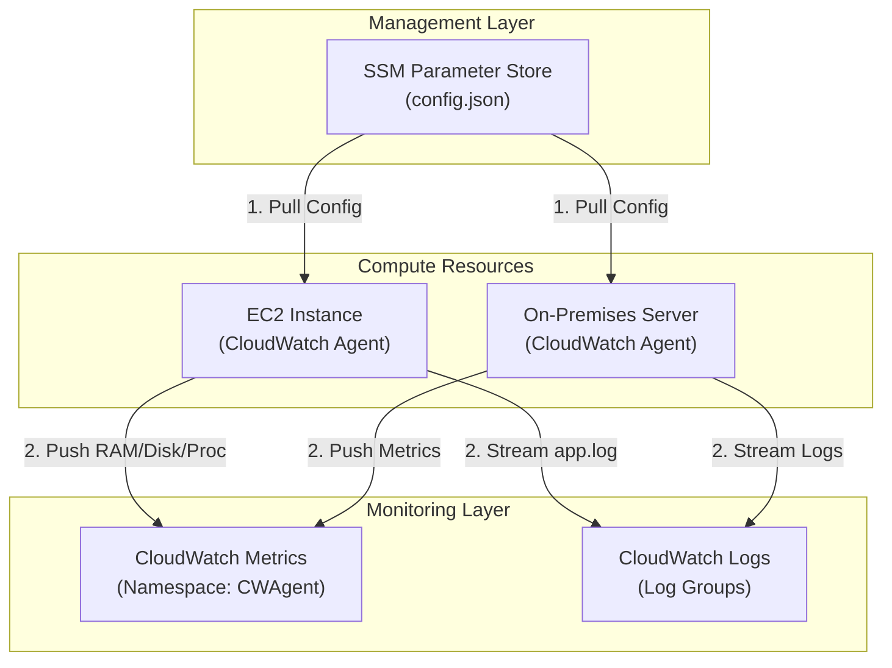

# Unified CloudWatch Agent

## Overview
The **Unified CloudWatch Agent** is a cross-platform tool for **Amazon EC2 instances** and **on-premises servers** that enables the collection of system-level metrics and internal log files. By default, AWS only provides hypervisor-level metrics (e.g., CPU utilization, Disk I/O); the Unified Agent is required to gain visibility into "inside-the-guest" metrics like RAM usage, used disk space, and individual process statistics.

## Key Concepts
- **System-Level Metrics**: Collects data that the hypervisor cannot see, such as **Memory (RAM) usage**, **Disk free space**, and **Swap usage**.
- **Log Collection**: Streams local log files (e.g., `/var/log/httpd/access_log`, Windows Event Logs) directly to **CloudWatch Logs**.
- **procstat Plugin**: A specialized plugin for monitoring individual processes on Linux and Windows, tracking CPU and memory usage by PID, name, or pattern.
- **SSM Parameter Store Integration**: Allows you to store the agent's configuration centrally in **AWS Systems Manager**, enabling multiple instances to pull the same configuration at runtime.

## Detailed Notes

### 1. Metrics and Namespaces
- **Namespace**: By default, custom metrics pushed by the agent use the `CWAgent` namespace.
- **Resolution**: Supports high-resolution metrics (down to 1-second intervals).
- **Dimensions**: Metrics can be aggregated by `InstanceId`, `ImageId`, `InstanceType`, etc.

### 2. The procstat Plugin
- **Function**: Monitors system utilization of specific processes.
- **Selection Methods**:
    - **pid_file**: Monitor a process via its PID file.
    - **exe**: Monitor processes matching a specific executable name.
    - **pattern**: Monitor processes matching a regex pattern.
- **Metrics**: Prefixed with `procstat_` (e.g., `procstat_cpu_usage`, `procstat_memory_rss`).

### 3. Configuration & Permissions
- **Configuration Wizard**: `amazon-cloudwatch-agent-config-wizard` helps generate the initial `config.json`.
- **IAM Roles**:
    - **EC2**: Requires a role with `CloudWatchAgentServerPolicy`.
    - **On-Premises**: Requires IAM user access keys with the same policy.
    - **SSM Admin**: To *store* a config in SSM via the wizard, you need the `CloudWatchAgentAdminPolicy`.

## Architecture / Flow

### Centralized Agent Configuration & Data Flow

## Security Relevance
- **Detection**: Monitoring for unusual processes (e.g., `procstat` detecting a crypto-miner) or disk exhaustion that could indicate a denial-of-service or large-scale log injection.
- **Audit Trail**: Streaming application and OS logs (syslog, auth.log) to CloudWatch ensures the audit trail is preserved even if the instance is terminated or the local disk is wiped by an attacker.
- **Visibility**: Provides the only way to monitor memory exhaustion, which can be a signal of a memory leak or a buffer overflow attack.

## Operational / Real-World Context
- **Deployment**: Best practice is to include the agent in your **Golden AMI** or install it via **User Data** scripts.
- **Automation**: Use **AWS Systems Manager Run Command** to install or update the agent across thousands of instances simultaneously.
- **Cost**: While the agent is free, you are billed for the number of custom metrics and the volume of logs ingested into CloudWatch.

## Common Pitfalls / Misconfigurations
- **Missing IAM Permissions**: The most common reason metrics fail to appear is an IAM role missing the `CloudWatchAgentServerPolicy`.
- **Clock Skew**: If the system time on the server is not synchronized (NTP), CloudWatch may reject the metrics or logs.
- **Incorrect Namespace**: Searching for RAM metrics in the `AWS/EC2` namespace instead of `CWAgent`.
- **Process Monitoring**: Forgetting that `procstat` requires the plugin to be explicitly configured in the JSON file.

## Troubleshooting Checklist
1.  **Check Local Logs**: `/opt/aws/amazon-cloudwatch-agent/logs/amazon-cloudwatch-agent.log`.
2.  **Validate Config**: Ensure the JSON is valid and the `SSM` parameter name matches.
3.  **Verify IAM**: Ensure the `CloudWatchAgentServerPolicy` is attached to the instance profile.
4.  **Network Connectivity**: Ensure the instance can reach the CloudWatch and SSM endpoints (check SG, NACL, and Route Tables).

## Exam / Review Notes
- **Memory/Disk**: If a question asks how to monitor RAM or Disk space, the answer is the **Unified CloudWatch Agent**.
- **Processes**: **procstat** is the key term for monitoring individual process utilization.
- **SSM**: Know that the agent can pull its configuration from the **SSM Parameter Store**.
- **On-Premises**: The Unified Agent works exactly the same on-premises as it does on EC2 (requires access keys).

## Summary
The Unified CloudWatch Agent bridges the visibility gap between the AWS hypervisor and the guest OS. It is a critical tool for both performance monitoring and security detection, providing deep insights into system health, process behavior, and application logs.

## Quick Review Checklist
- [ ] IAM Role with `CloudWatchAgentServerPolicy` attached?
- [ ] SSM Parameter Store contains valid `config.json`?
- [ ] Agent installed and started with `fetch-config` from SSM?
- [ ] `procstat` configured for critical security processes?
- [ ] Log groups and retention periods defined in the config?
