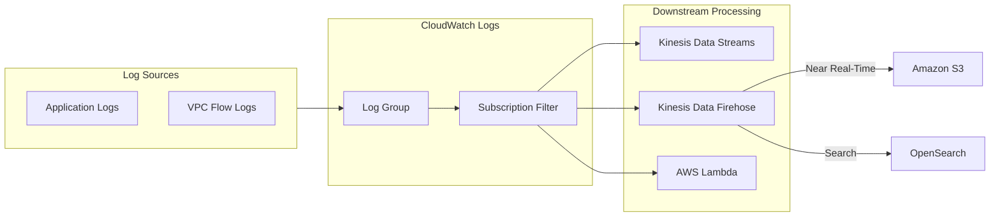
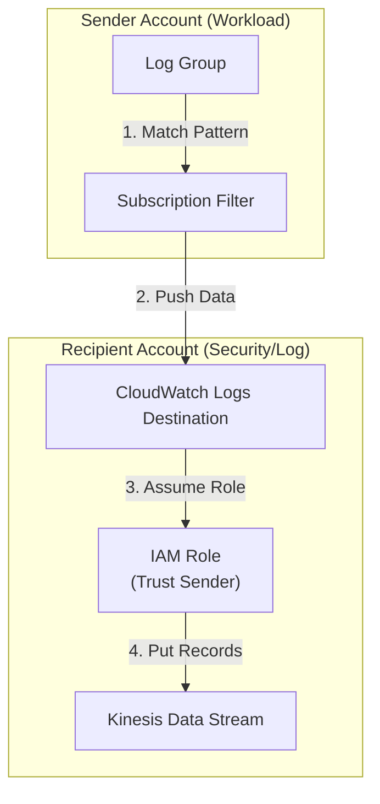

# Amazon CloudWatch Logs

## Overview
**Amazon CloudWatch Logs** is a managed service for storing, monitoring, and accessing log files from various sources, including EC2 instances, AWS CloudTrail, Route 53, and custom applications. It provides the infrastructure to centralize logs for analysis, alerting via metric filters, and long-term compliance storage.

## Key Concepts
- **Log Group**: A collection of log streams that share the same retention, monitoring, and access control settings (e.g., `/aws/lambda/my-function`).
- **Log Stream**: A sequence of log events that share the same source (e.g., a specific EC2 instance or container).
- **Retention Policy**: Settings that determine how long logs are kept (from 1 day to 10 years, or "Never Expire").
- **Metric Filter**: A rule that searches for patterns in log data and converts them into numerical CloudWatch Metrics (e.g., counting "403 Forbidden" errors).
- **Subscription Filter**: A real-time stream of log events delivered to a destination like Kinesis or Lambda.

## Detailed Notes

### 1. Data Ingestion
Logs can be sent to CloudWatch via:
- **CloudWatch Unified Agent**: Best for EC2 and on-premises servers.
- **Service Integrations**: Lambda, VPC Flow Logs, Route 53, API Gateway, and ECS send logs natively.
- **AWS SDK/CLI**: Direct ingestion using the `PutLogEvents` API.

### 2. Log Analysis: CloudWatch Logs Insights
- **Query Engine**: A purpose-built query language to search and analyze log data.
- **Visualizations**: Automatically generates bar, line, or pie charts based on query results.
- **Scope**: Can query multiple log groups simultaneously, including across different accounts.
- **Historical Only**: It is a query engine for stored data, not a real-time alerting engine.

### 3. Log Export vs. Streaming
- **Batch Export (S3)**:
    - Uses `CreateExportTask`.
    - Can take up to 12 hours to complete.
    - Not for real-time analysis; primarily for long-term archival or offline processing.
- **Real-Time Streaming (Subscription Filters)**:
    - Delivers events immediately to **Kinesis Data Streams**, **Kinesis Data Firehose**, or **AWS Lambda**.
    - Use Firehose to stream in near real-time to **Amazon OpenSearch** or **S3**.

### 4. Cross-Account Log Aggregation
To centralize logs from multiple accounts:
1.  **Recipient Account**: Create a **CloudWatch Logs Destination** (linked to a Kinesis stream) and an **Access Policy**.
2.  **Sender Account**: Create a **Subscription Filter** pointing to the destination in the recipient account.
3.  **IAM Role**: The recipient account must provide an IAM role that allows the sender account to put records into the Kinesis stream.

## Architecture / Flow

### 1. Real-Time Log Processing and Analytics

### 2. Cross-Account Log Aggregation

## Security Relevance
- **Persistence**: Centralizing logs in CloudWatch ensures that evidence is preserved even if an attacker deletes local logs or terminates the instance.
- **Alerting**: Metric filters on keywords like "password", "denied", or "root" can trigger **CloudWatch Alarms** for immediate notification of suspicious activity.
- **Encryption**: Logs are encrypted at rest by default. Using a **Customer Managed Key (CMK)** via KMS provides an additional layer of control and auditability.

## Operational / Real-World Context
- **Retention Management**: Always set a retention policy. Leaving logs to "Never Expire" can lead to significant unnecessary costs over time.
- **Insights Queries**: Use the "Sample Queries" feature to quickly learn how to filter VPC Flow logs for specific IP addresses or Lambda logs for timeout errors.
- **IAM Policies**: Use the `CloudWatchLogsFullAccess` or specific `logs:*` actions to control who can read or delete log data.

## Common Pitfalls / Misconfigurations
- **Indefinite Retention**: Forgetting to set an expiration, leading to "billing creep."
- **Missing Destination Policy**: Cross-account logging will fail if the destination access policy does not explicitly list the sender account ID.
- **Filter Pattern Errors**: Incorrect regex or pattern matching in metric filters resulting in missed alerts.
- **Throttling**: High-volume log ingestion can hit account limits; monitor the `IncomingLogEvents` metric.

## Exam / Review Notes
- **Real-Time vs. Batch**: If the question asks for "Real-time" or "Near real-time," use **Subscription Filters**. If it's for "Archival" or "Offline," use **S3 Export**.
- **Insights**: The tool of choice for interactive, ad-hoc SQL-like querying of log data.
- **Metric Filters**: Used to create **Alarms** based on log content (e.g., alert if "ERROR" appears > 5 times in 1 minute).
- **Encryption**: KMS encryption can be applied at the **Log Group** level.

## Summary
Amazon CloudWatch Logs is more than a storage service; it is a powerful detection and analysis platform. Through the use of Subscription Filters for real-time response and Insights for deep-dive investigation, it forms the backbone of the "Detection" and "Incident Response" pillars in the AWS Cloud.

## Quick Review Checklist
- [ ] Log groups named according to application/environment?
- [ ] Retention policies set for all log groups (e.g., 90 days)?
- [ ] Subscription filters configured for critical security events?
- [ ] Cross-account destinations verified with correct IAM trust?
- [ ] Metric filters and alarms set for high-value keywords?
