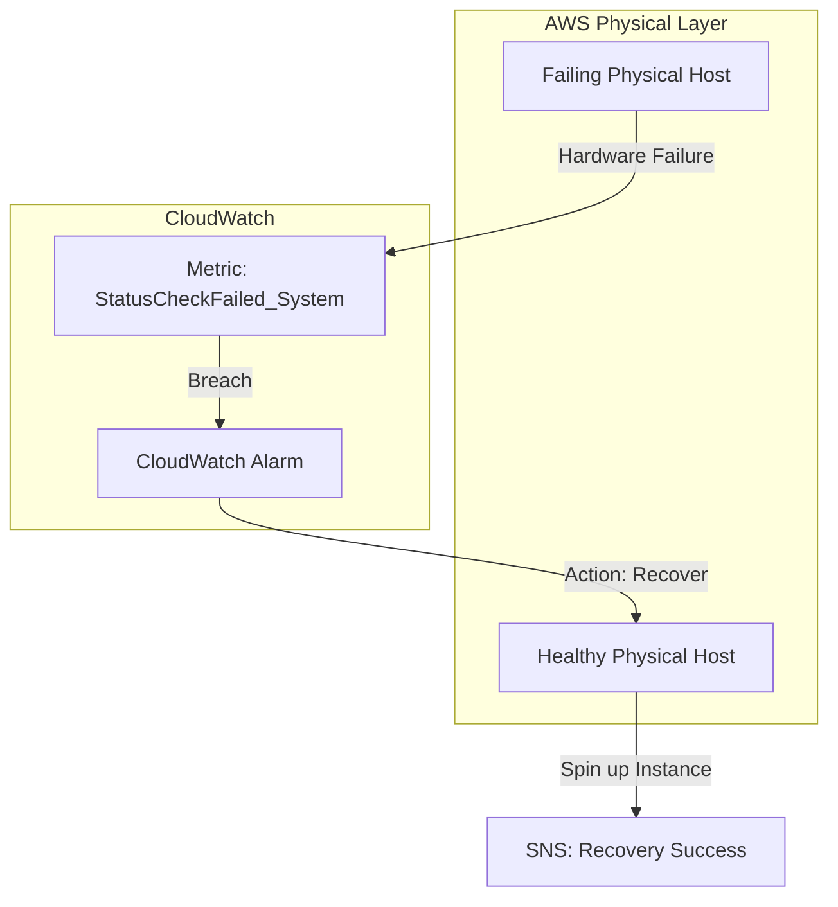
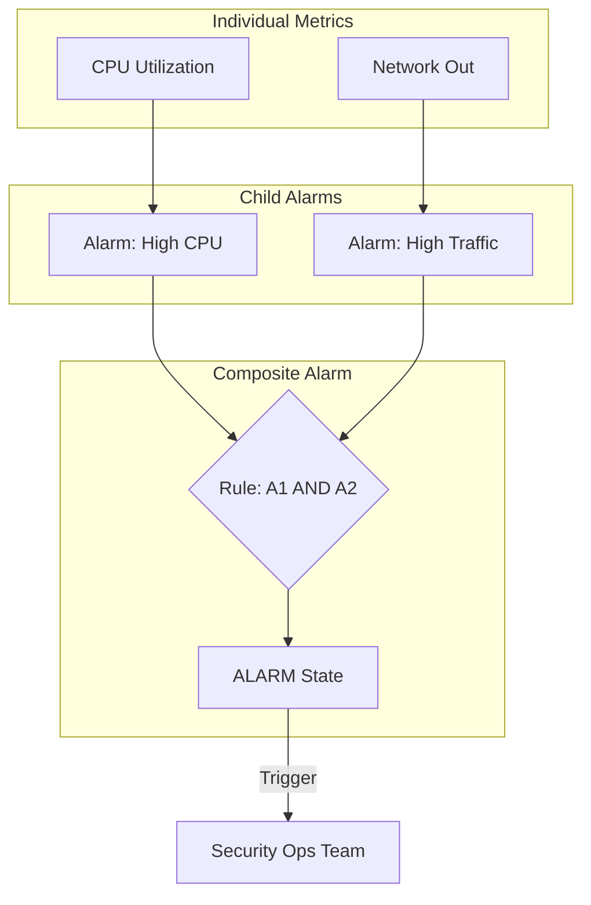

# Amazon CloudWatch Alarms

## Overview
**Amazon CloudWatch Alarms** allow you to watch a single metric (or a group of metrics) over a time period of your choosing and perform one or more actions based on the value of the metric relative to a threshold. Alarms are critical for automated response and notification in the **Detection** and **Response** domains.

## Key Concepts
- **Alarm States**:
    - **OK**: The metric is within the defined threshold.
    - **ALARM**: The metric has breached the threshold.
    - **INSUFFICIENT_DATA**: Not enough data points to determine the state (common with new alarms or intermittent metrics).
- **Period**: The length of time to evaluate the metric (e.g., 60 seconds). High-resolution metrics support 10-second or 30-second periods.
- **Evaluation Periods**: The number of consecutive periods that must breach the threshold before the alarm triggers (e.g., 3 out of 3).
- **Composite Alarms**: A higher-level alarm that monitors the states of multiple other alarms using rule logic (**AND**, **OR**).

## Detailed Notes

### 1. Alarm Targets & Actions
Alarms can trigger three main types of actions:
- **EC2 Actions**: Stop, Terminate, Reboot, or **Recover** an instance.
- **Auto Scaling Actions**: Scale out (add instances) or scale in (remove instances).
- **Notifications**: Send a message to an **Amazon SNS** topic (which can then trigger Email, SMS, Slack, or a Lambda function).

### 2. EC2 Instance Recovery
A specialized CloudWatch Alarm action designed for hardware failures:
- **Trigger**: Usually based on the `StatusCheckFailed_System` metric (which monitors the underlying physical host).
- **Behavior**: Moves the instance to a new physical host if the original hardware fails.
- **Persistence**: The recovered instance maintains the same **Private IP**, **Public IP**, **Elastic IP**, **Instance Metadata**, and **Placement Group**.

### 3. Composite Alarms
Used to reduce "alarm fatigue" and noise by combining multiple conditions:
- **Use Case**: Only alert if (CPU > 90% **AND** NetworkOut > 500MB).
- **Hierarchy**: Composite alarms do not monitor metrics directly; they monitor the *state* of other alarms.
- **Suppression**: Can be used to suppress child alarms when a parent alarm is active.

### 4. Testing Alarms
- **CLI Command**: `aws cloudwatch set-alarm-state`
- **Purpose**: Allows you to manually force an alarm into the `ALARM` state to verify that the downstream actions (e.g., Lambda remediation or SNS alerts) are working correctly without having to wait for a real breach.

## Architecture / Flow

### 1. EC2 System Recovery Workflow

### 2. Composite Alarm Logic (Noise Reduction)

## Security Relevance
- **DDoS Detection**: Alarms on high `RequestCount` or `NetworkIn` can trigger automated blocking via WAF or NACLs.
- **Resource Abuse**: Alarms on `CPUUtilization` can detect unauthorized crypto-mining or brute-force attacks.
- **Audit Logging Failures**: Alarms on `CloudWatch Logs` metric filters (e.g., searching for "AccessDenied") can alert security teams to failed login attempts or unauthorized configuration changes.

## Operational / Real-World Context
- **Detailed Monitoring**: Enable "Detailed Monitoring" (1-minute intervals) for faster alarm reaction times (default is 5 minutes).
- **Alarm History**: CloudWatch keeps 14 days of alarm state history, which is useful for post-incident timeline reconstruction.
- **Metric Math**: Use metric math to create alarms on ratios (e.g., "Error Rate" = Errors / Total Requests).

## Common Pitfalls / Misconfigurations
- **Wrong Period**: Setting a period too short for a slow-moving metric, leading to `INSUFFICIENT_DATA`.
- **Missing Action**: Creating an alarm that reaches the `ALARM` state but has no action defined (no SNS topic or EC2 action).
- **SNS Permissions**: The SNS topic policy must allow CloudWatch to publish messages to it.
- **Manual State Overrides**: Forgetting to reset an alarm state after testing with `set-alarm-state`.

## Exam / Review Notes
- **EC2 Recovery**: Key takeaway is that it preserves **IP addresses and metadata**.
- **Composite Alarms**: Used for **reducing noise** and complex conditional logic.
- **set-alarm-state**: The primary CLI tool for **testing** alarm actions.
- **Metric Filters**: Remember that logs → metric filter → metric → alarm → SNS is the standard detection pipeline.

## Summary
CloudWatch Alarms are the "if this, then that" of the AWS ecosystem. They provide the critical link between detection (metrics) and response (SNS/Lambda/Auto-Scaling), allowing for self-healing and automated security incident response.

## Quick Review Checklist
- [ ] Detailed monitoring enabled for critical instances?
- [ ] Composite alarms used to group related health checks?
- [ ] `set-alarm-state` used to verify remediation scripts?
- [ ] SNS topics encrypted with KMS for sensitive alerts?
- [ ] Alarms configured for all metric filters on security logs?
