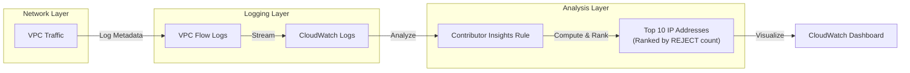

# CloudWatch Contributor Insights

## Overview
**CloudWatch Contributor Insights** is a feature that analyzes log data and creates time-series that display contributor data. This helps you understand who or what is impacting your system's performance or security by identifying the "Top Talkers" in your environment.

## Key Concepts
- **Contributor Data**: Information about the individual entities (e.g., IP addresses, user IDs, URLs) that are contributing to the data in your logs.
- **Rules**: Logic used to analyze logs. You can use **Built-in Rules** provided by AWS or create **Custom Rules**.
- **Top Talkers**: The entities that appear most frequently or contribute the most to a specific metric (e.g., the top 10 IPs by traffic volume).

## Detailed Notes

### 1. Analysis Capabilities
Contributor Insights performs real-time analysis of log events to:
- **Identify Heavy Users**: Find which IP addresses or users are consuming the most bandwidth.
- **Find Malicious Hosts**: Identify bad hosts that are generating high volumes of failed connection attempts.
- **Debug Application Errors**: Rank the URLs or API endpoints that are generating the most 5xx or 4xx errors.
- **DNS Monitoring**: Track the most frequently queried domain names.

### 2. Supported Logs
It works with any AWS-generated logs stored in CloudWatch Logs, including:
- **VPC Flow Logs**: For network traffic analysis.
- **Amazon Route 53 DNS Logs**: For query pattern analysis.
- **API Gateway Logs**: For request volume and error tracking.
- **Custom Application Logs**: Using JSON or common log formats.

### 3. Rule Evaluation
- Rules define what fields to look for and how to aggregate them.
- You can filter the logs before analysis (e.g., only analyze VPC Flow Logs with an `REJECT` action).
- The output is a ranked list of contributors displayed as a time-series graph.

## Architecture / Flow

### Identifying Top Network Talkers
This flow shows how Contributor Insights identifies potential DDoS or scanning activity from VPC Flow Logs.

## Security Relevance
- **DDoS Mitigation**: Quickly identify the source IP addresses of a volumetric attack.
- **Data Exfiltration**: Detect unusual spikes in outbound traffic from specific internal instances.
- **Compromised Credentials**: Identify user IDs making an unusually high number of `AccessDenied` API calls.
- **Inbound Scanning**: Find IPs that are hitting multiple ports with `REJECT` actions, indicating a port scan.

## Operational / Real-World Context
- **Real-Time Ranking**: Unlike CloudWatch Logs Insights (which is for historical ad-hoc queries), Contributor Insights provides continuous, real-time ranking.
- **Dashboard Integration**: Add Contributor Insights graphs to your main operational dashboards for a "high-level view" of system health.
- **Cost**: Pricing is based on the number of rules and the volume of log events processed.

## Common Pitfalls / Misconfigurations
- **Log Format**: If logs are not in a structured format (JSON, VPC Flow log format), the rule might fail to parse the fields correctly.
- **High Volume**: Processing extremely high-volume logs with broad rules can become expensive. Use filters to limit the scope of analysis.
- **Thresholds**: Contributor Insights ranks top talkers but doesn't alert by itself; you must create a **CloudWatch Alarm** on the rule's metric output for automated response.

## Exam / Review Notes
- **Top Talkers**: This is the primary keyword for Contributor Insights.
- **Real-Time vs. Ad-hoc**: Use **Contributor Insights** for continuous monitoring of "who" is doing "what." Use **Logs Insights** for searching specific events in the past.
- **VPC Flow Logs**: A very common use case for identifying attackers in the Detection domain.

## Summary
CloudWatch Contributor Insights is the "leaderboard" for your AWS logs. By identifying and ranking the most active contributors in your network and application traffic, it provides immediate visibility into both operational bottlenecks and security threats.

## Quick Review Checklist
- [ ] Rules created for "Top Rejecting IPs" in VPC Flow Logs?
- [ ] Rules created for "Top 5xx Generating URLs" in API Gateway?
- [ ] Contributor Insights graphs added to the Security Dashboard?
- [ ] Alarms configured on top contributor metrics?
- [ ] Log filters applied to minimize processing costs?
