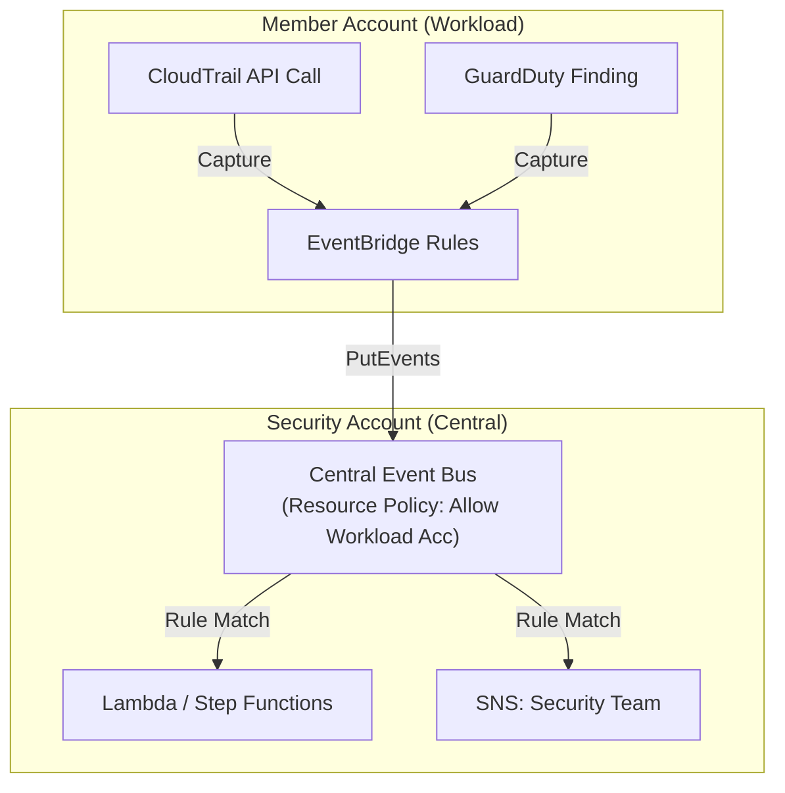
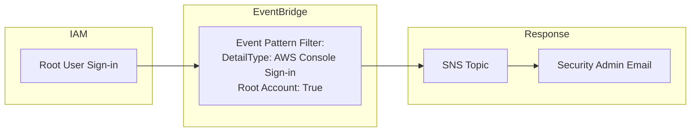

# Amazon EventBridge

## Overview
**Amazon EventBridge** (formerly **CloudWatch Events**) is a serverless event bus that makes it easy to connect applications using data from your own applications, integrated Software-as-a-Service (SaaS) applications, and AWS services. It is the central nervous system for event-driven architectures and automated security remediation in AWS.

## Key Concepts
- **Event Bus**: A pipeline that receives events.
    - **Default Event Bus**: Receives events from AWS services.
    - **Partner Event Bus**: Receives events from SaaS partners (e.g., Datadog, Auth0, Zendesk).
    - **Custom Event Bus**: Receives events from your own applications.
- **Rules**: Match incoming events and route them to targets. Rules use **Event Patterns** (JSON) to filter specific events.
- **Targets**: Destinations for matched events (e.g., Lambda, SNS, SQS, Step Functions, Kinesis).
- **Schema Registry**: Stores event structures (schemas) and can generate code for your applications to process events.
- **Event Archiving & Replay**: Allows you to record events and replay them later for debugging or recovery.

## Detailed Notes

### 1. Event Source Integration
EventBridge can react to:
- **AWS Service State Changes**: EC2 instance state changes, S3 object uploads, etc.
- **API Calls (CloudTrail Integration)**: By creating a rule that matches CloudTrail API calls, you can intercept and react to almost any action in your account (e.g., "StopLogging").
- **Schedules (Cron/Rate)**: Trigger actions at specific times or intervals (e.g., "Run a cleanup Lambda every Monday at 8 AM").

### 2. Cross-Account Event Buses
Using **Resource-based Policies**, you can allow other AWS accounts to send events to a central event bus. This is a common pattern for centralizing security monitoring across an AWS Organization.

### 3. EventBridge Pipes
A point-to-point integration tool that helps you connect an event source (like SQS or Kinesis) to a target, with optional filtering and enrichment (via Lambda or Step Functions) in the middle.

## Architecture / Flow

### 1. Centralized Cross-Account Security Monitoring

### 2. Automated Root User Login Alert

## Security Relevance
- **Detective & Corrective Control**: EventBridge allows you to detect a threat (e.g., via CloudTrail or GuardDuty) and immediately trigger a corrective action (e.g., Lambda to disable a user).
- **Visibility**: Monitors sensitive actions like root login, CloudTrail tampering, or changes to Security Groups.
- **Compliance**: Archiving events provides an immutable record of historical event patterns for audit purposes.

## Operational / Real-World Context
- **Debugging**: The **Replay** feature is invaluable for testing security remediation scripts without needing to re-trigger the original malicious activity.
- **SaaS Security**: Partner buses allow you to pull security alerts from external tools (like Auth0 for identity or Datadog for monitoring) into your AWS remediation workflows.

## Common Pitfalls / Misconfigurations
- **Missing Resource Policies**: Cross-account event delivery will fail if the destination bus policy doesn't explicitly permit the sender account.
- **Circular Loops**: A rule that triggers a Lambda, which then performs an action that triggers the same rule, can cause a costly execution loop.
- **Event Delivery Delays**: While usually near real-time, high-volume event spikes can lead to slight processing latency.

## Exam / Review Notes
- **CloudWatch Events**: EventBridge is the evolved version of CloudWatch Events.
- **Schema Registry**: Useful for developers to know the exact "shape" of events.
- **SaaS Integration**: EventBridge is the only service that provides a dedicated **Partner Event Bus**.
- **Cron Jobs**: The standard way to schedule serverless tasks in AWS.

## Summary
Amazon EventBridge is the glue of AWS security automation. By routing events from AWS, partners, and custom apps to a wide variety of remediation targets, it enables the creation of highly responsive, self-healing security architectures.

## Quick Review Checklist
- [ ] Root user sign-in alerts configured?
- [ ] CloudTrail "StopLogging" events monitored?
- [ ] Central event bus configured for multi-account aggregation?
- [ ] Event archiving enabled for critical security event buses?
- [ ] IAM roles for EventBridge targets follow the Principle of Least Privilege?
