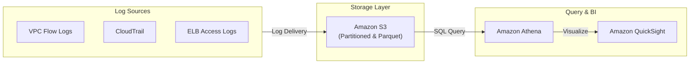
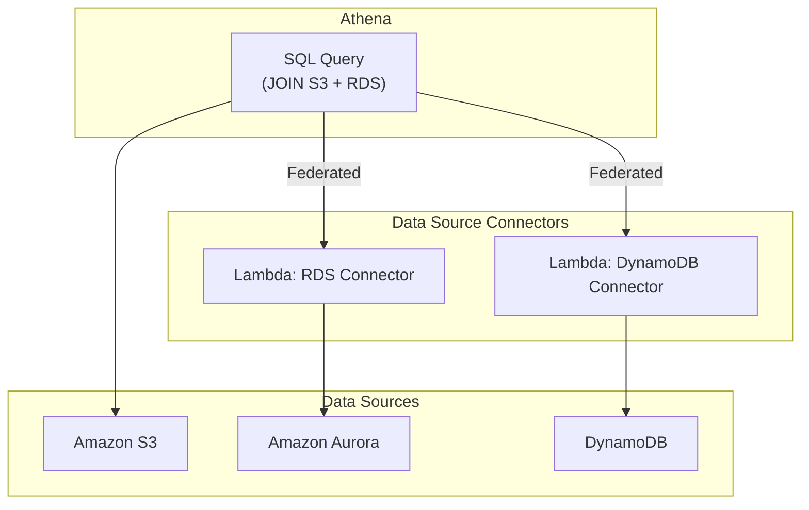

# Amazon Athena

## Overview
**Amazon Athena** is an interactive, serverless query service that makes it easy to analyze data directly in **Amazon S3** using standard SQL. Since it is serverless, there is no infrastructure to manage, and you pay only for the queries that you run (based on the amount of data scanned).

## Key Concepts
- **Presto Engine**: The underlying open-source distributed SQL query engine that powers Athena.
- **Serverless**: No database instances to provision or scale; Athena handles all the execution logic.
- **Ad-hoc Querying**: Ideal for quickly searching through logs or datasets without the need for complex ETL (Extract, Transform, Load) processes.
- **Federated Query**: The ability to query data across multiple sources (Relational, NoSQL, Object) using **Lambda Data Source Connectors**.

## Detailed Notes

### 1. Performance and Cost Optimization
Because Athena charges per terabyte of data scanned, optimizing your data storage is critical:
- **Columnar Storage**: Use formats like **Apache Parquet** or **ORC**. These formats allow Athena to read only the specific columns required for the query, significantly reducing data scanned and costs.
- **Data Compression**: Compress files (e.g., Snappy, Zlib, Gzip) to reduce the storage footprint and retrieval time.
- **Partitioning**: Divide your data into subsets based on columns like `year`, `month`, or `day`. Athena will only scan the specific partitions (folders) that match your `WHERE` clause.
- **File Sizing**: Aim for larger files (e.g., 128MB+) rather than many small files to minimize the overhead of opening and processing each file.

### 2. Federated Query
Athena can query data living outside of S3 by using a **Data Source Connector** (a Lambda function).
- **Supported Sources**: DynamoDB, RDS (MySQL, PostgreSQL), Redshift, CloudWatch Logs, and even on-premises databases.
- **Workflow**: Athena triggers the Lambda connector, which executes the query against the target source and returns the results to Athena for joining or final analysis.

### 3. Integration with QuickSight
**Amazon QuickSight** is often used as the visualization layer for Athena.
- **Troubleshooting Permissions**: 
    - QuickSight needs **S3 GetObject** permissions on the data bucket.
    - If the S3 data is encrypted with **SSE-KMS**, the QuickSight IAM role must be granted **kms:Decrypt** permissions on the KMS key.

## Architecture / Flow

### 1. Log Analysis and Visualization Pipeline
The standard pattern for security log analysis.

### 2. Federated Query Across Heterogeneous Sources
Querying multiple databases as if they were one.

## Security Relevance
- **Post-Incident Forensics**: Athena is the primary tool for searching through months of CloudTrail or VPC Flow logs to determine the extent of a security breach.
- **Compliance Reporting**: Generate reports on user activity or resource access patterns directly from audit logs.
- **Vulnerability Scanning**: Query VPC Flow logs to find IP addresses performing port scans or connecting from known malicious regions.

## Operational / Real-World Context
- **No Performance Impact**: Querying data in S3 does not impact the performance of the applications generating the logs.
- **Query Result Storage**: Athena automatically saves the results of every query into a designated S3 bucket.
- **Schema Management**: Uses **AWS Glue Data Catalog** to store table definitions and schemas.

## Common Pitfalls / Misconfigurations
- **Unpartitioned Data**: Scanning the entire bucket for a simple query is slow and expensive.
- **Small Files**: "Small file syndrome" can lead to query timeouts or extremely slow performance.
- **Missing Trail Slashes**: When defining the `LOCATION` in a `CREATE TABLE` statement, the S3 path must end with a trailing slash (`/`).
- **KMS Grant Issues**: Forgetting to update the KMS key policy to allow the QuickSight or Athena service roles to decrypt the data.

## Exam / Review Notes
- **S3 + SQL**: If the requirement is to query S3 using SQL without a database, the answer is **Athena**.
- **Columnar Formats**: Parquet and ORC are the gold standard for Athena performance.
- **Cost**: Remember that pricing is per **TB scanned**.
- **Federated Query**: Use this for querying "data in place" without moving it to S3.

## Summary
Amazon Athena provides a powerful, serverless SQL interface for data stored in S3. Its ability to perform high-performance, cost-effective ad-hoc analysis on vast amounts of log data makes it an indispensable tool for security investigators and compliance auditors.

## Quick Review Checklist
- [ ] Data converted to Parquet/ORC for cost-efficiency?
- [ ] Partitioning implemented (e.g., `/year/month/day/`)?
- [ ] S3 bucket for query results configured?
- [ ] IAM roles granted `athena:*` and `s3:Get*` permissions?
- [ ] KMS policies updated to allow `kms:Decrypt` for encrypted datasets?
