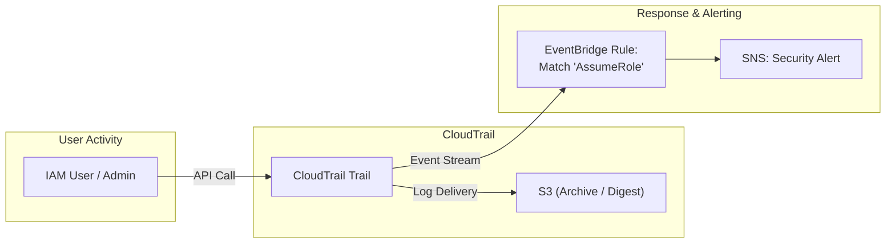
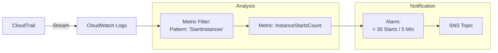

# AWS CloudTrail

## Overview
**AWS CloudTrail** is a service that provides governance, compliance, operational auditing, and risk auditing of your AWS account. It records actions taken by a user, role, or an AWS service as events, including actions taken through the AWS Management Console, AWS CLI, and AWS SDKs/APIs.

## Key Concepts
- **Management Events**: Operations performed on resources in your account (e.g., `AttachRolePolicy`, `TerminateInstances`). Logged by default.
- **Data Events**: High-volume operations on or within a resource (e.g., S3 `GetObject`, Lambda `Invoke`). Not logged by default due to volume and cost.
- **Insights Events**: Unusual API activity patterns detected by ML (e.g., a sudden burst of IAM deletions). Requires separate enablement.
- **Trail**: A configuration that enables delivery of events to an S3 bucket and/or CloudWatch Logs.
- **Log File Integrity Validation**: Uses **Digest Files** (SHA-256) to cryptographically verify that log files have not been modified or deleted after delivery.

## Detailed Notes

### 1. CloudTrail Lake
A managed data lake for aggregating, storing, and querying events using SQL.
- **Unified Store**: Centralizes CloudTrail events, Insights, AWS Config configuration items, and Audit Manager evidence.
- **Immutability**: Data is stored in an immutable data store with up to **10 years** of retention.
- **Querying**: Provides a built-in SQL query interface and pre-defined dashboards.

### 2. Multi-Account and Organization Trails
- **Organization Trail**: Created in the management account to log events for all member accounts. 
- **Security**: Member accounts can see the trail but **cannot** modify or delete it.
- **Aggregation**: Events are automatically delivered to a single S3 bucket in the management or log archive account.

### 3. Log Integrity and Security
- **Digest Files**: Contain hashes of the log files delivered in the last hour. If the hash in the digest doesn't match the current file hash, the file was tampered with.
- **S3 Security**: Best practices include enabling **S3 Versioning**, **MFA Delete**, **KMS Encryption**, and **Object Lock** on the destination bucket.

### 4. Event Latency
- **EventBridge/Logs Delivery**: Typically within **15 minutes** of an API call.
- **S3 Delivery**: Typically within **5 minutes** of the event.
- **Note**: CloudTrail is not strictly real-time; there is a slight delay in processing and delivery.

## Architecture / Flow

### 1. API Monitoring and Automated Response
CloudTrail acts as the sensor for API activity, triggering EventBridge for remediation.

### 2. Metric Filtering for Threshold Alarms
Detecting brute-force or bulk resource operations.

## Security Relevance
- **Audit Trail**: Provides the "Who, What, When, and Where" for every action in the account.
- **Compliance**: Meets regulatory requirements (SOC, PCI, HIPAA) for logging and log integrity.
- **Anomaly Detection**: CloudTrail Insights identifies malicious or accidental spikes in destructive API calls.

## Operational / Real-World Context
- **Global vs. Regional**: Always enable CloudTrail for "All Regions" to ensure global activity (like IAM) and activity in unused regions is captured.
- **Investigation**: Use **Amazon Athena** to query raw S3 logs for complex forensic investigations that go beyond the 90-day console history.
- **Log Management**: Move logs to Glacier for long-term storage and use S3 Object Lock for legal hold/compliance.

## Common Pitfalls / Misconfigurations
- **Logging Disabled**: Attackers often attempt to disable CloudTrail (`StopLogging`) to hide their tracks.
- **Unvalidated Logs**: Storing logs in S3 without enabling "Log File Integrity Validation" makes them less reliable for legal or audit evidence.
- **Missing Data Events**: Forgetting to enable Data Events for highly sensitive S3 buckets containing PII.
- **Console-only View**: Relying only on the Event History in the console, which only goes back **90 days**.

## Exam / Review Notes
- **Management vs. Data Events**: Know that Data Events are **off** by default and cover S3/Lambda activity.
- **Digest Files**: The answer for "how to prove logs weren't modified."
- **Organization Trail**: Centralized management; member accounts cannot stop the trail.
- **Athena/SQL**: The primary tool for searching archived CloudTrail logs in S3.
- **EventBridge**: The tool for near real-time automation based on API calls.

## Summary
AWS CloudTrail is the definitive audit record for the AWS Cloud. By capturing every API call and providing mechanisms for log integrity and SQL-based analysis, it serves as the foundation for the "Detection" domain and is essential for incident response and compliance.

## Quick Review Checklist
- [ ] Trail enabled for "All Regions"?
- [ ] Log File Integrity Validation (Digest Files) enabled?
- [ ] Data Events enabled for critical S3 buckets?
- [ ] Organization trail configured for the entire AWS Org?
- [ ] CloudTrail logs being delivered to an encrypted, locked S3 bucket?
- [ ] CloudWatch Logs integration enabled for real-time alerting?
