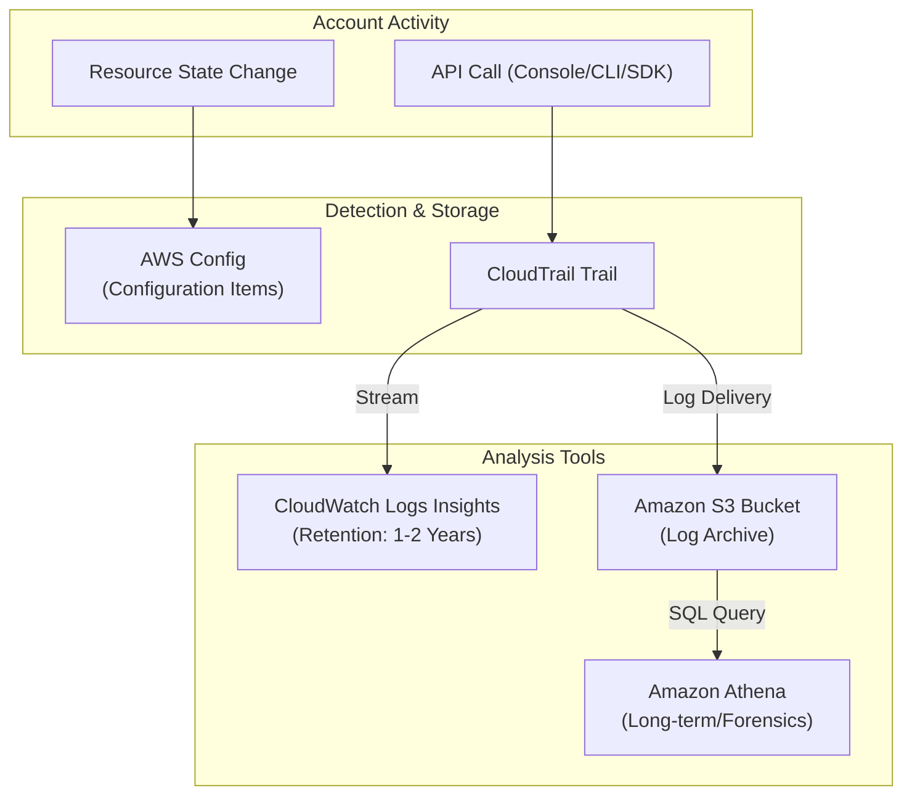

# Monitoring Account Activity

## Overview
Monitoring account activity in AWS requires a multi-layered approach to capture configuration changes, API interactions, and operational trends. By combining services like **AWS Config**, **AWS CloudTrail**, **CloudWatch Logs**, and **Amazon Athena**, security teams can maintain a comprehensive audit trail for both real-time detection and long-term forensic investigation.

## Key Concepts
- **Configuration History**: The record of state changes for AWS resources (managed by **AWS Config**).
- **API History**: The record of "who called which API" (managed by **AWS CloudTrail**).
- **Log Streaming**: The process of sending logs from a source (CloudTrail) to a destination (CloudWatch Logs) for immediate analysis.
- **Ad-hoc Investigation**: Using SQL-like queries (Athena/Logs Insights) to search through vast amounts of historical activity data.

## Detailed Notes

### 1. Configuration State vs. API Action
- **AWS Config**: Captures **What** the resource looks like now and how it looked in the past. It uses a **Configuration Recorder** to track relationships and properties.
- **AWS CloudTrail**: Captures **Who** performed an action on the resource. It records the identity, time, source IP, and parameters of the API call.

### 2. Temporal Analysis (Timeline)
- **CloudTrail Console**: Provides an event history for the past **90 days**.
- **CloudWatch Logs Insights**: By streaming CloudTrail events to CloudWatch Logs, you can retain and search API history far beyond the 90-day window using a specialized query language.
- **Amazon Athena**: Queries raw CloudTrail logs stored in S3. This is the preferred method for very long-term (multi-year) storage and complex statistical analysis (e.g., "Sum all failed login attempts by IP across the last 2 years").

### 3. Monitoring Capabilities Comparison
| Feature | AWS Config | CloudTrail | Logs Insights | Athena |
|---------|------------|------------|---------------|--------|
| **Focus** | Resource State | API Interaction | Log Search | SQL Analytics |
| **History** | Config Timeline | 90-day History | User-defined | Infinite (S3) |
| **Query** | Config Rules | Filtered Search | Custom Query | Standard SQL |

## Architecture / Flow

### Unified Activity Monitoring Architecture

## Security Relevance
- **Accountability**: Proves which user or role was responsible for a specific action (e.g., "Who opened port 22 on the Production Security Group?").
- **Root Cause Analysis**: Correlating a configuration change (Config) with an API call (CloudTrail) to understand *why* a resource is non-compliant.
- **Compliance Evidence**: Provides the "chain of custody" for account activity required by auditors.

## Operational / Real-World Context
- **Centralized Logging**: In a multi-account environment, always aggregate activity logs into a single S3 bucket in a dedicated Security account.
- **Cost Efficiency**: Use CloudWatch Logs for "hot" data (recent weeks/months) and S3+Athena for "cold" data (archival/compliance).

## Common Pitfalls / Misconfigurations
- **Missing Configuration Recorder**: AWS Config is enabled but the recorder is off, resulting in no historical data.
- **Log Gaps**: Failing to enable CloudTrail in "All Regions," allowing attackers to operate undetected in unused regions.
- **Storage Limits**: Not setting a retention policy on CloudWatch Logs, leading to unexpected storage costs.

## Exam / Review Notes
- **Config vs. CloudTrail**: Config is for **State**; CloudTrail is for **Identity/Action**.
- **90-Day Limit**: CloudTrail's built-in history is only 90 days; use **S3/Athena** or **CloudWatch Logs** for anything longer.
- **Athena**: The tool of choice for **advanced queries** and **multi-year** log searches.

## Summary
Monitoring account activity is a tripartite effort: CloudTrail logs the actions, AWS Config logs the resulting state changes, and Athena/Logs Insights provide the tools to search and analyze that data at scale. Together, they form a complete picture of an account's operational and security posture.

## Quick Review Checklist
- [ ] AWS Config recorder enabled for all resources?
- [ ] Multi-region CloudTrail enabled and delivering to S3?
- [ ] CloudTrail logs streaming to CloudWatch for near real-time search?
- [ ] Retention policies set for logs to match compliance needs?
- [ ] Athena table created for searching long-term CloudTrail history?
