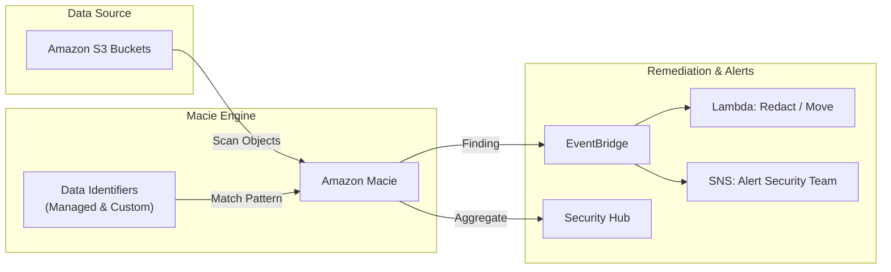
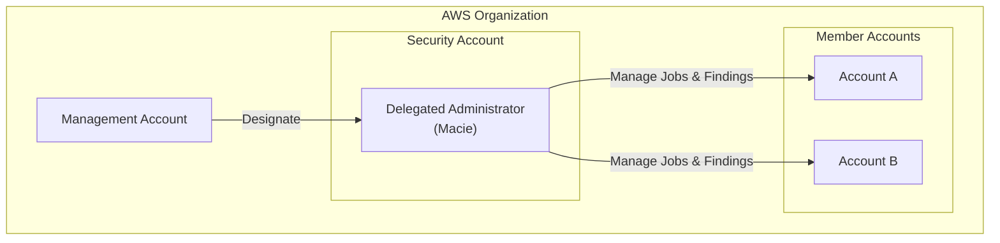

# Amazon Macie

## Overview
**Amazon Macie** is a fully managed data security and data privacy service that uses machine learning and pattern matching to discover and protect sensitive data in **Amazon S3**. It automates the discovery of sensitive data, such as Personally Identifiable Information (PII), and provides a continuous view of the security and privacy of your data.

## Key Concepts
- **PII (Personally Identifiable Information)**: Data that can be used to identify an individual (e.g., Social Security Numbers, names, addresses).
- **Data Identifiers**:
    - **Managed Data Identifiers**: Pre-defined patterns by AWS for common sensitive data like credit card numbers, AWS credentials, and bank account details.
    - **Custom Data Identifiers**: User-defined patterns using regular expressions (Regex), keywords, and proximity rules (e.g., internal Employee IDs).
- **Allow List**: A list of specific text patterns or strings that Macie should ignore (e.g., public business phone numbers).
- **Sensitive Data Discovery Results**: Detailed records of analysis stored in an S3 bucket for long-term retention and bulk querying.

## Detailed Notes

### 1. Finding Types
Macie generates two primary categories of findings:
- **Sensitive Data Findings**: Triggered when Macie discovers PII or other sensitive content within an S3 object based on data identifiers.
- **Policy Findings**: Triggered by security risks in S3 bucket configurations, such as:
    - Bucket is publicly accessible.
    - Default encryption is disabled.
    - Shared with an external AWS account.

### 2. Analysis and Retention
- **Jobs**: You can run one-time or scheduled sensitive data discovery jobs.
- **Automated Discovery**: Macie can perform continuous automated sensitive data discovery across your S3 inventory.
- **Suppression Rules**: Used to automatically archive findings that match specific criteria (e.g., known test data) to reduce noise.
- **Retention**: Findings are stored for **90 days** in the Macie console. Discovery results can be exported to S3 for longer retention and analyzed via **Amazon Athena**.

### 3. Multi-Account Strategy
- **AWS Organizations**: Supports central management of Macie across multiple accounts.
- **Delegated Administrator**: A member account can be designated as the Macie administrator to manage settings and view findings for the entire organization.

## Architecture / Flow

### 1. Sensitive Data Discovery and Remediation

### 2. Multi-Account Hierarchy

## Security Relevance
- **Data Privacy Compliance**: Helps organizations meet regulatory requirements like GDPR, HIPAA, and PCI DSS by identifying unprotected sensitive data.
- **Leak Prevention**: Detects if sensitive data has been accidentally uploaded to public or unencrypted buckets.
- **Credential Protection**: Identifies hardcoded AWS access keys or private keys stored in S3.

## Operational / Real-World Context
- **One-Click Enablement**: Easy to start, but cost is based on the volume of data processed, so it is important to target specific buckets for large-scale environments.
- **Centralized Findings**: Using the delegated administrator model ensures that the security team has a unified view of sensitive data risks across the entire cloud estate.

## Common Pitfalls / Misconfigurations
- **Cost Management**: Running full scans on petabytes of data without filtering can lead to high costs. Use discovery jobs to target specific areas first.
- **Ignoring Policy Findings**: Policy findings regarding public buckets are just as critical as sensitive data findings.
- **Outdated Custom Identifiers**: Regex patterns for custom identifiers should be regularly tested and updated to ensure accuracy.

## Exam / Review Notes
- **S3 Focus**: If the question is about finding PII in **S3**, **Amazon Macie** is the correct service.
- **Custom vs Managed**: Know that you can create your own Regex-based identifiers.
- **EventBridge**: The standard way to automate a response to a Macie finding.
- **Athena Integration**: Used for querying discovery results stored in S3.

## Summary
Amazon Macie is a specialized tool for S3 data privacy. By leveraging machine learning and customizable identifiers, it provides the necessary visibility to protect PII and ensure S3 bucket security across an entire AWS Organization.

## Quick Review Checklist
- [ ] Delegated administrator configured in Organizations?
- [ ] Custom data identifiers created for company-specific data?
- [ ] Discovery results exported to S3 for long-term audit?
- [ ] EventBridge rules set up for critical findings?
- [ ] S3 buckets reviewed for policy findings (Public/Unencrypted)?
