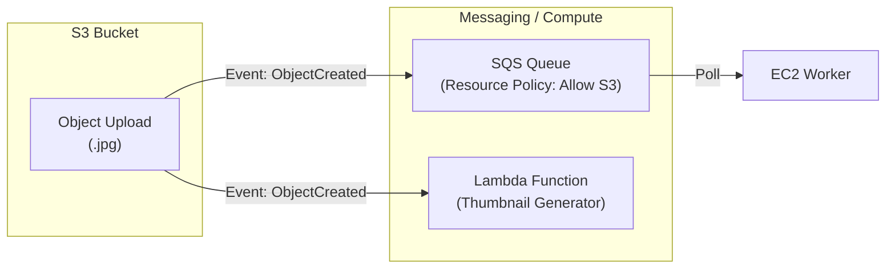
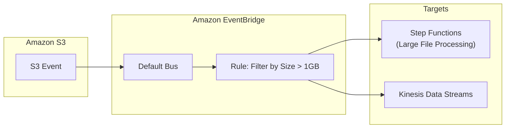

# Amazon S3 Event Notifications

## Overview
**Amazon S3 Event Notifications** enable you to receive notifications when certain events happen in your S3 bucket. It is a key component for building serverless, event-driven architectures that react to data changes (e.g., uploading a photo triggers a thumbnail generation process).

## Key Concepts
- **S3 Events**: Actions that trigger a notification, such as `ObjectCreated` (Put, Post, Copy), `ObjectRemoved` (Delete), `ObjectRestore`, and `Replication`.
- **Filtering**: You can restrict notifications to specific objects using **Prefix** (e.g., `images/`) or **Suffix** (e.g., `.jpg`) patterns.
- **Destinations (Standard)**:
    - **SNS Topics**: For broadcasting alerts to multiple subscribers.
    - **SQS Queues**: For decoupling and processing events asynchronously.
    - **Lambda Functions**: For immediate serverless code execution.
- **EventBridge Integration**: A newer, more powerful option that sends all bucket events to **Amazon EventBridge** for advanced routing and filtering.

## Detailed Notes

### 1. Standard Event Destinations
When using standard destinations (SNS, SQS, Lambda), S3 requires permission to publish to the target. This is handled via **Resource-based Policies**, not IAM roles for S3.
- **SNS/SQS**: The topic or queue must have an Access Policy allowing `s3.amazonaws.com` to perform `sns:Publish` or `sqs:SendMessage`.
- **Lambda**: The function must have a Resource Policy allowing `s3.amazonaws.com` to perform `lambda:InvokeFunction`.

### 2. EventBridge Integration
Enabling the "Amazon EventBridge" toggle in S3 bucket properties sends all events to the account's default event bus.
- **Advanced Filtering**: EventBridge allows filtering by metadata, object size, and complex patterns that the standard S3 filtering (prefix/suffix) cannot handle.
- **Multiple Targets**: A single event can be routed to over 18 different AWS services simultaneously (e.g., Step Functions, Kinesis Data Streams).
- **Reliability**: EventBridge provides built-in event archiving and replay capabilities.

### 3. Latency and Delivery
- Events are typically delivered in **seconds** but can occasionally take a minute or longer.
- For standard notifications, S3 sends a **Test Event** when you save the configuration to verify that the destination policy is correctly configured.

## Architecture / Flow

### 1. Standard Event Notification (SQS/Lambda)

### 2. Advanced EventBridge Workflow

## Security Relevance
- **Detective Control**: Automatically triggers a security scan or malware analysis (e.g., via Amazon GuardDuty or a third-party tool) when new files are uploaded.
- **Data Integrity**: Monitors for unauthorized deletions or modifications in sensitive buckets.
- **Access Control**: Resource-based policies ensure that only your specific S3 bucket can trigger downstream actions, preventing unauthorized event injection.

## Operational / Real-World Context
- **Thumbnail Generation**: A classic use case where an upload triggers a Lambda to resize an image.
- **Audit Logging**: Use notifications to log file movements into a separate tracking database (DynamoDB).
- **Testing**: Use the SQS "Poll for messages" feature to inspect the JSON structure of the S3 event, which includes the `eventName`, `bucket name`, and `object key`.

## Common Pitfalls / Misconfigurations
- **Policy Validation Error**: You cannot save an S3 Event Notification if the target (SNS/SQS/Lambda) does not already have a policy allowing S3 access.
- **Circular Loops**: A Lambda function that processes an object and then writes it back to the same bucket (with the same prefix/suffix) can trigger itself in an infinite, expensive loop.
- **Prefix Overlap**: S3 does not allow overlapping prefix/suffix rules for the same event type within standard notifications (this is avoided by using EventBridge).

## Exam / Review Notes
- **Resource Policies**: Remember that S3 needs the **Target's** permission (SNS/SQS Policy, Lambda Resource Policy) to deliver events.
- **Targets**: Standard targets are SNS, SQS, and Lambda. Everything else goes through **EventBridge**.
- **EventBridge Advantage**: Use EventBridge for **advanced filtering** or **archiving/replaying** events.

## Summary
S3 Event Notifications are the primary mechanism for building reactive, data-driven systems on AWS. Whether using standard destinations for simple tasks or EventBridge for complex routing, they allow security and operations teams to automate responses to data changes with minimal latency.

## Quick Review Checklist
- [ ] Resource-based policy attached to SNS/SQS/Lambda?
- [ ] EventBridge integration enabled for complex routing?
- [ ] Circular loops avoided (Lambda output vs. input)?
- [ ] Filtering (Prefix/Suffix) correctly applied to avoid unnecessary triggers?
- [ ] S3 bucket events correctly selected (ObjectCreated vs. ObjectRemoved)?
