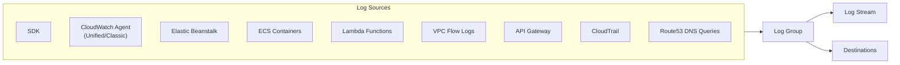
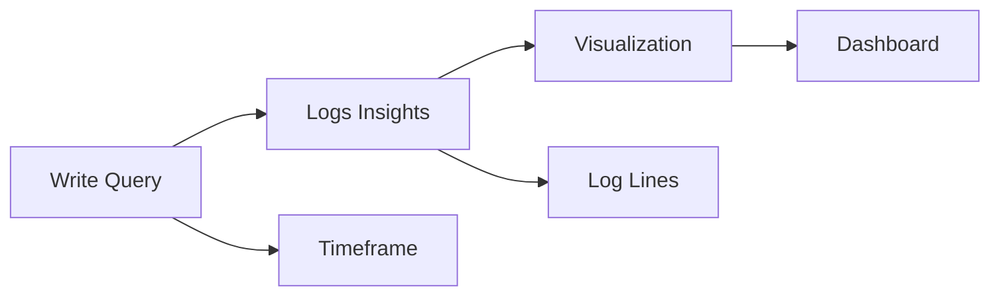
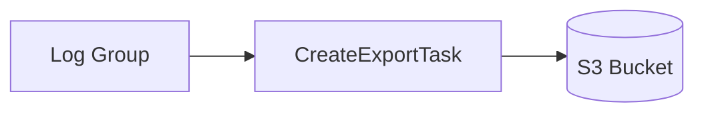
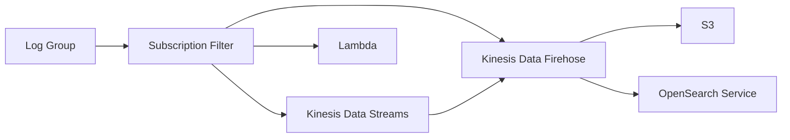
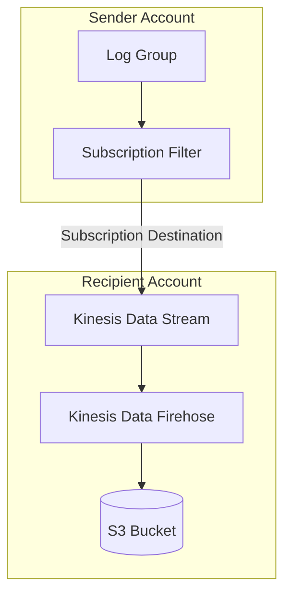

# Domain 1: Detection

## Amazon CloudWatch Logs

### Overview

- Centralized logging service for AWS and on-premises applications
- **Log Groups**: Named containers for application logs (e.g., one per application)
- **Log Streams**: Instances within a log group (specific containers, EC2 instances, log files)
- **Retention**: 1 day to 10 years, or indefinitely

### Log Sources

| Source | Description |
|--------|-------------|
| SDK | Send logs directly via API |
| CloudWatch Agent / Unified Agent | Collect logs from EC2/on-premises |
| Elastic Beanstalk | Application logs |
| ECS | Container logs |
| Lambda | Function execution logs |
| VPC Flow Logs | VPC network traffic metadata |
| API Gateway | API request logs |
| CloudTrail | API call logs (filter-based) |
| Route53 | DNS query logs |

### Encryption
- Logs encrypted by default using AWS-managed keys
- Optional: Use your own KMS customer-managed keys (CMK)

### Querying Logs

#### CloudWatch Logs Insights

- Purpose-built query language for CloudWatch Logs
- Automatically detects fields from log data
- Features:
  - Filter by conditions
  - Calculate aggregate statistics
  - Sort and limit events
  - Save queries
  - Add to CloudWatch Dashboards
  - Query multiple log groups (including cross-account)

#### Example Queries
- Most 25 recent events
- Count events with exceptions/errors
- Filter by specific IP address

> **Note**: CloudWatch Logs Insights queries historical data only - not real-time

### Export & Subscriptions

#### S3 Export (Batch)

- Batch export to S3
- Can take up to **12 hours** to complete
- Use `CreateExportTask` API

#### Real-Time Streaming (Subscriptions)

- **Real-time** delivery of log events
- Subscription filters define which events to send
- Destinations: Kinesis Data Streams, Kinesis Data Firehose, Lambda

### Cross-Account Log Aggregation

**Setup Process**:
1. Create subscription filter in sender account
2. Create destination (Kinesis Data Stream) in recipient account
3. Attach destination access policy to allow sender
4. Create IAM role in recipient account with permission to send to Kinesis
5. Allow sender account to assume the role

### Retention Policy

| Storage Tier | Retention |
|--------------|-----------|
| CloudWatch Logs | 1 day to 10 years |
| S3 (via export/subscription) | Custom |
| S3 Glacier | Long-term archival |

### Exam Tips

- **Log Groups** = applications
- **Log Streams** = instances/files/containers within an app
- Subscription filters enable **real-time** log streaming
- Export to S3 is **batch** (up to 12 hours)
- Logs Insights queries are **not real-time**
- Cross-account aggregation uses Kinesis Data Streams + Firehose
- Default encryption is AWS-managed; can use CMK