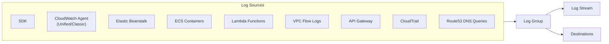
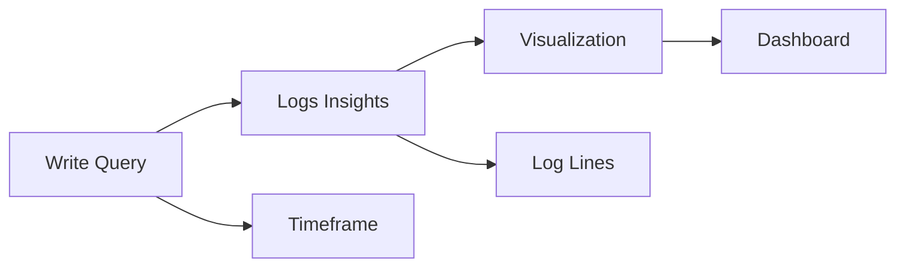
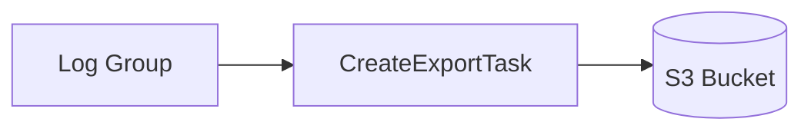
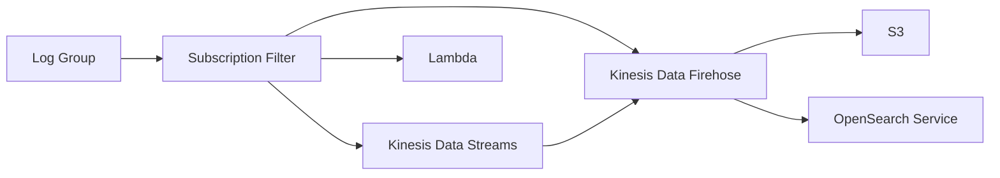
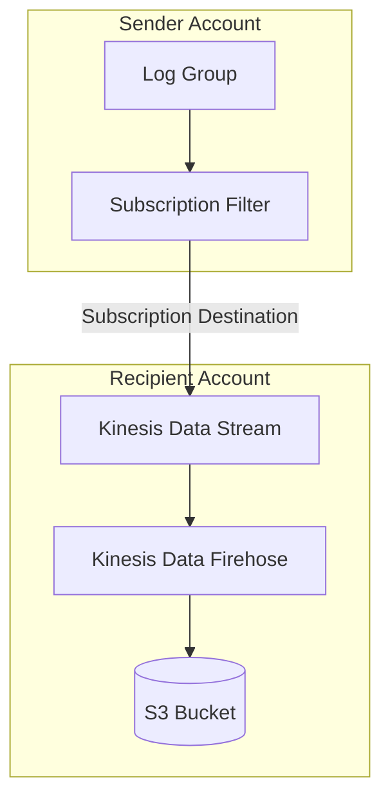
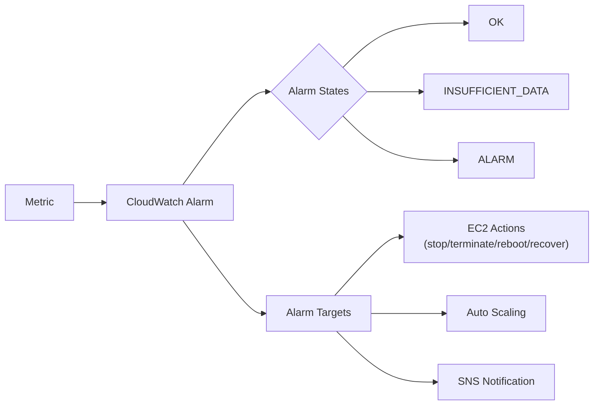
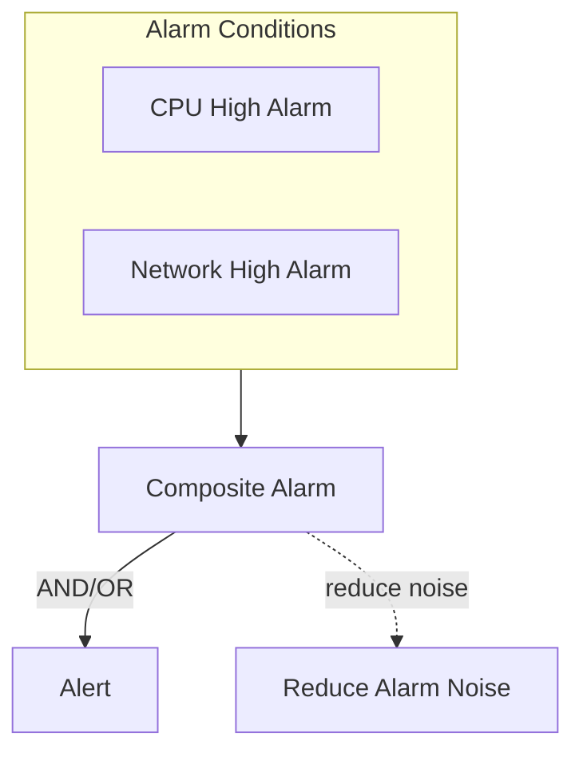
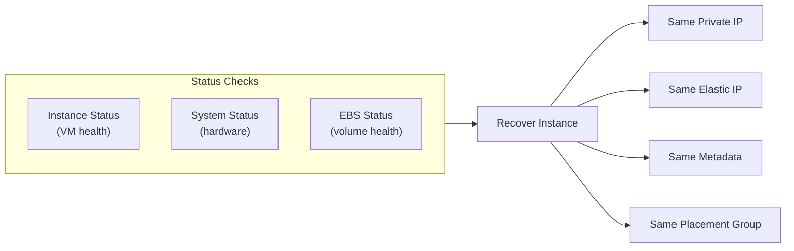
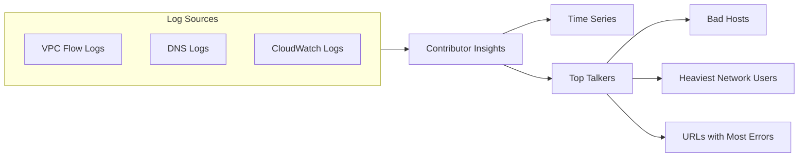
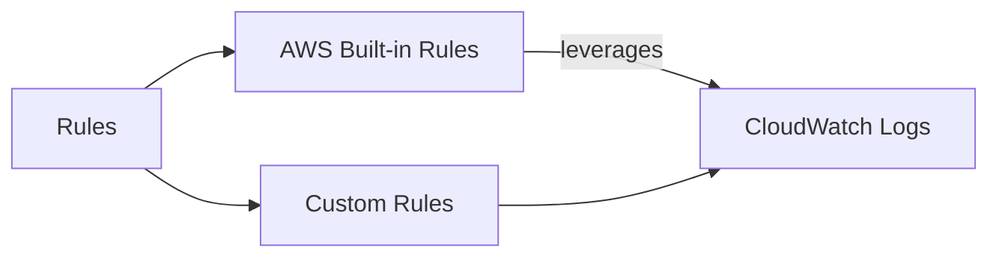

# Domain 1: Detection

## Amazon CloudWatch Logs

### Overview


- Centralized logging service for AWS and on-premises applications
- **Log Groups**: Named containers for application logs (e.g., one per application)
- **Log Streams**: Instances within a log group (specific containers, EC2 instances, log files)
- **Retention**: 1 day to 10 years, or indefinitely

### Log Sources

| Source | Description |
|--------|-------------|
| SDK | Send logs directly via API |
| CloudWatch Agent / Unified Agent | Collect logs from EC2/on-premises |
| Elastic Beanstalk | Application logs |
| ECS | Container logs |
| Lambda | Function execution logs |
| VPC Flow Logs | VPC network traffic metadata |
| API Gateway | API request logs |
| CloudTrail | API call logs (filter-based) |
| Route53 | DNS query logs |

### Encryption
- Logs encrypted by default using AWS-managed keys
- Optional: Use your own KMS customer-managed keys (CMK)

### Querying Logs

#### CloudWatch Logs Insights


- Purpose-built query language for CloudWatch Logs
- Automatically detects fields from log data
- Features:
  - Filter by conditions
  - Calculate aggregate statistics
  - Sort and limit events
  - Save queries
  - Add to CloudWatch Dashboards
  - Query multiple log groups (including cross-account)

#### Example Queries
- Most 25 recent events
- Count events with exceptions/errors
- Filter by specific IP address

> **Note**: CloudWatch Logs Insights queries historical data only - not real-time

### Export & Subscriptions

#### S3 Export (Batch)

- Batch export to S3
- Can take up to **12 hours** to complete
- Use `CreateExportTask` API

#### Real-Time Streaming (Subscriptions)


- **Real-time** delivery of log events
- Subscription filters define which events to send
- Destinations: Kinesis Data Streams, Kinesis Data Firehose, Lambda

### Cross-Account Log Aggregation



**Setup Process**:
1. Create subscription filter in sender account
2. Create destination (Kinesis Data Stream) in recipient account
3. Attach destination access policy to allow sender
4. Create IAM role in recipient account with permission to send to Kinesis
5. Allow sender account to assume the role

### Retention Policy

| Storage Tier | Retention |
|--------------|-----------|
| CloudWatch Logs | 1 day to 10 years |
| S3 (via export/subscription) | Custom |
| S3 Glacier | Long-term archival |

### Exam Tips

- **Log Groups** = applications
- **Log Streams** = instances/files/containers within an app
- Subscription filters enable **real-time** log streaming
- Export to S3 is **batch** (up to 12 hours)
- Logs Insights queries are **not real-time**
- Cross-account aggregation uses Kinesis Data Streams + Firehose
- Default encryption is AWS-managed; can use CMK

---

## CloudWatch Alarms

### Overview


- Triggers notifications for any CloudWatch metric
- Evaluation options: sampling, percentage, max, min, etc.

### Alarm States

| State | Description |
|-------|-------------|
| **OK** | Metric is within defined threshold |
| **ALARM** | Metric exceeds threshold |
| **INSUFFICIENT_DATA** | Not enough data available (starting up or missing metrics) |

### Period & Resolution
- **Period**: Length of time in seconds to evaluate the metric
- **High Resolution Metrics**: Support 10s, 30s, or multiples of 60 seconds

### Alarm Targets

| Target | Actions |
|--------|---------|
| **EC2 Instance** | Stop, Terminate, Reboot, Recover |
| **Auto Scaling** | Trigger scale-in/scale-out actions |
| **SNS** | Send notification (then trigger Lambda, email, etc.) |

### Composite Alarms


- Monitors state of **multiple other alarms**
- Supports **AND** and **OR** conditions
- Reduces alarm fatigue by creating complex conditions
- Example: Trigger alert only when CPU is high **AND** network traffic is high

### EC2 Instance Recovery



- **Instance Status**: Checks EC2 virtual machine
- **System Status**: Checks underlying hardware
- **EBS Status**: Checks attached EBS volumes
- **Recovery**: Preserves private IP, public IP, Elastic IP, metadata, placement group

### Alarm Good to Know

- Can create alarms based on **CloudWatch Logs metric filters**
- Test alarms using CLI:
  ```bash
  aws cloudwatch set-alarm-state \
    --alarm-name "myalarm" \
    --state-value ALARM \
    --state-reason "testing"
  ```
- Alarm actions require correct IAM permissions
- Can set alarm to trigger on any metric namespace (CWAgent, EC2, Lambda, etc.)

---

## CloudWatch Contributor Insights

### Overview


- Analyzes log data and creates **time series** of contributor data
- Identifies **top talkers** and what/who is impacting system performance

### Use Cases

| Use Case | Description |
|----------|-------------|
| Find Bad Hosts | Identify hosts causing errors |
| Heaviest Network Users | Find top bandwidth consumers |
| Top Error URLs | Identify URLs generating most errors |
| Throttling | Find API endpoints being throttled |

### Works With
- **Any AWS-generated logs**: VPC Flow Logs, DNS logs, etc.
- CloudWatch Logs (custom application logs)

### Rules



- **Built-in Rules**: Created by AWS, leverages your existing CloudWatch Logs
- **Custom Rules**: Create your own rules for specific analysis

### Example: VPC Flow Logs

```
VPC Flow Logs → CloudWatch Logs → Contributor Insights → Top 10 IP Addresses
```

### Key Features
- Real-time contributor data visualization
- Time series charts showing top contributors
- Works across multiple log groups
- Can be used to create alarms on top contributors