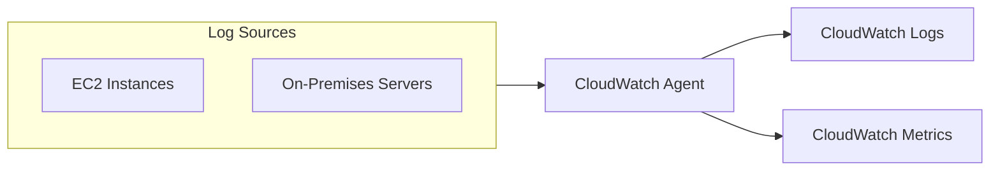
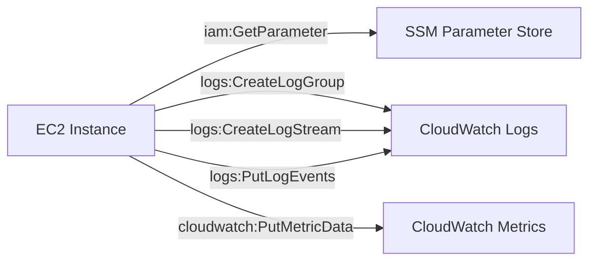
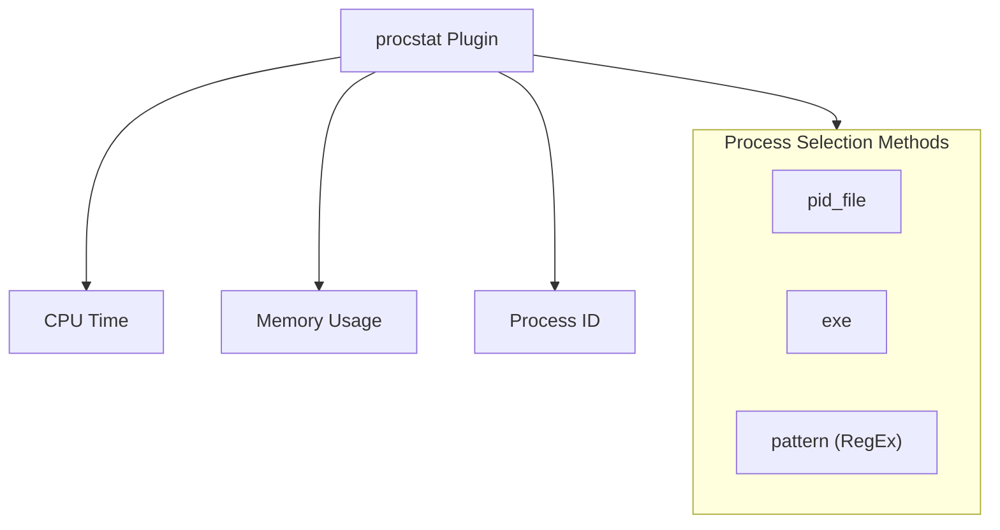
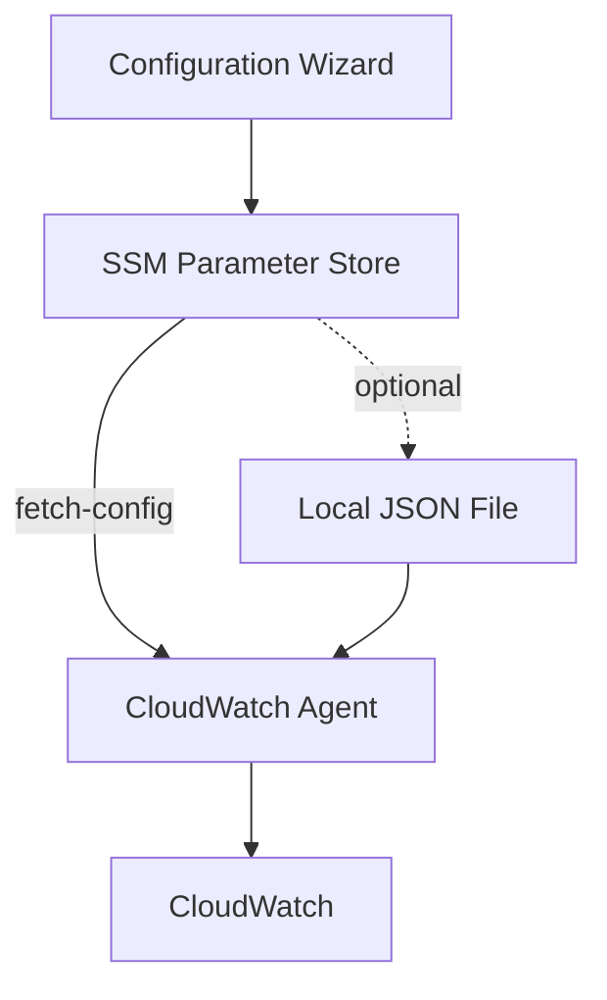

# Domain 1: Detection

## Amazon CloudWatch Agent

### Overview


- Collects **metrics and logs** from EC2 instances and on-premises servers
- Sends data to **CloudWatch Logs** and **CloudWatch Metrics**

### Capabilities

#### Metrics Collection
- System-level metrics:
  - RAM usage
  - Disk space
  - CPU utilization
  - Process information
- Default namespace: **CWAgent** (configurable)

#### Log Collection
- No logs from EC2 can be sent without using the CloudWatch agent
- Centralized configuration using **SSM Parameter Store**

### IAM Permissions



Required IAM permissions for EC2 to send logs and metrics:
- `cloudwatch:PutMetricData`
- `logs:CreateLogGroup`
- `logs:CreateLogStream`
- `logs:PutLogEvents`
- `ssm:GetParameter`

### Procstat Plugin

The **procstat plugin** collects metrics and monitors system utilization of individual processes:

- **Supports**: Linux and Windows
- **Metrics collected**:
  - CPU time used by process
  - Memory used by process
  - Process ID tracking



#### Process Selection Methods
| Method | Description |
|--------|-------------|
| `pid_file` | Specify a file containing PIDs to monitor |
| `exe` | Match by executable name |
| `pattern` | Match by PID or Regular Expression |

#### Procstat Metrics
- Metrics begin with **`procstat` prefix**
- Examples:
  - `procstat_cpu_time`
  - `procstat_memory_usage`
  - `procstat_pid_count`

### Installation & Setup

#### Installation (Amazon Linux 2)
```bash
sudo yum install Amazon-cloudwatch-agent
```

#### Configuration Wizard
Run the wizard to generate configuration:
```bash
amazon-cloudwatch-agent-ctl -a start-config
```

The wizard prompts for:
- OS type (Linux/Windows)
- EC2 or On-Premises
- StatsD daemon enable/disable (default port 18176)
- Metrics collection (CPU, memory, disk, network, processes, swap)
- EC2 dimensions
- Log files to monitor
- Retention period

#### IAM Policies
| Policy | Purpose |
|--------|---------|
| **CloudWatchAgentServerPolicy** | Send metrics/logs to CloudWatch, get parameters from SSM |
| **CloudWatchAgentAdminPolicy** | PUT config into SSM Parameter Store (only needed during setup) |

### Starting the Agent

#### From SSM Parameter Store
```bash
amazon-cloudwatch-agent-ctl -a fetch-config -m ec2 -c ssm:AmazonCloudWatch-linux
```

#### From Local Config File
```bash
amazon-cloudwatch-agent-ctl -a start -c file:/path/to/config.json
```

### Metrics Collected

| Category | Metrics |
|----------|---------|
| **CPU** | cpu_usage_idle, cpu_usage_iowait, etc. |
| **Memory** | mem_used_percent, mem_available, mem_cached, etc. |
| **Disk** | disk_used_percent, disk_inodes_free, etc. |
| **Network** | netstat_tcp_established, packets_in/out, etc. |
| **Processes** | processes_running, processes_idle, processes_dead, etc. |
| **Swap** | swap_used_percent, swap_free, etc. |

### Configuration Storage



- Configuration stored in SSM Parameter Store (e.g., `AmazonCloudWatch-linux`)
- Can also use local JSON configuration file
- SSM approach enables centralized config management across multiple instances

### Exam Tips

- **No logs can be sent from EC2 without the agent** - this is a common exam question
- Default namespace is **CWAgent**
- StatsD daemon can be enabled for custom application metrics
- Default collection interval is **60 seconds**
- High resolution metrics available (1s, 10s, 30s, 60s)
- Procstat plugin metrics begin with `procstat` prefix
- Use **Admin policy** only when storing config to SSM; use **Server policy** for runtime

### Troubleshooting

#### Agent Fails to Start
- Check config validation logs:
  ```
  /opt/aws/amazon-cloudwatch-agent/logs/configuration-validation.log
  ```

#### Cannot Find Metrics
- Verify you are checking the correct **namespace** (default: CWAgent)
- Check config file: `amazon-cloudwatch-agent.json`

#### Agent Not Pushing Log Events
| Check | Action |
|-------|--------|
| Agent Version | Update to latest agent version |
| Connectivity | Test connectivity to CloudWatch Logs endpoint |
| Security Groups | Verify SG allows outbound to CloudWatch |
| NACLs | Check NACL allows traffic |
| Account/Region | Verify correct account and region in config |
| Log Group | Confirm log group name is correct |
| IAM Permissions | Verify required permissions |
| System Time | Ensure EC2 instance system time is correct |