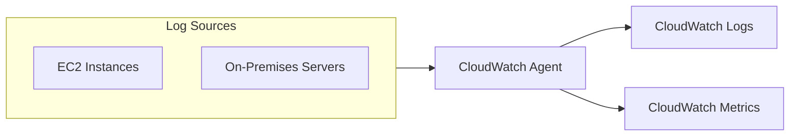
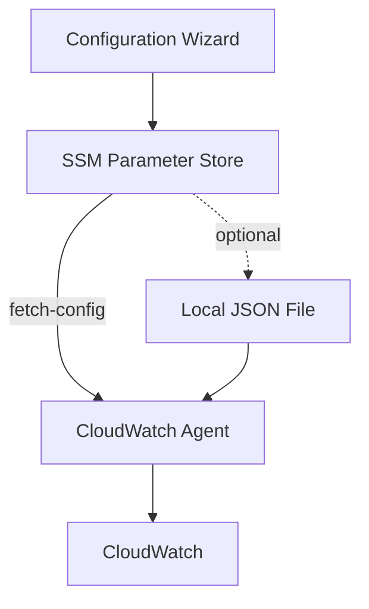

# Amazon CloudWatch Agent

## Overview
The **Amazon CloudWatch Agent** is a unified agent that enables the collection of system-level metrics and log files from both **Amazon EC2** instances and on-premises servers. It is essential for monitoring resource utilization beyond standard hypervisor-level metrics, such as RAM usage and individual process performance.



## Key Concepts
- **Unified Agent**: A single agent for both metrics and logs, replacing older standalone agents.
- **System Metrics**: Collects RAM, disk, and process-level data not available via standard EC2 monitoring.
- **Log Collection**: Transmits application and system logs to CloudWatch Logs.
- **Configuration Management**: Centralized management via **SSM Parameter Store**.

## Detailed Notes

### 1. Capabilities

#### Metrics Collection
- System-level metrics:
  - RAM usage
  - Disk space
  - CPU utilization (including core-level)
  - Process information
- Default namespace: **CWAgent** (configurable).

#### Log Collection
- **Mandatory**: No logs from within the EC2 OS can be sent to CloudWatch without an agent.
- Centralized configuration using **SSM Parameter Store**.

### 2. Procstat Plugin
The **procstat plugin** monitors the system utilization of individual processes.
- **Supports**: Linux and Windows.
- **Metrics collected**:
  - CPU time used by process.
  - Memory usage.
  - Process ID tracking.

#### Process Selection Methods
| Method | Description |
|--------|-------------|
| `pid_file` | Specify a file containing PIDs to monitor. |
| `exe` | Match by executable name. |
| `pattern` | Match by PID or Regular Expression. |

> **Note**: Procstat metrics begin with the `procstat` prefix (e.g., `procstat_cpu_time`).

### 3. Installation & Setup

#### Installation (Amazon Linux 2)
```bash
sudo yum install Amazon-cloudwatch-agent
```

#### Configuration Wizard
Run the wizard to generate configuration:
```bash
amazon-cloudwatch-agent-ctl -a start-config
```

#### IAM Policies & Permissions
Required IAM permissions for the EC2 instance:
- `cloudwatch:PutMetricData`
- `logs:CreateLogGroup` / `CreateLogStream` / `PutLogEvents`
- `ssm:GetParameter`

| Policy | Purpose |
|--------|---------|
| **CloudWatchAgentServerPolicy** | Send metrics/logs to CloudWatch, get parameters from SSM. |
| **CloudWatchAgentAdminPolicy** | PUT config into SSM Parameter Store (needed only during setup). |

## Architecture / Flow

### Configuration Storage


## Security Relevance
- **Detective Control**: Logs and metrics provide the audit trail needed to detect compromised instances or unusual resource consumption.
- **Process Monitoring**: Using **procstat** helps detect unauthorized processes or resource-heavy malware (e.g., crypto miners).

## Operational / Real-World Context
- **Centralized Config**: Using SSM Parameter Store allows you to update the agent configuration for an entire fleet of instances simultaneously.
- **Fleet Management**: Standardize monitoring across Hybrid environments (On-Prem + AWS).

## Common Pitfalls / Misconfigurations
- **Missing IAM Permissions**: The agent will fail to push data if the instance role lacks the `CloudWatchAgentServerPolicy`.
- **Clock Skew**: If the instance time is incorrect, CloudWatch may reject the incoming metrics/logs.
- **Namespace Confusion**: Forgetting that custom metrics reside in the `CWAgent` namespace by default.

## Exam / Review Notes
- **EC2 Logs Requirement**: You MUST use an agent to send OS logs to CloudWatch.
- **Procstat**: The tool for monitoring individual process utilization.
- **Namespace**: Default is `CWAgent`.
- **Admin vs. Server Policy**: Admin is for *writing* the config to SSM; Server is for *running* the agent.

## Summary
The CloudWatch Agent is the primary mechanism for deep visibility into EC2 and on-premises instances. By combining system metrics, log collection, and process monitoring via the procstat plugin, it provides a comprehensive detective control for AWS environments.

## Quick Review Checklist
- [ ] Agent is required for RAM and individual process metrics.
- [ ] Config is typically stored in SSM Parameter Store for scaling.
- [ ] `procstat` is for per-process monitoring.
- [ ] `CloudWatchAgentServerPolicy` must be attached to the instance role.
- [ ] Check `/opt/aws/amazon-cloudwatch-agent/logs/configuration-validation.log` if it fails to start.
