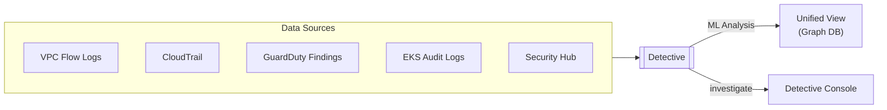
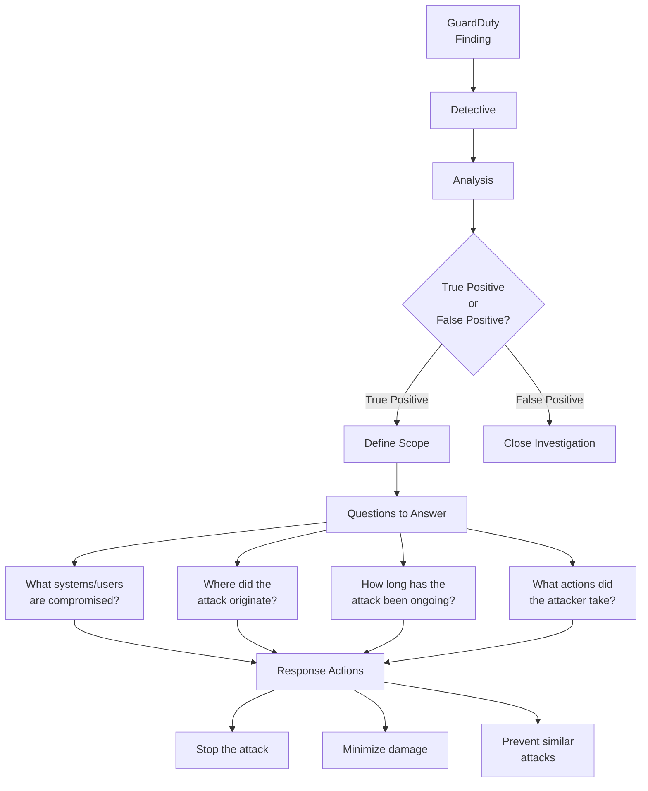
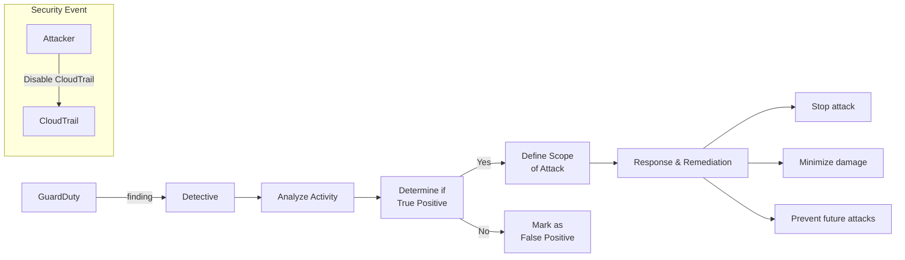

# Domain 1: Detection

## Amazon Detective

### Overview

- **Analyze, investigate, and identify root cause** of security findings using:
  - Machine Learning (ML)
  - Graph theory
  - Statistics
- **Automatically collects and processes** events from:
  - VPC Flow Logs
  - CloudTrail
  - GuardDuty findings
- **Creates a unified view** of all activity
- **Optional data sources**: EKS audit logs, Security Hub, and more
- **Retention**: 1 year of aggregated data analysis

### What It Answers
- **How did it happen?**
- **What was affected?**
- **What actions did an attacker take?**

### View Details
- Affected resources
- When an IP connected to an EC2
- API calls
- Login attempts
- All activity timeline

## Investigation Process

### Investigating IAM Users/Roles
- Helps investigate IAM users/roles to determine if a principal is involved in a security event
- Example: Determine if a compromised IAM principal was used maliciously

### Investigation Workflow

## Architecture Example

### Scenario: CloudTrail Disabled

### Investigation Steps
1. **GuardDuty generates a finding** when CloudTrail is disabled
2. **Detective ingests the finding**
3. **Analyze** whether activity is a true positive or false positive
4. **If True Positive**:
   - Define scope of malicious activity
   - Identify compromised systems and users
   - Identify attack origin
   - Determine attack duration
5. **Respond**:
   - Stop the attack
   - Minimize damage
   - Prevent similar attacks

## Data Collection

### Required Data Sources
- VPC Flow Logs
- CloudTrail
- GuardDuty findings

### Optional Data Sources
- EKS audit logs
- Security Hub findings
- Additional AWS services

### Analysis Features
- Machine learning models
- Graph-based behavior analysis
- Statistical analysis
- 365 days of historical data
