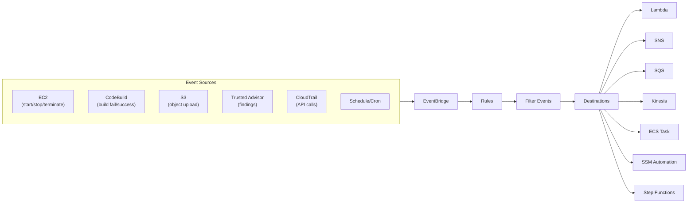
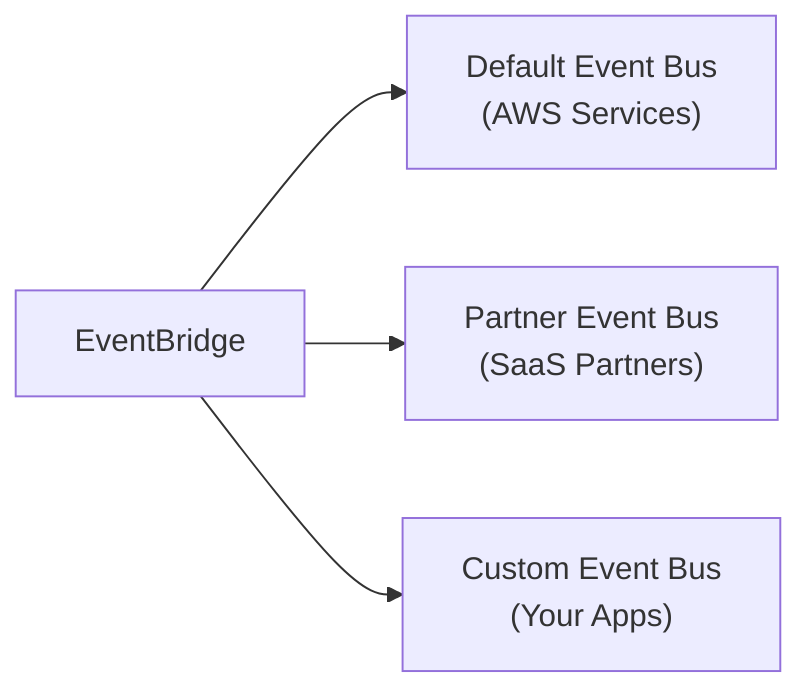
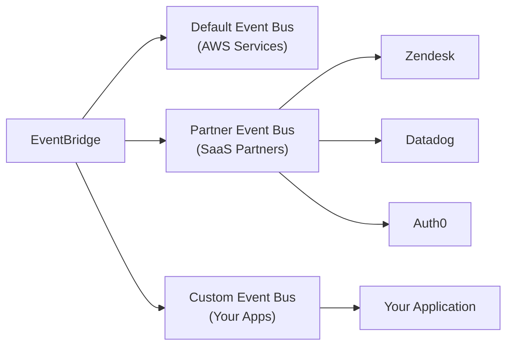
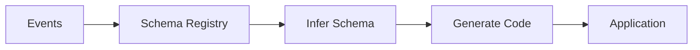
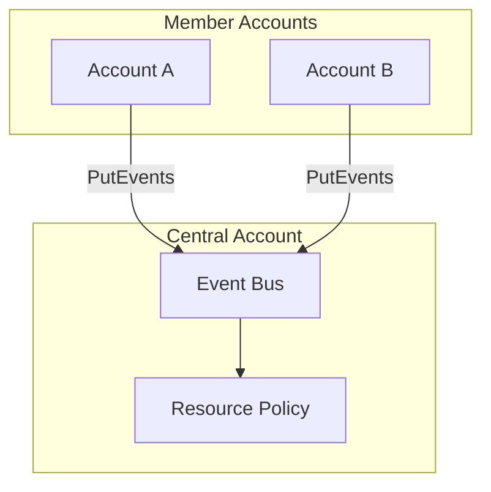

# Domain 1: Detection

## Amazon EventBridge

> **Note**: Previously known as CloudWatch Events. Both names may appear on the exam.

### Overview


- Serverless event bus that routes events between AWS services
- **Default Event Bus**: Receives events from AWS services
- **Schedule**: Cron jobs to trigger actions at specific times
- **Event Pattern**: React to specific service events

### Capabilities

#### Schedule/Cron Jobs
- Trigger Lambda functions on a schedule
- Examples: every hour, every Monday at 8am, first Monday of the month

#### Event Patterns
- React to service events (e.g., IAM root login)
- Filter events by specific criteria (e.g., specific S3 bucket)
- Combine with CloudTrail to intercept any API call

### Event Bus Types



- Serverless event bus that routes events between AWS services
- **Default Event Bus**: Receives events from AWS services
- **Schedule**: Cron jobs to trigger actions at specific times
- **Event Pattern**: React to specific service events

### Capabilities

#### Schedule/Cron Jobs
- Trigger Lambda functions on a schedule
- Examples: every hour, every Monday at 8am, first Monday of the month

#### Event Patterns
- React to service events (e.g., IAM root login)
- Filter events by specific criteria (e.g., specific S3 bucket)
- Combine with CloudTrail to intercept any API call

### Event Bus Types



| Event Bus | Description |
|-----------|-------------|
| **Default** | Events from AWS services (EC2, S3, CodeBuild, etc.) |
| **Partner** | Events from SaaS partners (Zendesk, Datadog, Auth0, etc.) |
| **Custom** | Your own applications can send custom events |

### Destinations

| Destination | Use Case |
|-------------|----------|
| Lambda | Run custom code |
| SNS | Send notifications |
| SQS | Queue events |
| Kinesis Data Streams | Stream to data lakes |
| ECS Task | Launch container tasks |
| SSM Automation | Run SSM runbooks |
| Step Functions | Orchestrate workflows |
| CodePipeline | Trigger CI/CD |
| CodeBuild | Trigger builds |
| EC2 Actions | Start/stop/reboot instances |

### Event Schema & Registry



- **Schema Registry**: EventBridge analyzes events and infers schema
- **Code Generation**: Download code bindings to know event structure in advance
- **Versioning**: Schemas can be versioned over time

### Cross-Account & Archive

#### Cross-Account Access


- Use **resource-based policies** to allow cross-account access
- Central event bus for AWS Organization
- Member accounts can send events to central bus

#### Event Archive & Replay
- Archive all events or filter subsets
- Retention: indefinite or set period
- **Replay**: Replay archived events for debugging/testing

### Creating Rules

#### Event Pattern Example: EC2 State Change
```json
{
  "source": ["aws.ec2"],
  "detail-type": ["EC2 Instance State-change Notification"],
  "detail": {
    "state": ["shutting-down", "terminated"]
  }
}
```
- Filter by EC2 instance state changes
- Catch events like instance termination or shutdown

#### Schedule Options
- **One-time**: Trigger once and done
- **Recurring**: 
  - **Rate-based**: Every X minutes/hours/days
  - **Cron-based**: Specific times (e.g., every Monday at 8am)
- **Flexible time window**: Optional buffer for scheduling

### Retry & Dead-Letter Queue
- Failed deliveries are retried
- Configure **dead-letter queue** for failed events after retries exhausted

### API Destinations
- Send events to **external HTTP endpoints**
- Integrate with on-premises systems or third-party services

### Example Use Cases

#### IAM Root Login Alert
```
IAM Root Sign-in Event → EventBridge → SNS → Email Notification
```

#### EC2 Termination Alert
```
EC2 State Change (terminated) → EventBridge → SNS → Email
```

#### Scheduled Lambda
```
Cron (every hour) → EventBridge → Lambda → Run Script
```

#### CloudTrail Integration
```
CloudTrail API Call → EventBridge → Filter → Lambda → Custom Action
```

### Exam Tips

- **Formerly CloudWatch Events** - know both names
- **Default event bus** receives AWS service events
- Can create **custom event buses** for your applications
- **Partner event buses** for SaaS integrations (Zendesk, Datadog, Auth0, etc.)
- **Schema Registry** - infer schemas and generate code
- **Archive & Replay** - useful for debugging production issues
- **Resource-based policies** enable cross-account event routing
- Combine with **CloudTrail** to capture all API calls as events
- Event patterns use JSON to filter events (e.g., EC2 state = terminating)
- Schedules support **cron** and **rate** expressions
- **Dead-letter queue** handles failed event deliveries
- **API Destinations** connect to external HTTP endpoints