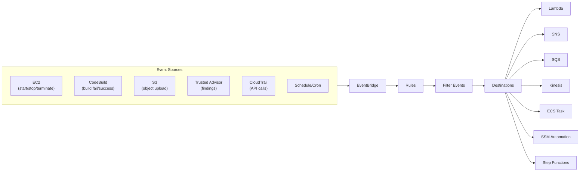
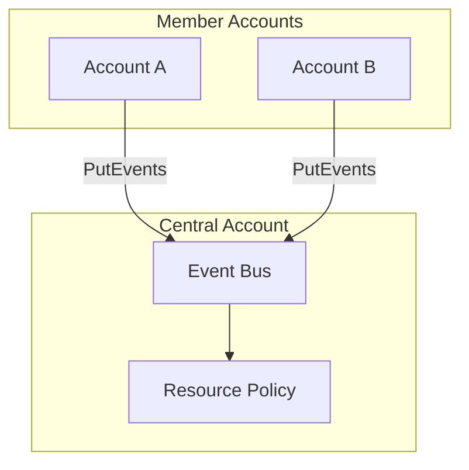

# Amazon EventBridge

> **Note**: Previously known as **CloudWatch Events**. Both names may appear on the exam.

## Overview
**Amazon EventBridge** is a serverless event bus that makes it easy to connect applications together using data from your own applications, integrated SaaS applications, and AWS services. It is the core of event-driven architectures in AWS, allowing you to route events from sources to targets based on rules.



## Key Concepts
- **Event Bus**: Receives events. You can use the **Default** bus (AWS services), **Partner** bus (SaaS), or **Custom** bus (your apps).
- **Rules**: Match incoming events and route them to targets.
- **Targets**: AWS services or HTTP endpoints that receive events in JSON format.
- **Schema Registry**: Stores event structures (schemas) to help developers generate code for event-driven applications.

## Detailed Notes

### 1. Event Bus Types
| Event Bus | Description |
|-----------|-------------|
| **Default** | Receives events from AWS services (EC2, S3, etc.). |
| **Partner** | Receives events from SaaS partners (Zendesk, Datadog, Auth0). |
| **Custom** | Receives events from your own applications via the `PutEvents` API. |

### 2. Creating Rules & Patterns
Rules use JSON patterns to filter events.
- **Event Patterns**: Match specific fields in the event JSON (e.g., matching only "terminated" EC2 instances).
- **Schedules**: Cron or rate expressions to trigger targets at specific times.

#### Event Pattern Example: EC2 State Change
```json
{
  "source": ["aws.ec2"],
  "detail-type": ["EC2 Instance State-change Notification"],
  "detail": {
    "state": ["shutting-down", "terminated"]
  }
}
```

### 3. Advanced Features
- **Archive & Replay**: You can archive events and "replay" them later to debug or recover from failures in your downstream applications.
- **API Destinations**: Send events to any HTTP endpoint outside of AWS (e.g., a 3rd party webhook).
- **Dead-Letter Queues (DLQ)**: SQS queues used to store events that couldn't be delivered to a target after retries.

## Architecture / Flow

### Cross-Account Event Routing
You can aggregate events from multiple accounts into a central event bus using **Resource-Based Policies**.



## Security Relevance
- **Detective/Corrective Control**: EventBridge is the "glue" for automated remediation. For example, a GuardDuty finding can trigger an EventBridge rule that invokes a Lambda function to isolate a compromised instance.
- **Governance**: Intercept sensitive API calls (via CloudTrail) like `iam:CreateUser` to trigger immediate security notifications.

## Operational / Real-World Context
- **SaaS Integration**: Use Auth0 events to trigger user onboarding workflows in AWS.
- **Compliance**: Automatically tag resources as they are created by intercepting the `CreateResource` API call.

## Common Pitfalls / Misconfigurations
- **Missing Permissions**: The EventBridge rule needs an IAM role with permission to invoke the target (e.g., `sns:Publish`).
- **Circular Loops**: Avoid rules that trigger actions that then generate the same event (e.g., a rule that reacts to S3 tags and then updates S3 tags).

## Exam / Review Notes
- **Formerly CloudWatch Events**: The terms are often used interchangeably in older questions.
- **JSON Filtering**: Understand how to read an event pattern.
- **Cross-Account**: Enabled via resource-based policies on the event bus.
- **Partner Events**: SaaS integration is a unique feature of EventBridge.

## Summary
Amazon EventBridge is the central nervous system for AWS automation. It decouples event sources from their handlers, enabling scalable, automated security responses and cross-service integrations.

## Quick Review Checklist
- [ ] Uses Rules to match event patterns or schedules.
- [ ] Supports cross-account aggregation via resource policies.
- [ ] Can replay archived events for troubleshooting.
- [ ] Integrates with SaaS partners (Datadog, Auth0, etc.).
- [ ] API Destinations allow calling external webhooks.
