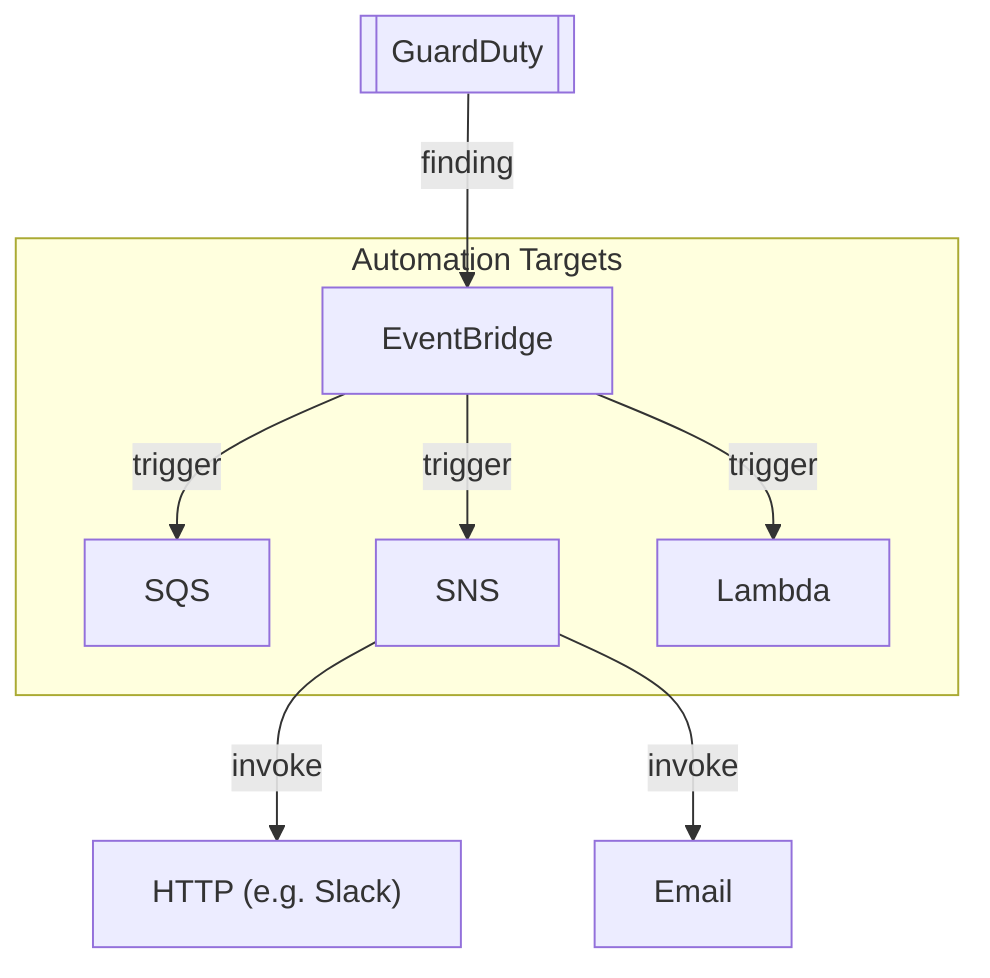
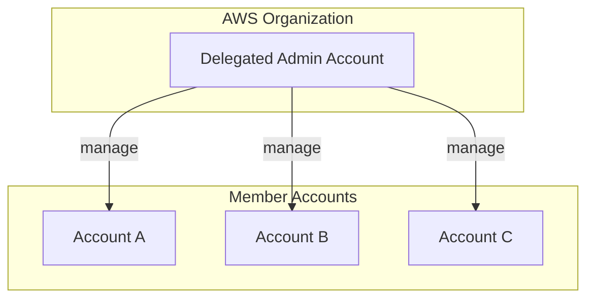

# Amazon GuardDuty

## Overview
**Amazon GuardDuty** is a continuous security monitoring service that analyzes and processes VPC Flow Logs, AWS CloudTrail management events, CloudTrail S3 data events, and DNS logs. It uses threat intelligence feeds and machine learning to identify unexpected and potentially unauthorized and malicious activity within your AWS environment.

```mermaid
flowchart LR
    subgraph DataSources [Data Sources (Primary)]
        direction TB
        VPC(["VPC Flow Logs"])
        CT(["CloudTrail Logs"])
        R53(["Route 53 DNS Query Logs"])
    end

    subgraph Optional [Optional Features]
        direction TB
        S3(["S3 Logs"])
        EBS(["EBS Volumes"])
        LNA(["Lambda Network Activity"])
        RDS(["RDS & Aurora Login Activity"])
        EKS(["EKS Audit Logs & Runtime Monitoring"])
    end

    DataSources --> GD[["GuardDuty"]]
    Optional --> GD

    GD -- "findings" --> EB["EventBridge"]

    EB -- "trigger" --> SNS["SNS"]
    EB -- "invoke" --> Lambda["Lambda"]
```

## Key Concepts
- **Threat Detection**: Uses AI/ML, anomaly detection, and malicious file discovery.
- **One-Click Enable**: No software to install or manage.
- **Findings**: Security alerts with severity scores ranging from 0.1 to 8.9+.
- **Independent Streams**: Pulls data directly from AWS service logs without impacting performance.

## Detailed Notes

### 1. Data Sources & Analysis
| Data Source | What It Detects |
|-------------|-----------------|
| **CloudTrail Management Events** | Unusual API calls, unauthorized deployments, account compromise. |
| **VPC Flow Logs** | Suspicious IP communications, data exfiltration, port scanning. |
| **Route 53 DNS Query Logs** | Domain fluxing, communication with known malicious domains (C2). |

### 2. Protection Plans (Optional)
- **Malware Protection**: Scans EBS volumes for malware without impact on the running instance.
- **S3 Protection**: Monitors object-level activity to detect suspicious access patterns.
- **RDS Protection**: Analyzes login activity to detect brute-force or unauthorized access.
- **Lambda/EKS Protection**: Specialized monitoring for serverless and container workloads.

### 3. Findings & Severity
Findings use a standard naming convention: `ThreatPurpose:ResourceTypeAffected/ThreatFamilyName.DetectionMechanism!Artifact`.
- **Low (0.1 – 3.9)**: Suspicious activity that was already blocked.
- **Medium (4.0 – 6.9)**: Anomalous behavior requiring investigation.
- **High (7.0 – 8.9+)**: High probability of compromise or active attack.

## Architecture / Flow

### Automated Response Workflow


### Multi-Account Strategy
GuardDuty integrates with **AWS Organizations**. A designated **Delegated Admin** account can manage findings across the entire organization.



## Security Relevance
- **Detective Control**: GuardDuty is the primary detective service for identifying infrastructure-level threats.
- **Anomaly Detection**: It establishes a baseline of "normal" behavior and alerts on deviations, helping detect Zero-Day threats or Insider Threats.

## Operational / Real-World Context
- **Global Service**: GuardDuty must be enabled in every region to ensure full coverage, as attackers often target unused regions to avoid detection.
- **Suppression Rules**: Use suppression rules to automatically archive known false positives (e.g., a vulnerability scanner identified as a port scanner).

## Common Pitfalls / Misconfigurations
- **Custom DNS Resolvers**: GuardDuty only analyzes DNS logs if you use the **default VPC DNS resolver**. It cannot see queries sent to 3rd party resolvers (e.g., 8.8.8.8) unless captured in VPC Flow Logs.
- **Regional Silos**: Forgetting to aggregate findings to a central security account can lead to missed alerts in secondary regions.

## Exam / Review Notes
- **No Agent**: One of the biggest selling points is that it is agentless.
- **Trusted vs. Threat IP Lists**: Trusted lists prevent finding generation; Threat lists force finding generation for matching traffic.
- **Archiving**: Archiving a finding in GuardDuty DOES NOT archive it in Security Hub.

## Summary
Amazon GuardDuty is an essential "set-and-forget" service for AWS security. By continuously monitoring logs and applying ML-based threat detection, it provides high-fidelity alerts for account and resource compromise.

## Quick Review Checklist
- [ ] Enabled via a single click; agentless.
- [ ] Analyzes VPC Flow Logs, CloudTrail, and DNS Logs.
- [ ] severity scores: 0.1-3.9 (Low), 4.0-6.9 (Med), 7.0-8.9 (High).
- [ ] Trusted IP lists whitelist known-good traffic.
- [ ] Integrates with EventBridge for automated remediation.
