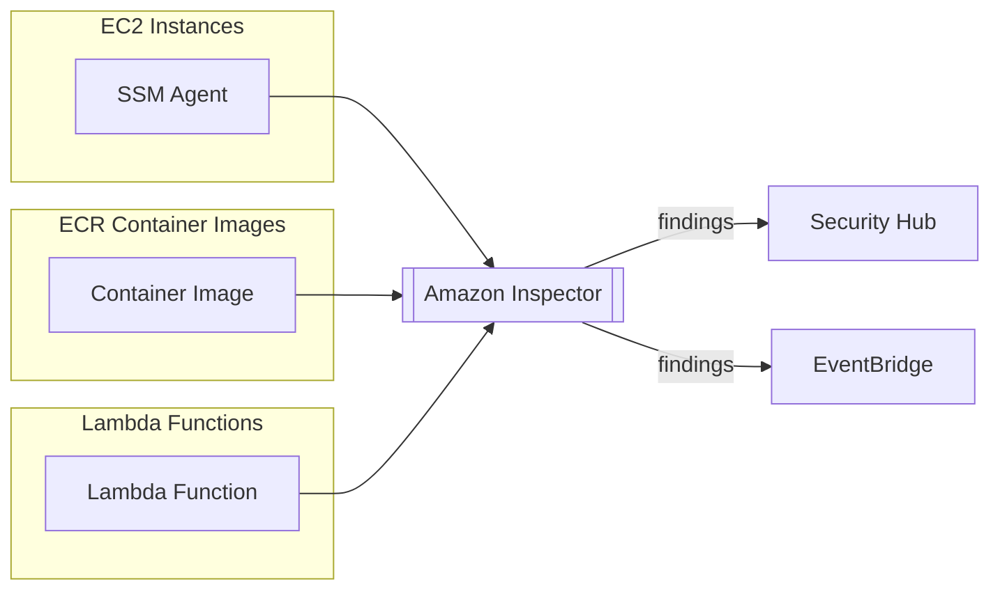
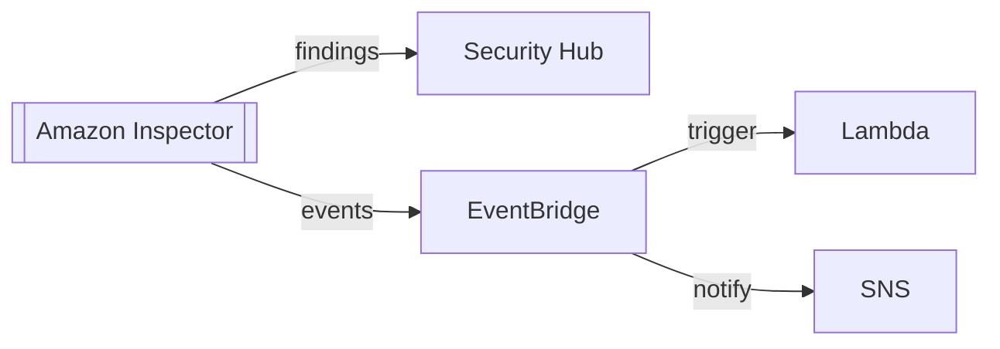

# Domain 1: Detection

## Amazon Inspector

### Overview

- **Automated security assessment service** that finds software vulnerabilities in your AWS environment
- **Continuous scanning** of infrastructure - only when needed
- Integrates with **Security Hub** for centralized findings
- Sends findings and events to **EventBridge** for automation

### What AWS Inspector Evaluates

| Resource Type | What It Analyzes |
|---------------|------------------|
| **EC2 Instances** | Running OS against known vulnerabilities, unintended network accessibility |
| **ECR Container Images** | Container images as they are pushed |
| **Lambda Functions** | Function code and package dependencies |

### Assessment Capabilities

#### EC2 Instances
- Leverages **AWS SSM Agent** to analyze:
  - Running OS against known vulnerabilities
  - Unintended network accessibility
- Identifies CVEs and security misconfigurations

#### Container Images (ECR)
- Assessment of container images as they are pushed to ECR
- Scans for vulnerabilities in:
  - Operating system packages
  - Application dependencies

#### Lambda Functions
- Identifies vulnerabilities in:
  - Function code
  - Package dependencies
- Assessment of functions as they are deployed

### Vulnerability Detection

- **Package Vulnerabilities**: Scans EC2, ECR, and Lambda against a database of CVEs
- **Network Reachability**: Analyzes EC2 instances for unintended network accessibility
- **Risk Scoring**: All vulnerabilities are associated with a risk score for prioritization

### Integration

- **Security Hub**: Centralized security findings
- **EventBridge**: 
  - Sends findings as events
  - Triggers automated responses via Lambda
  - Notifies via SNS

### Key Features

- **Automated Assessments**: Continuously scans your infrastructure
- **On-Demand Scanning**: Scan when needed, not continuously
- **CVE Database**: Comprehensive database of Common Vulnerabilities and Exposures
- **Prioritization**: Risk scores help prioritize remediation efforts
- **Multi-Resource Support**: EC2, ECR, and Lambda coverage