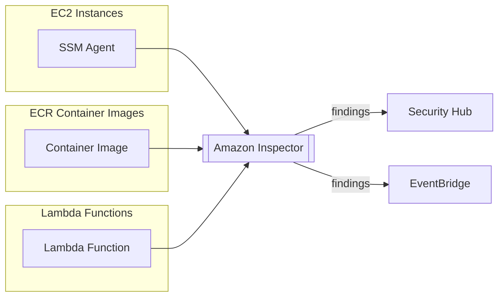
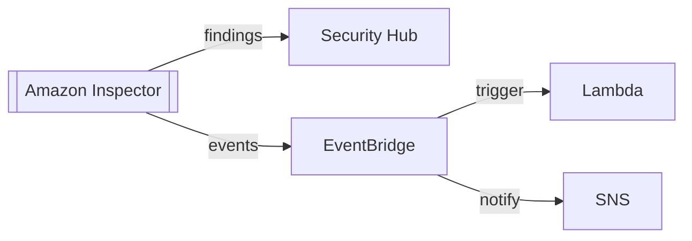

# Amazon Inspector

## Overview
**Amazon Inspector** is an automated security assessment service that helps improve the security and compliance of applications deployed on AWS. It automatically discovers and scans **Amazon EC2** instances, **Amazon ECR** container images, and **AWS Lambda** functions for known software vulnerabilities and unintended network exposure.

## Key Concepts
- **Continuous Scanning**: Automatically scans resources whenever a change occurs (e.g., new image push, new CVE released).
- **Vulnerability Database**: Uses an up-to-date database of Common Vulnerabilities and Exposures (CVEs).
- **Network Reachability**: Analyzes VPC configurations to find EC2 instances accessible from outside the VPC.
- **Risk Scoring**: Provides a highly contextualized score for each finding based on the severity of the vulnerability and the environment.

## Detailed Notes

### 1. Assessment Capabilities
| Resource Type | Assessment Focus |
|---------------|------------------|
| **EC2 Instances** | Analyzes the running OS for CVEs and checks for unintended network accessibility. |
| **ECR Images** | Scans container images for vulnerabilities in OS packages and application dependencies upon push. |
| **Lambda Functions** | Scans function code and associated package dependencies during deployment and continuously thereafter. |

#### EC2 Scans (SSM Agent)
- Inspector leverages the **AWS Systems Manager (SSM) Agent** to perform deep scans of the software installed on the instance.
- It identifies security misconfigurations and software versions with known vulnerabilities.

### 2. Integration & Automation
Inspector is designed to be part of a larger automated security workflow.

- **Security Hub**: Consolidates Inspector findings with alerts from other services.
- **EventBridge**: Triggers near real-time remediation (e.g., blocking a vulnerable container image from being deployed).

## Security Relevance
- **Detective Control**: Inspector identifies "weak spots" before they can be exploited.
- **Patch Management**: Findings highlight which systems require urgent patching, helping prioritize operational tasks based on actual risk.

## Operational / Real-World Context
- **CI/CD Pipelines**: Integrate Inspector with ECR to ensure only "clean" images are promoted to production.
- **Fleet-Wide Visibility**: Provides a single dashboard to see the vulnerability status of thousands of EC2 instances and functions.

## Common Pitfalls / Misconfigurations
- **Missing SSM Agent**: If the SSM Agent is not installed or configured correctly on an EC2 instance, Inspector cannot perform software vulnerability scans.
- **Managed Policies**: Failing to attach the necessary IAM permissions to the SSM role will prevent the agent from communicating with the Inspector service.

## Exam / Review Notes
- **EC2 + ECR + Lambda**: These are the three main targets for Inspector.
- **SSM Agent**: Required for EC2 software scans.
- **Network Reachability**: This is a key feature—it checks if your security groups/NACLs are too open.
- **Security Hub**: Standard destination for centralized findings.

## Summary
Amazon Inspector provides automated, continuous vulnerability management. By scanning compute resources (EC2, ECR, Lambda) for both software flaws and network exposure, it allows security teams to maintain a strong security posture with minimal manual effort.

## Quick Review Checklist
- [ ] Scans EC2, ECR, and Lambda.
- [ ] Requires SSM Agent for EC2 host-level scans.
- [ ] Provides highly contextualized risk scores.
- [ ] Continuously scans when new CVEs are added to the database.
- [ ] Findings integrated with Security Hub and EventBridge.
