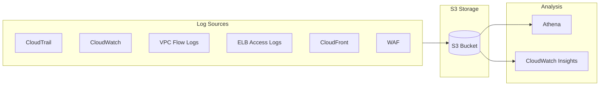
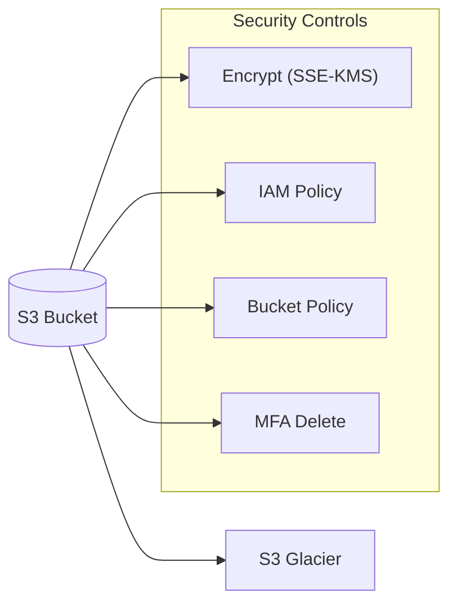
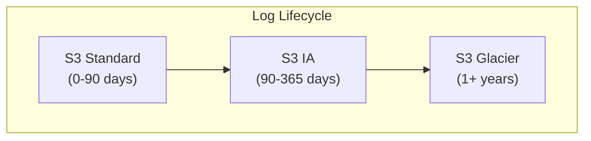

# Domain 1: Detection

## Logging in AWS for Security and Compliance

### Service Logs Overview

| Service | Log Type | Description |
|---------|----------|-------------|
| **CloudTrail** | API Calls | Records all API calls made in your AWS account |
| **AWS Config** | Configuration | Tracks configuration changes over time for compliance |
| **CloudWatch Logs** | Application/Network | Full log data retention for analysis |
| **VPC Flow Logs** | Network Traffic | IP traffic within the VPC |
| **ELB Access Logs** | Request Metadata | Metadata of requests made to Load Balancers |
| **CloudFront Logs** | Web Distribution | Access logs for web distributions |
| **AWS WAF Logs** | Web Requests | Full logging of all requests analyzed by WAF |

### Log Storage and Analysis

- **AWS Athena**: Can analyze all logs stored in S3 (common exam question)
- **CloudWatch Logs Insights**: For analyzing CloudWatch logs

### S3 Log Security

When storing logs in S3:

- **Encryption**: Enable S3 server-side encryption (SSE-S3 or SSE-KMS)
- **Access Control**: Use IAM policies and S3 bucket policies
- **MFA Delete**: Enable MFA delete to prevent accidental deletion
- **Versioning**: Enable versioning for log retention
- **Lifecycle Policies**: Move logs to S3 Glacier for cost savings

### Log Retention Strategy

- **Short-term**: Keep active logs in S3 Standard for quick access
- **Long-term**: Move to S3 Glacier for cost-effective archival
- **Compliance**: Configure lifecycle rules based on retention requirements

### Key Security Considerations

- **完整性 (Integrity)**: Use CloudTrail with S3 bucket versioning to ensure log integrity
- **可用性 (Availability)**: Cross-region replication for critical logs
- **机密性 (Confidentiality)**: Encrypt sensitive logs at rest
- **合规性 (Compliance)**: Use AWS Config rules to monitor compliance of log configurations