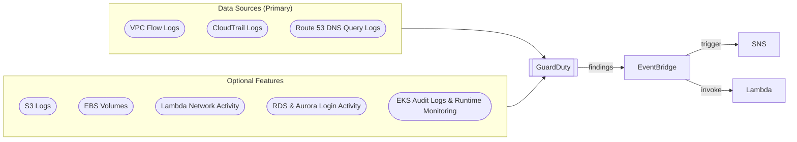
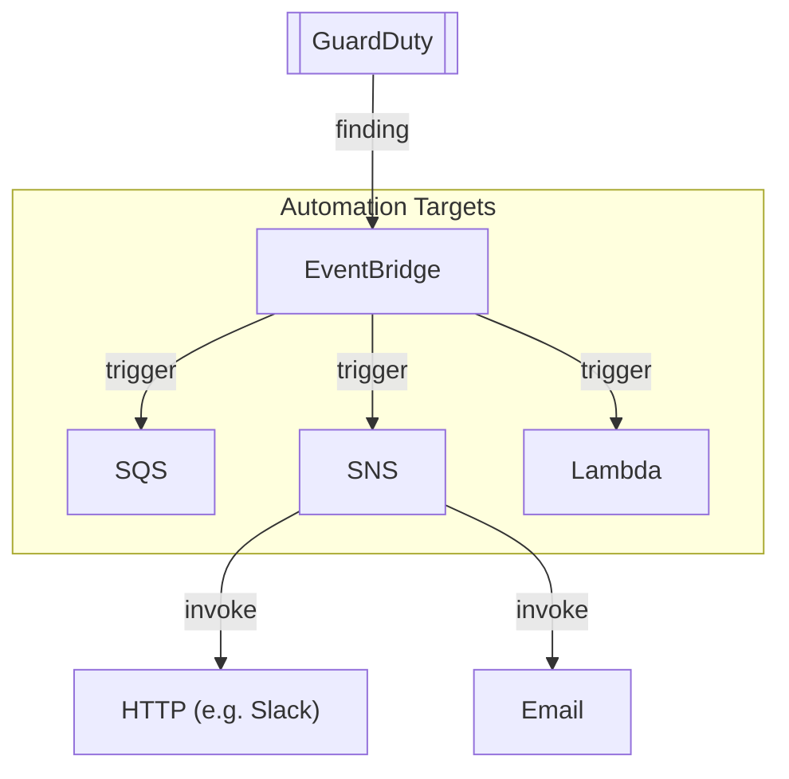

# Domain 1: Detection

## GuardDuty

### Service Architecture

### Overview
- **Threat detection service** that uses AI/ML, anomaly detection, and malicious file discovery
- **No software to install** - one-click enable
- **Findings** can be sent to EventBridge for automation via Lambda + SNS

### What It Analyzes
| Data Source | What It Detects |
|-------------|-----------------|
| CloudTrail Management Events | Unusual API calls, unauthorized deployments |
| VPC Flow Logs | IP addresses, strange/malicious traffic |
| R53 DNS Query Logs | Compromised EC2 sending encoded data via DNS queries |

### Extended Threat Protection
- Detects **multi-stage attacks** spanning multiple data sources and AWS resources

### Use Cases

#### 1. Detect Compromised EC2/ECS/EKS
- Malware activity / crypto mining
- Malicious domain communications
- TOR networks
- Reverse shells

#### 2. Anomalous Network Traffic
- Unusual/suspicious network traffic
- Malicious IP communication
- Data exfiltration
- Port scanning / brute force
- Outbound port scans

#### 3. Compromised AWS Account
- Suspicious use of AWS account resources
- API calls from unfamiliar IP addresses
- Compromised IAM credentials
- IAM role enumeration
- Attempts to disable CloudTrail logging

### Protection Plans (Optional Extensions)

| Plan | Description |
|------|-------------|
| Malware Protection for EC2 | Scans EBS volumes to detect malware |
| EKS Protection | Monitors Kubernetes audit logs from EKS clusters |
| Runtime Monitoring | OS-level events on EC2/ECS/EKS |
| Lambda Protection | Lambda network activity monitoring (via VPC flow logs) |
| S3 Protection | Identifies security risks for S3 buckets |
| Malware Protection for S3 | Scans uploaded objects to detect malware |
| Malware Protection for AWS Backups | Scans backups (EBS snapshots, AMIs, etc.) |
| RDS Protection | Analyzes RDS/Aurora login activity for access threats |

## GuardDuty Findings & Automations

### Findings Characteristics
- **Data Streams**: Pulls independent streams directly from CloudTrail (management & data events), VPC Flow Logs, and EKS logs.
- **Severity Scores**: Range from **0.1 to 8.9+**.
    - **Low**: 0.1 – 3.9
    - **Medium**: 4.0 – 6.9
    - **High**: 7.0 – 8.9+
- **Naming Convention**: `ThreatPurpose:ResourceTypeAffected/ThreatFamilyName.DetectionMechanism!Artifact`
- **Testing**: Generate **sample findings** in the GuardDuty console to verify automation workflows.
- **Investigation**: Use the console to identify the specific **API** used to invoke a finding.

### Automated Response
- **EventBridge Integration**: Primary mechanism for automated security responses.
- **Multi-Account**: Events are published to both the **administrator account** and the **member account** of origin.
- **Workflow Example**: GuardDuty Findings → EventBridge (Filter for High/Critical) → SNS Topic → Administrator Notification.

#### Automation Architecture

