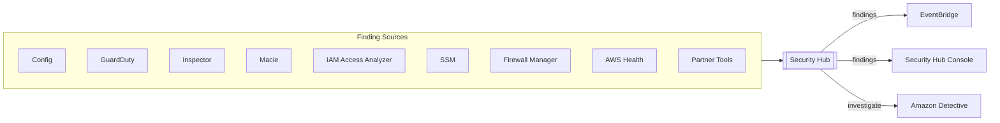
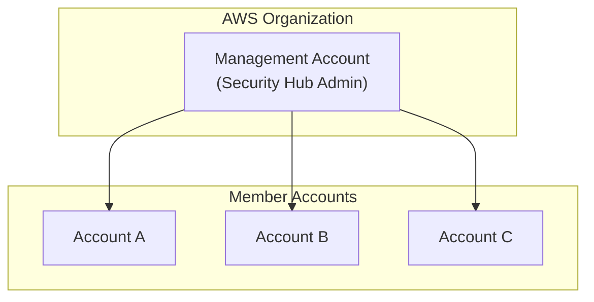
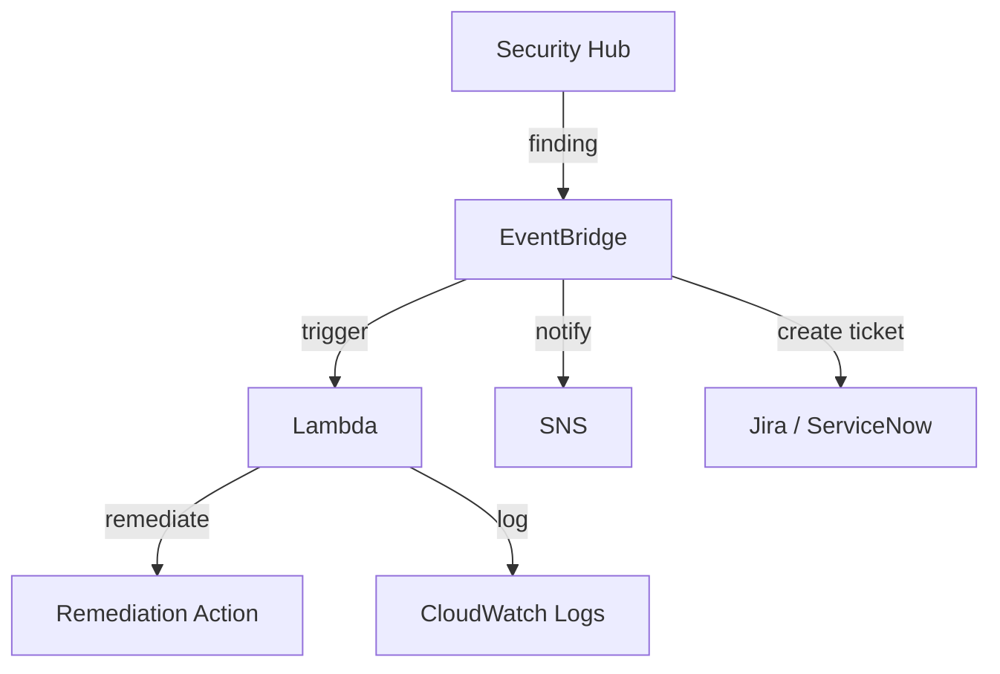

# AWS Security Hub

## Overview
**AWS Security Hub** is a cloud security posture management service that performs security best practice checks, aggregates alerts, and enables automated remediation. it provides a comprehensive view of your security state within AWS and helps you check your environment against security industry standards and best practices.

## Key Concepts
- **Centralized Management**: Consolidates findings from multiple AWS services and 3rd party partners.
- **ASFF (AWS Security Finding Format)**: A standardized JSON format for all findings, regardless of the source.
- **Insights**: Groupings of findings that point to specific security issues requiring attention (e.g., "S3 buckets with public read access").
- **Security Standards**: Automated, continuous checks against standards like CIS AWS Foundations, PCI DSS, and NIST.

## Detailed Notes

### 1. Integration Requirements
- **AWS Config**: Security Hub **requires** AWS Config to be enabled in all accounts and regions where you want to perform security checks.
- **Resource Recording**: Config must be recording the resources being checked for the findings to be accurate.

### 2. Multi-Account Strategy
Security Hub is designed for organizations. You can designate a single account as the **Security Hub Administrator** to aggregate findings from all member accounts.

### 3. Finding Characteristics
- **Update Cycle**: Findings are automatically updated when the status of the underlying resource changes.
- **Retention**: findings are automatically deleted after **90 days** if they are not updated.
- **ASFF Structure**: Includes Finding ID, Severity, Region, Product ARN, and Resource ARN.

## Architecture / Flow

### Automated Remediation Workflow
Security Hub integrates with **Amazon EventBridge** to trigger custom actions.

## Security Relevance
- **Posture Management**: Continuously monitors if your environment drifts from security best practices.
- **Single Pane of Glass**: Reduces "alert fatigue" by aggregating disparate security alerts into a single console.

## Operational / Real-World Context
- **Centralized Dashboards**: Executives and security leads use Security Hub to get a high-level view of compliance scores across the organization.
- **Incident Response**: Findings serve as the entry point for incident response workflows, often linking directly to Amazon Detective for deeper investigation.

## Common Pitfalls / Misconfigurations
- **Config Not Enabled**: The most common reason Security Hub "isn't working" is that AWS Config was never enabled in the member accounts.
- **Region Exclusion**: Security Hub is a regional service. You must enable it in every region and use **Cross-Region Aggregation** to see everything in one place.
- **Archiving Findings**: Archiving a finding in the source service (like GuardDuty) does **not** archive it in Security Hub.

## Exam / Review Notes
- **Config Required**: You cannot use Security Hub without AWS Config.
- **ASFF**: This is the standard format used by Security Hub.
- **Administrator Account**: Used to manage multiple member accounts.
- **Remediation**: Handled via EventBridge + Lambda.

## Summary
AWS Security Hub is the central hub for security monitoring in AWS. By standardizing findings into the ASFF format and integrating with AWS Config and EventBridge, it enables a "Detect -> Analyze -> Respond" loop at scale.

## Quick Review Checklist
- [ ] AWS Config must be enabled.
- [ ] Uses ASFF for all findings.
- [ ] Findings persist for 90 days.
- [ ] Cross-region aggregation should be enabled.
- [ ] Use EventBridge for automated remediation.
