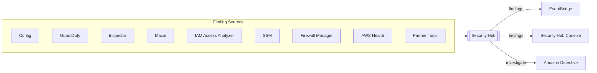
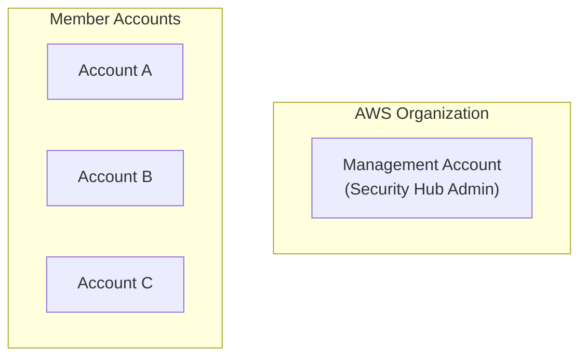
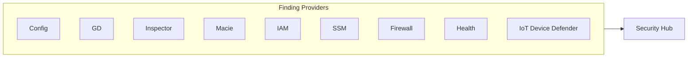
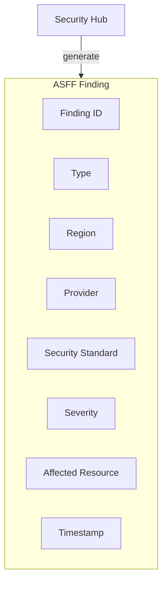
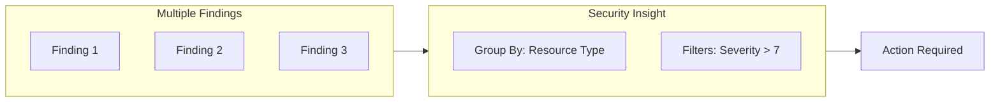
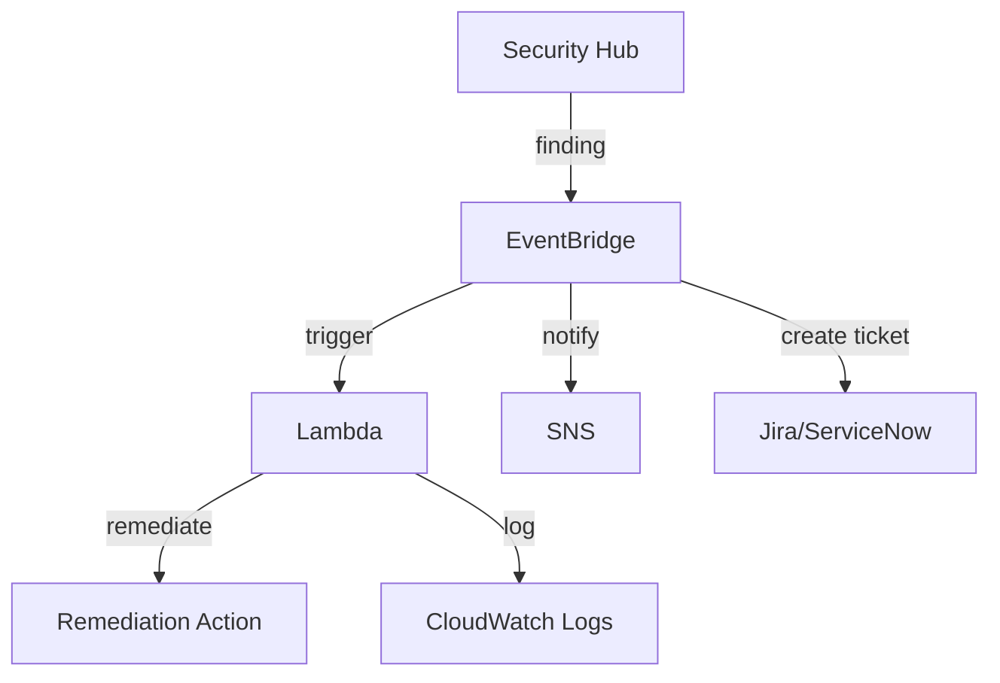

# Domain 1: Detection

## Security Hub

### Service Architecture

### Overview
- **Central security tool** to manage security across several AWS accounts
- **Automates security checks** via predefined or custom findings
- **Requires AWS Config service** to be enabled
- Collects issues and findings from multiple AWS services
- Generates EventBridge events for security issues

### Finding Sources
| Service | Type |
|---------|------|
| Config | Configuration rules compliance |
| GuardDuty | Threat detection |
| Inspector | Vulnerability assessments |
| Macie | Data classification and protection |
| IAM Access Analyzer | Access analyzer findings |
| SSM | Patch compliance, operational issues |
| Firewall Manager | WAF, Shield, security policy compliance |
| AWS Health | Service health events |
| Partner Tools | APN security solutions |

### Cross-Account & Region Features

### Organization Integration
- Manage all accounts in the organization
- Automatically detects new accounts
- Management account is the Security Hub admin by default
- Can designate a member account as Security Hub admin
- **AWS Config must be enabled** on all accounts (Security Hub does not manage AWS Config)

## Security Standards

### Supported Standards
- CIS AWS Foundations
- PCI DSS
- AWS Foundational Security Best Practices

### How Standards Work
- Generates findings from continuous checks against rules
- Each standard has predefined security controls
- Findings are formatted in AWS Security Finding Format (ASFF)

## Security Hub Integrations

### Services Sending Findings to Security Hub

| Service | Integration |
|---------|-------------|
| Config | Configuration rules |
| Firewall Manager | Security policy findings |
| GuardDuty | Threat detections |
| AWS Health | Service health events |
| IAM Access Analyzer | Access analyzer findings |
| Inspector | Vulnerability scan results |
| IoT Device Defender | IoT security findings |
| Macie | Data discovery findings |
| SSM Patch Manager | Patch compliance |

### Services Receiving Findings from Security Hub
- Amazon Detective (investigation)
- AWS Chatbot (Slack/Teams notifications)
- AWS Config (configuration recording)
- AWS Systems Manager (OpsCenter/Explorer)
- Trusted Advisor
- Audit Manager

### Third-Party Integrations

#### Send Findings to Security Hub
- 3coresec
- AlertLogic
- Aqua

#### Receive Findings from Security Hub
- Atlassian
- FireEye
- Fortinet

#### Update Findings in Security Hub
- Atlassian
- ServiceNow

## Findings

### AWS Security Finding Format (ASFF)

### Finding Characteristics
- Automatically updates findings when status changes
- Automatically deletes findings after 90 days
- Filter by:
  - Region
  - Integration source
  - Security standard
  - Insight
  - Severity

### GuardDuty Integration
- Automatically integrates when Security Hub is enabled
- Findings formatted into ASFF
- Findings sent within 5 minutes
- **Important**: Archiving GuardDuty findings does NOT update them in Security Hub
- Archiving is separate between the two services

## Insights

### Overview
- Collection of related findings identifying a security area requiring attention
- Groups findings across multiple finding providers
- Defined by a **Group By** statement and optional filters

### Insight Types
- **Managed Insights**: Pre-built insights by AWS
- **Custom Insights**: User-defined grouping rules

### Examples
- EC2 instances with findings detecting poor security practices
- IAM credentials with suspicious activity
- S3 buckets with public access issues

## Custom Actions

### Overview
- Automate Security Hub with EventBridge
- Create actions for response and remediation
- Trigger on selected findings

### Use Cases

### Automation Workflow
1. **Detect**: Security Hub identifies a finding
2. **Ingest**: EventBridge receives the finding event
3. **Remediate**: Lambda executes remediation
4. **Log**: Actions logged for audit trail

### Common Automation Patterns
- Auto-remediation via Lambda
- Notification to security team via SNS
- Ticket creation in ITSM tools
- Integration with SOAR platforms
