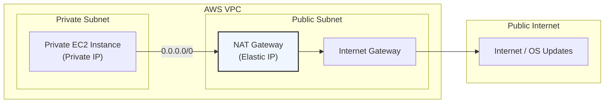

# AWS NAT Gateway

## Overview
A **NAT Gateway** (Network Address Translation) is a managed AWS service that allows instances in a **private subnet** to connect to the internet or other AWS services (outbound traffic) while preventing the internet from initiating a connection with those instances (inbound traffic). It is a more scalable and reliable alternative to the legacy NAT Instance.

## Key Concepts
- **Public Subnet Requirement**: A NAT Gateway must be created in a public subnet (a subnet with a route to an Internet Gateway).
- **Elastic IP (EIP)**: A NAT Gateway requires a static public IPv4 address (Elastic IP) to communicate with the internet.
- **Unidirectional Traffic**: It allows outbound responses but blocks unsolicited inbound requests.
- **Managed Service**: AWS handles scaling (from 5 Gbps to 100 Gbps), patching, and high availability within a single Availability Zone.

## Detailed Notes

### 1. Networking & Connectivity
- **Route Table Configuration**: To use a NAT Gateway, you must update the route table of the private subnet to send internet-bound traffic (`0.0.0.0/0`) to the NAT Gateway ID (`nat-xxxxxxxx`).
- **Dependency**: A NAT Gateway cannot function without an **Internet Gateway (IGW)** attached to the VPC.
- **Bandwidth**: Starts at 5 Gbps and scales automatically to 100 Gbps.

### 2. High Availability (HA)
- **AZ Redundancy**: A NAT Gateway is redundant within a single Availability Zone (AZ).
- **Multi-AZ Architecture**: If the AZ where the NAT Gateway resides goes down, private subnets in other AZs lose internet access. 
- **Best Practice**: To achieve fault tolerance, deploy one NAT Gateway per AZ and configure AZ-specific route tables.

### 3. NAT Gateway vs. NAT Instance
| Feature | NAT Gateway | NAT Instance |
|---------|-------------|--------------|
| **Management** | Fully managed by AWS. | Managed by the user (patching, OS). |
| **Availability** | Highly available within an AZ. | Requires custom failover scripts. |
| **Bandwidth** | Scales up to 100 Gbps. | Depends on the EC2 instance type. |
| **Security Groups** | Not used/required. | Required to control traffic. |
| **Bastion Host** | Cannot be used as a Bastion. | Can be used as a Bastion. |
| **Source/Dest Check** | Not applicable. | Must be disabled on the instance. |

## Architecture / Flow

## Security Relevance
- **Preventive Control**: Acts as a security barrier by ensuring that backend servers cannot be reached directly from the internet.
- **Simplified Security**: Since NAT Gateways don't use security groups, the security focus remains on the individual EC2 instance security groups and Network ACLs.
- **Centralized Outbound Path**: Allows for easier auditing of outbound traffic when combined with VPC Flow Logs.

## Operational / Real-World Context
- **Updates & Patches**: The primary use case is allowing private instances (like database servers or app servers) to run `yum update` or reach external APIs.
- **Cost**: You are charged for the NAT Gateway hourly rate and a data processing fee per GB. In high-traffic environments, data processing costs can become significant.

## Common Pitfalls / Misconfigurations
- **Placement**: Placing the NAT Gateway in a private subnet (it will not have internet access).
- **Route Table Missing**: Forgetting to update the private subnet's route table to point to the NAT Gateway.
- **Black Hole Routes**: If a NAT Gateway is deleted but the route remains in the route table, the route status becomes "Black Hole," and traffic will drop.
- **Single Point of Failure**: Using only one NAT Gateway for a Multi-AZ VPC.

## Exam / Review Notes
- **NAT Gateway vs Bastion**: NAT Gateway is for **Outbound** traffic; Bastion is for **Inbound** management.
- **Fault Tolerance**: Always recommend one NAT Gateway per AZ for production workloads.
- **Security Groups**: NAT Gateways do **not** have security groups.
- **EIP**: One Elastic IP is required per NAT Gateway.

## Summary
A NAT Gateway provides a highly available and managed way for private instances to access the internet. It requires a public subnet, an Elastic IP, and an IGW to function. For production environments, it is superior to NAT instances due to its managed nature and automatic scaling.

## Quick Review Checklist
- [ ] NAT Gateway is in a **Public Subnet**.
- [ ] Private subnet route table has a route: `0.0.0.0/0 -> NAT-GW`.
- [ ] Elastic IP is allocated and associated.
- [ ] For Multi-AZ HA, there is one NAT Gateway per AZ.
- [ ] IGW is attached to the VPC.
