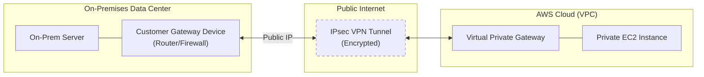

# AWS Site-to-Site VPN

## Overview
**AWS Site-to-Site VPN** creates a secure, encrypted tunnel between an on-premises network (data center or office) and an AWS VPC over the public internet. It uses **IPsec** (Internet Protocol Security) to ensure data confidentiality and integrity, allowing the two networks to communicate as if they were on the same private network.

## Key Concepts
- **Virtual Private Gateway (VGW)**: The VPN concentrator on the AWS side of the connection. It is attached to a specific VPC.
- **Customer Gateway (CGW)**: A resource representing the physical device or software application on the on-premises side of the connection.
- **Customer Gateway Device**: The actual hardware (e.g., Cisco, Juniper) or software (e.g., strongSwan) on-premises.
- **VPN Connection**: The logical connection consisting of two encrypted tunnels for high availability.
- **Route Propagation**: An AWS VPC feature that automatically pushes the on-premises network routes into the VPC route tables.

## Detailed Notes

### 1. Gateway Addressing
- **Public CGW**: If the CGW has a public, internet-routable IP, use that IP for the configuration.
- **Private CGW (Behind NAT)**: If the CGW is behind a NAT device, use the **Public IP of the NAT device**. Ensure **NAT-Traversal (NAT-T)** is enabled on the on-premises device (UDP port 4500).

### 2. Implementation Requirements
- **Route Propagation**: Even if the VPN tunnel is "Up," traffic will not flow until **Route Propagation** is enabled in the VPC route table settings. This allows the VGW to advertise on-premises routes to the subnets.
- **Security Groups**: Ensure that Security Groups and Network ACLs allow the necessary traffic. 
    - > **Exam Tip**: If a ping fails between on-prem and AWS, check if **ICMP** is allowed in the inbound rules of the target Security Group.
- **High Availability**: Each Site-to-Site VPN connection includes **two tunnels** to different AWS endpoints. For true end-to-end HA, the customer should also use two CGW devices on-premises.

### 3. AWS VPN CloudHub
CloudHub is a hub-and-spoke model used to provide secure communication between multiple remote sites.
- **Architecture**: Multiple remote sites (CGWs) connect to a single VGW.
- **Connectivity**: Sites can communicate with each other through the VGW.
- **Routing**: Requires **Dynamic Routing** (BGP) to be configured on all VPN connections.
- **Network Path**: All traffic flows over the public internet (encrypted via VPN).

## Architecture / Flow

## Security Relevance
- **Data Protection**: Provides encryption in transit for data moving between on-premises and AWS.
- **Isolation**: Keeps administrative and application traffic off the unencrypted public internet.
- **Compliance**: Helps meet regulatory requirements for secure data transmission between physical and cloud locations.

## Operational / Real-World Context
- **Setup Steps**:
    1. Create **Customer Gateway** (provide on-prem IP).
    2. Create **Virtual Private Gateway**.
    3. Attach VGW to the VPC.
    4. Create **VPN Connection** linking CGW and VGW.
    5. Download configuration file for the on-prem device.
    6. Enable **Route Propagation** in VPC Route Tables.

## Common Pitfalls / Misconfigurations
- **Route Propagation Disabled**: The most common reason for "connected but no traffic" issues.
- **Overlapping CIDRs**: If the on-premises network and the VPC use the same IP ranges, routing will fail.
- **MTU Issues**: VPN tunnels have overhead; if the MTU is too high, packets may be dropped or fragmented (typical VPN MTU is 1427).
- **IKE Policy Mismatch**: Phase 1 or Phase 2 encryption/hash settings must match exactly between the CGW and AWS.

## Exam / Review Notes
- **VGW vs. CGW**: VGW is AWS side; CGW is your side.
- **CloudHub**: Used for site-to-site communication (site A to site B) via AWS.
- **Public Internet**: Unlike Direct Connect, VPN travels over the public internet.
- **Transit Gateway**: For modern architectures with many VPCs, **Transit Gateway** is preferred over VGW for managing VPN connections.

## Summary
AWS Site-to-Site VPN provides a quick-to-deploy, encrypted connection between on-premises environments and AWS. It relies on a Virtual Private Gateway (AWS) and a Customer Gateway (On-prem) and requires route propagation to be enabled in the VPC for successful communication.

## Quick Review Checklist
- [ ] VGW created and attached to the correct VPC?
- [ ] CGW created with the correct public IP (or NAT public IP)?
- [ ] VPN Connection established with two active tunnels?
- [ ] **Route Propagation** enabled in the subnet route tables?
- [ ] Security Groups allow the required traffic (including ICMP for testing)?
- [ ] Dynamic (BGP) vs. Static routing correctly chosen?
