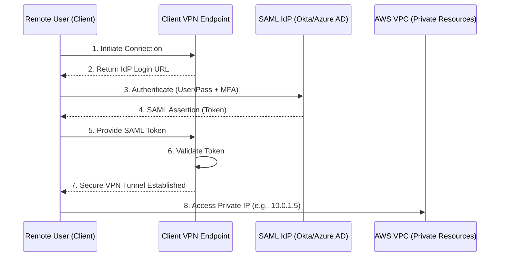

# AWS Client VPN

## Overview
**AWS Client VPN** is a managed client-based VPN service that enables users to securely access AWS resources and on-premises networks from any location using an **OpenVPN-based** client. Unlike Site-to-Site VPN (which connects two networks), Client VPN connects individual users (laptops/workstations) to a VPC.

## Key Concepts
- **Client VPN Endpoint**: The resource you create and configure to enable and manage client VPN sessions.
- **Target Network Association**: Associating a VPC subnet with the Client VPN endpoint to provide access to that VPC.
- **Authorization Rules**: Specifically defining which users (based on AD groups or network CIDRs) have access to which network ranges.
- **Client Software**: Users connect using an OpenVPN-compatible client or the AWS-provided Client VPN software.

## Detailed Notes

### 1. Connectivity & Use Cases
- **Private Access**: Allows remote employees to access EC2 instances, RDS databases, or internal websites using **Private IP addresses** as if they were local to the VPC.
- **Extended Reach**: If the target VPC is connected to an on-premises data center (via Site-to-Site VPN or Direct Connect), Client VPN users can also access on-premises resources privately.
- **Internet Access**: Can be configured to route all client internet traffic through the VPC (Split-tunneling off) or only VPC-bound traffic (Split-tunneling on).

### 2. Authentication Types
AWS Client VPN supports three main methods for verifying user identity:

#### A. Active Directory Authentication (User-based)
- Integrates with **AWS Directory Service** (Managed Microsoft AD or AD Connector).
- Users log in with their existing corporate credentials.
- Supports **Multi-Factor Authentication (MFA)**.

#### B. Mutual Authentication (Certificate-based)
- Uses digital certificates for both the client and the server.
- The server and client certificates must be uploaded to **AWS Certificate Manager (ACM)**.
- Each user typically has a unique client certificate for identification and revocation.

#### C. SAML 2.0 Based Federated Authentication (SSO)
- Supports **IAM Identity Center** (formerly AWS SSO) or external IdPs (Okta, Ping, Azure AD).
- Uses the SAML 2.0 protocol for authentication.
- **Flow**: Client initiates -> Endpoint provides IdP URL -> User logs into IdP -> IdP returns SAML Token -> Token passed to Client VPN -> Access granted.

## Architecture / Flow

### SAML 2.0 Authentication Flow

## Security Relevance
- **Data Protection**: Encrypts all traffic between the user's device and the AWS network over the public internet.
- **Authorization Rules**: Provides granular control over which users can access specific subnets or CIDR blocks.
- **Connection Logging**: Detailed logs can be sent to **CloudWatch Logs**, recording connection attempts, duration, and the source IP of the user.

## Operational / Real-World Context
- **Split Tunneling**: 
    - **Enabled**: Only traffic destined for the VPC goes through the VPN. This saves bandwidth and reduces latency for the user's internet activity.
    - **Disabled**: All traffic goes through the VPN, allowing for centralized inspection of the user's internet traffic.
- **Client Configuration**: Administrators export a `.ovpn` configuration file from the AWS Console and provide it to users.

## Common Pitfalls / Misconfigurations
- **Security Group Rules**: The Client VPN endpoint has its own security group. If it doesn't allow outbound traffic to the target resources, the connection will fail.
- **Routing Table**: Forgetting to add routes for on-premises CIDRs in the Client VPN route table if "extended reach" is required.
- **Certificate Expiration**: Mutual authentication fails immediately if the certificates in ACM expire.

## Exam / Review Notes
- **OpenVPN**: The underlying protocol for AWS Client VPN.
- **Three Auth Types**: AD, Mutual (ACM), and SAML (SSO).
- **MFA**: Supported via AD and SAML authentication.
- **Split Tunneling**: Know the difference for bandwidth and security implications.
- **Private IP Access**: The core purpose is reaching private IPs without an IGW or public IP on the target.

## Summary
AWS Client VPN provides a managed, scalable, and secure way for remote users to connect to AWS resources using an OpenVPN client. It supports robust authentication methods including AD, Certificates, and SAML-based SSO, and allows for fine-grained authorization to network resources.

## Quick Review Checklist
- [ ] Client VPN Endpoint created and associated with a subnet?
- [ ] Authentication method chosen (AD, Mutual, or SAML)?
- [ ] Authorization rules defined for specific CIDR ranges?
- [ ] Security Groups allow traffic from the Client VPN ENI to target resources?
- [ ] Split-tunneling preference set correctly?
- [ ] Client configuration file (.ovpn) exported and distributed?
