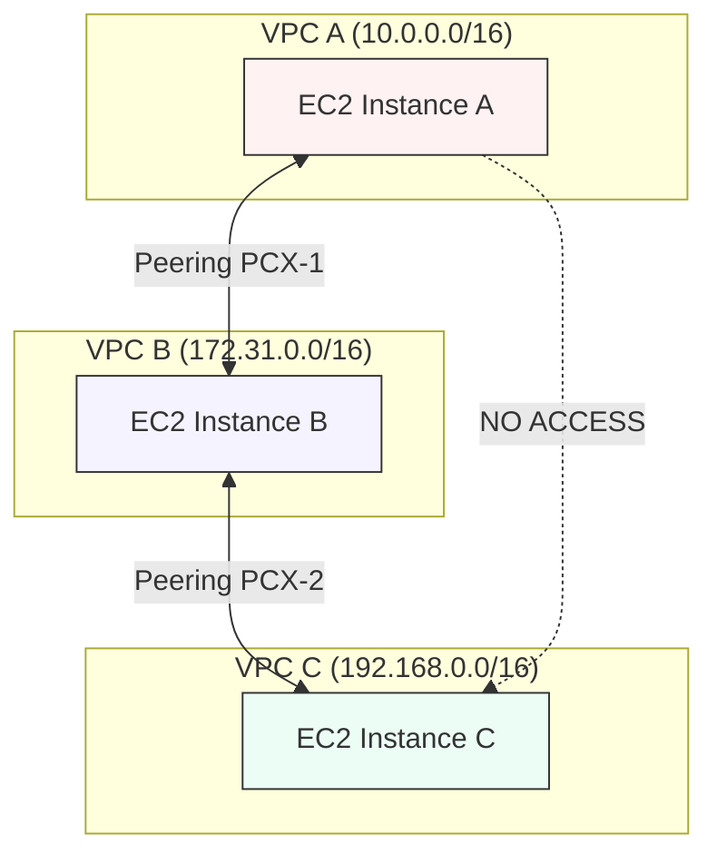

# VPC Peering

## Overview
**VPC Peering** is a networking connection between two VPCs that enables you to route traffic between them using private IPv4 or IPv6 addresses. Instances in either VPC can communicate with each other as if they are within the same network. AWS uses the existing infrastructure of a VPC to create a VPC peering connection; it is neither a gateway nor a VPN connection, and does not rely on separate physical hardware.

## Key Concepts
- **Requester and Acceptor**: One VPC sends a request to peer, and the owner of the target VPC must accept it.
- **Non-Transitive**: Peering is strictly between two VPCs. If VPC A is peered with VPC B, and VPC B is peered with VPC C, VPC A **cannot** communicate with VPC C through VPC B.
- **No Overlapping CIDRs**: You cannot peer VPCs that have matching or overlapping IP address ranges.
- **Regions and Accounts**: Peering works across different AWS accounts and across different AWS Regions (Inter-Region VPC Peering).

## Detailed Notes

### 1. Connectivity and Routing
- **AWS Backbone**: Traffic stays on the private AWS network and never traverses the public internet.
- **Route Table Updates**: Establishing the peering connection is not enough. You must manually add a route in the route tables of **both** VPCs pointing to the CIDR of the peered VPC via the Peering Connection ID (`pcx-xxxxxx`).
- **DNS Resolution**: You can enable DNS hostnames resolution so that queries for private DNS hostnames of instances in the peered VPC resolve to their private IP addresses.

### 2. Security Group Referencing
- **Cross-VPC Referencing**: You can allow traffic to/from a Security Group in a peered VPC.
- **Scope**: This works within the same region, even if the VPCs are in different accounts.
- **Benefit**: Instead of allowing a whole CIDR range, you can allow exactly the instances belonging to a specific Security Group, enforcing the principle of least privilege.

### 3. Inter-Region Peering
- **Encryption**: All inter-region traffic is encrypted by AWS using modern AEAD (Authenticated Encryption with Associated Data) algorithms.
- **Latency**: Subject to the physical distance between regions, but still stays on the AWS global network.

## Architecture / Flow

### Non-Transitive Peering Logic

## Security Relevance
- **Private Communication**: Keeps sensitive traffic off the public internet.
- **Principle of Least Privilege**: Using Security Group referencing (where supported) is more secure than CIDR-based rules.
- **Isolation**: Allows for "Shared Services" architectures where a central security/logging VPC is peered with multiple application VPCs.

## Operational / Real-World Context
- **VPC Peering Mesh**: In large environments, managing many peering connections becomes complex (N*(N-1)/2 connections). For many VPCs, **AWS Transit Gateway** is the preferred scalable solution.
- **Data Transfer Costs**: There is a cost for data transfer across peering connections (same as across Availability Zones).

## Common Pitfalls / Misconfigurations
- **Overlapping CIDRs**: Attempting to peer two VPCs that both use `10.0.0.0/16`.
- **Route Table Neglect**: Forgetting to update the route tables after the peering is accepted.
- **Transitive Expectations**: Expecting a "hub" VPC to act as a router for "spoke" VPCs.
- **Security Group Inbound Rules**: Forgetting to allow the peered CIDR or SG in the inbound rules of the destination instance.

## Exam / Review Notes
- **Transitivity**: Peering is **never** transitive.
- **CIDRs**: Must be unique (no overlap).
- **SG Referencing**: Supported across accounts within the **same region**.
- **Public Internet**: Traffic does **not** go over the internet, even for inter-region peering.

## Summary
VPC Peering provides a high-performance, private connection between VPCs. It is ideal for point-to-point connections but requires careful route management and does not support transitive routing.

## Quick Review Checklist
- [ ] Peering request accepted by the owner?
- [ ] Non-overlapping CIDR blocks verified?
- [ ] Routes added to **both** VPC route tables?
- [ ] Security groups updated to allow peered traffic?
- [ ] (Optional) Private DNS resolution enabled in peering settings?
