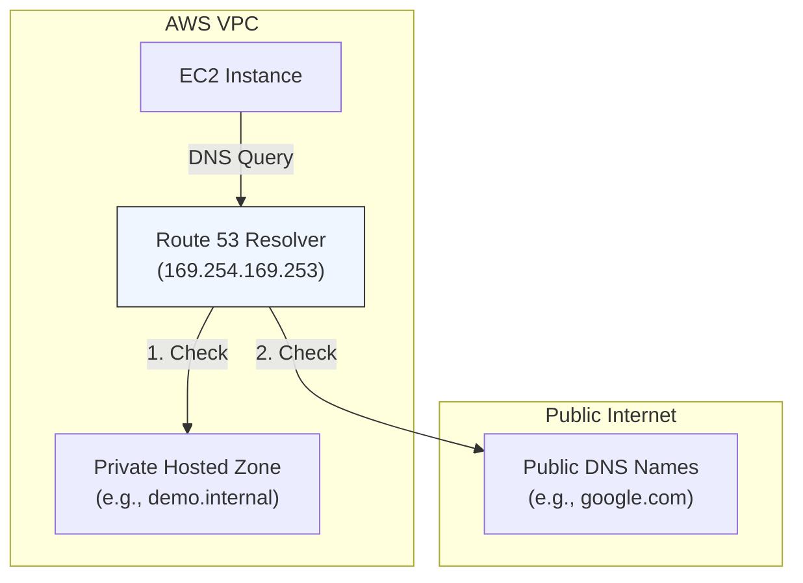

# VPC DNS Resolution & Hostnames

## Overview
AWS provides a managed DNS service for VPCs through the **Route 53 Resolver** (formerly known as the "AmazonProvidedDNS"). To fully leverage internal and external DNS within a VPC, two specific attributes must be configured: **enableDnsSupport** and **enableDnsHostnames**. Understanding how these interact is crucial for managing private hosted zones and ensuring instances can resolve both public and internal endpoints.

## Key Concepts
- **enableDnsSupport**: Determines whether the VPC supports DNS resolution through the Amazon-provided DNS server (Route 53 Resolver).
- **enableDnsHostnames**: Determines whether instances with public IP addresses receive corresponding public DNS hostnames.
- **Route 53 Resolver IP**: The DNS server is located at the VPC network range base plus two (e.g., `10.0.0.2` for `10.0.0.0/16`) or the reserved link-local address `169.254.169.253`.
- **Private Hosted Zone (PHZ)**: A Route 53 container that holds information about how you want to route traffic for a domain and its subdomains within one or more VPCs without exposing the DNS records to the internet.

## Detailed Notes

### 1. DNS Attribute Interaction
| Attribute | Setting | Result |
|-----------|---------|--------|
| **enableDnsSupport** | `true` (Default) | Instances can query the Route 53 Resolver to resolve public and internal names. |
| **enableDnsSupport** | `false` | Instances cannot use the Route 53 Resolver. You must provide your own DNS server. |
| **enableDnsHostnames** | `true` | Instances with a public IP get a public DNS hostname (e.g., `ec2-54-x-x-x.compute-1.amazonaws.com`). |
| **enableDnsHostnames** | `false` | Instances do not get public DNS hostnames, even if they have public IPs. |

> **Important**: `enableDnsHostnames` has no effect unless `enableDnsSupport` is also set to `true`.

### 2. Private Hosted Zones (PHZ)
To use Route 53 Private Hosted Zones for internal service discovery (e.g., `app.internal`), **both** attributes must be set to `true`.
- **Split-Horizon DNS**: You can use the same domain name for both public and private use. Internal requests will resolve via the PHZ, while external requests resolve via the public hosted zone.
- **Association**: You must explicitly associate the PHZ with the VPC(s) that need to resolve those records.

### 3. DNS Resolution Flow
When an EC2 instance makes a DNS query:
1. It sends the request to the Route 53 Resolver (`VPC base + 2` or `169.254.169.253`).
2. The Resolver checks for a matching record in any associated **Private Hosted Zones**.
3. If no match is found, it checks **VPC-specific records** (e.g., internal EC2 hostnames).
4. If still no match, it performs a recursive lookup for **Public DNS** names on the internet.

## Architecture / Flow

## Security Relevance
- **Isolation**: Private Hosted Zones allow you to use custom domain names internally without exposing your infrastructure's naming convention or IP addresses to the public internet.
- **Controlled Exfiltration**: By disabling `enableDnsSupport` and using a custom DNS server, organizations can implement DNS filtering to prevent instances from resolving malicious domains.
- **DNSSEC**: Route 53 Resolver supports DNSSEC validation for outgoing DNS queries to ensure the integrity of the responses.

## Operational / Real-World Context
- **Default VPCs**: Both settings are `true` by default.
- **Custom VPCs**: `enableDnsSupport` is `true` by default, but `enableDnsHostnames` is `false` by default.
- **Interface VPC Endpoints**: Require both settings to be `true` to support "Private DNS" names for the service (e.g., resolving `s3.amazonaws.com` directly to the private endpoint IP).

## Common Pitfalls / Misconfigurations
- **Missing PHZ Association**: Creating a PHZ but forgetting to associate it with the target VPC.
- **Attributes Disabled**: Forgetting to enable `enableDnsHostnames` when trying to use Private DNS for VPC Endpoints.
- **Custom DNS Conflict**: If an instance is configured to use a custom DNS server (via DHCP Options Sets) that doesn't forward to the Route 53 Resolver, it won't be able to resolve records in Private Hosted Zones.

## Exam / Review Notes
- **Link-Local IP**: `169.254.169.253` is the reserved IP for the Route 53 Resolver.
- **Base + 2**: The VPC DNS server is always at the second IP of the subnet range (e.g., `10.0.0.2`).
- **PHZ Requirements**: Remember `enableDnsSupport` AND `enableDnsHostnames` must be `true`.
- **SCS-C02 Context**: Focus on how these settings impact service discovery and secure internal communication.

## Summary
VPC DNS resolution is a managed service that simplifies internal and external naming. By configuring `enableDnsSupport` and `enableDnsHostnames`, you enable instances to receive public hostnames and participate in Private Hosted Zones for secure, private service discovery.

## Quick Review Checklist
- [ ] `enableDnsSupport` = Enables the Route 53 Resolver.
- [ ] `enableDnsHostnames` = Assigns public DNS names to instances with public IPs.
- [ ] Both settings must be `true` for Private Hosted Zones and VPC Endpoint Private DNS.
- [ ] Route 53 Resolver IP is either `Base + 2` or `169.254.169.253`.
