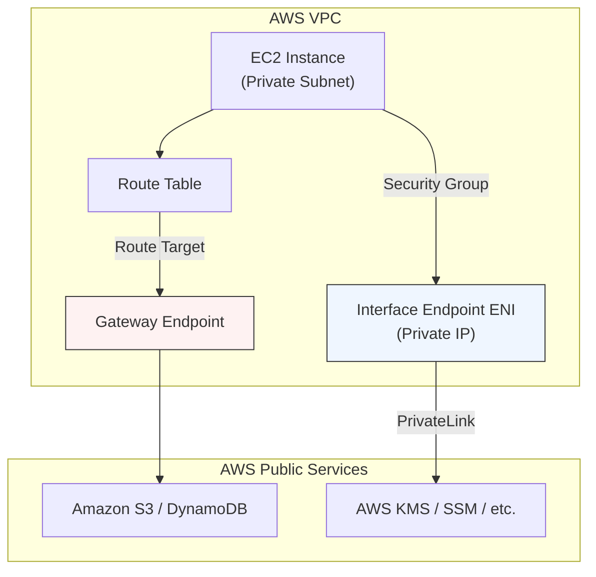

# VPC Endpoints

## Overview
**VPC Endpoints** enable private connections between your VPC and supported AWS services or VPC endpoint services powered by PrivateLink. Traffic between your VPC and the service does not leave the Amazon network, eliminating the need for an Internet Gateway, NAT Gateway, or VPN connection to access AWS APIs.

## Key Concepts
- **Interface Endpoints (PrivateLink)**: An Elastic Network Interface (ENI) with a private IP address from your subnet range that serves as an entry point for traffic destined for a supported service.
- **Gateway Endpoints**: A gateway that you specify as a target in your route table for traffic to a supported AWS service (S3 and DynamoDB only).
- **VPC Endpoint Policy**: An IAM resource policy attached to the endpoint to control which principals can use the endpoint to access which resources.
- **Private DNS**: A feature that allows the standard service DNS name (e.g., `s3.us-east-1.amazonaws.com`) to resolve to the private IP of the interface endpoint.

## Detailed Notes

### 1. Gateway Endpoints (S3 & DynamoDB)
- **Supported Services**: Only **Amazon S3** and **DynamoDB**.
- **Implementation**: Updates the **Route Table** of the subnet.
- **Security**: Does NOT use Security Groups. Access is controlled via VPC Endpoint Policies and Resource Policies (Bucket/Table policies).
- **Transitivity**: Cannot be accessed from over a VPN, Direct Connect, or VPC Peering. You must create a gateway endpoint in each VPC.

### 2. Interface Endpoints (AWS PrivateLink)
- **Supported Services**: Most AWS services (KMS, CloudWatch, SSM, etc.), Marketplace services, and own services.
- **Implementation**: Creates an **ENI** in your subnet.
- **Security**: Uses **Security Groups** to control traffic to the ENI (typically allows inbound 443 from the VPC CIDR).
- **Connectivity**: Can be accessed over Site-to-Site VPN and Direct Connect from on-premises.
- **Private DNS**: Requires `enableDnsSupport` and `enableDnsHostnames` set to `true` in the VPC.

### 3. VPC Endpoint Policies
VPC Endpoint policies are JSON documents that restrict what can be done through the endpoint.
- **Evaluation Logic**: Access is allowed only if the **Identity Policy**, **Endpoint Policy**, AND **Resource Policy** (if applicable) all allow the action, and no explicit Deny exists.
- **Organization Restriction**: Use the `aws:PrincipalOrgID` condition to ensure only accounts within your AWS Organization can use the endpoint.

### 4. Service-Specific Requirements (Exam High-Lights)
| Service | Required Endpoints / Notes |
|---------|---------------------------|
| **SSM / Session Manager** | Requires `ssm`, `ssmmessages`, and `ec2messages`. |
| **Patch Manager** | Requires SSM endpoints + **S3 Gateway Endpoint** (to download patches from AWS-owned S3 buckets). |
| **CodeDeploy (EC2)** | Requires `codedeploy` AND `codedeploy-commands-secure` (for agent communication). |
| **Secrets Manager** | Often used for private Lambdas to fetch DB credentials without a NAT Gateway. |
| **API Gateway** | Private REST APIs require the `execute-api` interface endpoint. |

## Architecture / Flow

## Security Relevance
- **Data Perimeter**: Prevents data exfiltration by using endpoint policies to restrict access to only specific authorized buckets or accounts.
- **No Public Exposure**: Private instances can stay truly private (no IGW/NAT) while still interacting with AWS services.
- **Network Isolation**: Traffic stays on the AWS global backbone, reducing exposure to internet-based threats.

## Operational / Real-World Context
- **Private DNS Optimization**: When Private DNS is enabled, you don't need to change your application code; the standard SDK calls will automatically route through the endpoint.
- **Cost**: Gateway endpoints are **free**. Interface endpoints have an **hourly cost** plus data processing fees per GB.

## Common Pitfalls / Misconfigurations
- **DNS Settings**: Forgetting to enable `enableDnsHostnames` and `enableDnsSupport` prevents Private DNS from working.
- **Security Group Inbound**: The Interface Endpoint SG must allow inbound traffic from the instances (usually port 443).
- **Security Group Outbound**: The EC2 instance SG must allow outbound traffic to the Interface Endpoint.
- **On-Prem Access to S3**: You cannot reach an S3 Gateway Endpoint from on-prem. To access S3 privately from on-prem, you must use an **S3 Interface Endpoint**.

## Exam / Review Notes
- **S3 Gateway vs Interface**: Use Gateway for cost (free) and intra-VPC traffic. Use Interface for access from on-prem or via Peering/Transit Gateway.
- **SSM Endpoints**: If Session Manager isn't working in a private VPC, check for the 3 required endpoints (`ssm`, `ssmmessages`, `ec2messages`).
- **Endpoint Policy**: Use it to enforce that only *your* S3 buckets can be accessed from the VPC.

## Quick Review Checklist
- [ ] Gateway = S3/DynamoDB (Route Table, Free).
- [ ] Interface = PrivateLink (ENI, SG, Paid).
- [ ] PHZ / Private DNS requires `enableDnsSupport` & `enableDnsHostnames`.
- [ ] Endpoint Policies do NOT replace IAM policies; they act as a filter.
- [ ] `aws:PrincipalOrgID` is used for organizational boundaries.
