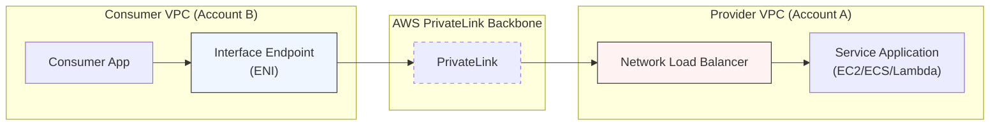

# AWS PrivateLink (VPC Endpoint Services)

## Overview
**AWS PrivateLink** provides private connectivity between VPCs, AWS services, and your on-premises networks, without exposing your traffic to the public internet. It allows a **Service Provider** to expose a service (hosted behind a Network Load Balancer) to **Service Consumers** in different VPCs or accounts. This is the underlying technology that powers Interface VPC Endpoints.

## Key Concepts
- **VPC Endpoint Service**: The resource created by the Service Provider to share their application. It must be backed by a **Network Load Balancer (NLB)** or a Gateway Load Balancer (GWLB).
- **Service Consumer**: The entity that creates an **Interface VPC Endpoint** to connect to the Endpoint Service.
- **Service Name**: A unique identifier (e.g., `com.amazonaws.vpce.us-east-1.vpce-svc-xxxxxxxx`) used by consumers to find and connect to the service.
- **Acceptance Required**: An optional setting where the provider must manually approve each connection request from consumers.

## Comparison: VPC Peering vs. PrivateLink

| Feature | VPC Peering | AWS PrivateLink |
|---------|-------------|-----------------|
| **Network Scope** | Connects two entire VPC networks. | Connects specific services only. |
| **Routing** | Requires route table updates. | No route table updates required. |
| **CIDR Overlap** | **Not allowed**. | **Allowed** (since only the ENI is exposed). |
| **Scalability** | Complex mesh for many VPCs. | Scales easily to thousands of consumer VPCs. |
| **Transitivity** | Not transitive. | Can be accessed via VPN/Direct Connect/Peering. |

## Detailed Notes

### 1. Architecture Components
- **Service Provider VPC**: Contains the application instances (EC2, ECS tasks, etc.) sitting behind an **NLB**.
- **PrivateLink**: The logical connection that bridges the consumer's ENI to the provider's NLB.
- **Consumer VPC**: Contains an **Interface Endpoint (ENI)** that receives a private IP from the consumer's subnet.

### 2. Implementation Steps
1. **Provider**: Create a Network Load Balancer (NLB) pointing to the application.
2. **Provider**: Create an **Endpoint Service** and associate it with the NLB.
3. **Provider**: (Optional) Whitelist specific AWS Principals (Accounts/Users/Roles) allowed to connect.
4. **Consumer**: Create an **Interface VPC Endpoint**, choosing "Other endpoint services" and providing the Provider's **Service Name**.
5. **Provider**: Accept the connection request (if "Acceptance Required" is enabled).

### 3. Advanced Integration (ECS & On-Prem)
- **ECS Integration**: You can chain an NLB to an Application Load Balancer (ALB) to expose path-based routing services via PrivateLink.
- **On-Prem Access**: Because PrivateLink uses Interface Endpoints (ENIs), on-premises users can reach these services over **Direct Connect** or **Site-to-Site VPN**.

## Architecture / Flow

## Security Relevance
- **Data Exfiltration Prevention**: Consumers only have access to the specific service, not the provider's entire VPC.
- **No Internet Exposure**: Traffic never traverses the public internet, reducing the risk of man-in-the-middle attacks.
- **Permission Control**: Providers can restrict which AWS accounts are permitted to see and connect to their endpoint service.

## Operational / Real-World Context
- **SaaS Delivery**: Software vendors use PrivateLink to securely deliver their services to customers' VPCs without the headache of managing VPC Peering and CIDR overlaps.
- **Microservices**: Large organizations use it to share internal "common services" (like logging or auth) across hundreds of department-owned VPCs.

## Common Pitfalls / Misconfigurations
- **NLB Dependency**: Forgetting that PrivateLink **requires** an NLB (or GWLB); it cannot point directly to an EC2 instance or ALB (though NLB can point to an ALB).
- **AZ Mismatch**: If the Consumer creates an endpoint in `us-east-1a` but the Provider's service is only available in `us-east-1b`, connectivity will fail unless cross-zone load balancing is enabled.
- **Acceptance Pending**: The connection remains in "Pending" status until the provider approves it.

## Exam / Review Notes
- **Scalability**: If the question asks for a way to connect **thousands of VPCs**, the answer is **PrivateLink**.
- **CIDR Overlap**: If you need to connect VPCs with **overlapping IP ranges**, the answer is **PrivateLink**.
- **One-Way Connectivity**: PrivateLink is unidirectional (Consumer -> Provider). The Provider cannot initiate a connection back to the Consumer.

## Summary
AWS PrivateLink (VPC Endpoint Services) is the gold standard for secure, scalable service sharing. By using an NLB on the provider side and an Interface Endpoint on the consumer side, it bypasses the limitations of VPC Peering and ensures traffic remains entirely within the AWS private network.

## Quick Review Checklist
- [ ] Provider has a Network Load Balancer (NLB).
- [ ] Endpoint Service created and Service Name shared with consumer.
- [ ] Consumer created an Interface Endpoint using the Service Name.
- [ ] Connection accepted by the provider?
- [ ] Security Groups on the Consumer ENI allow inbound traffic from the application?
