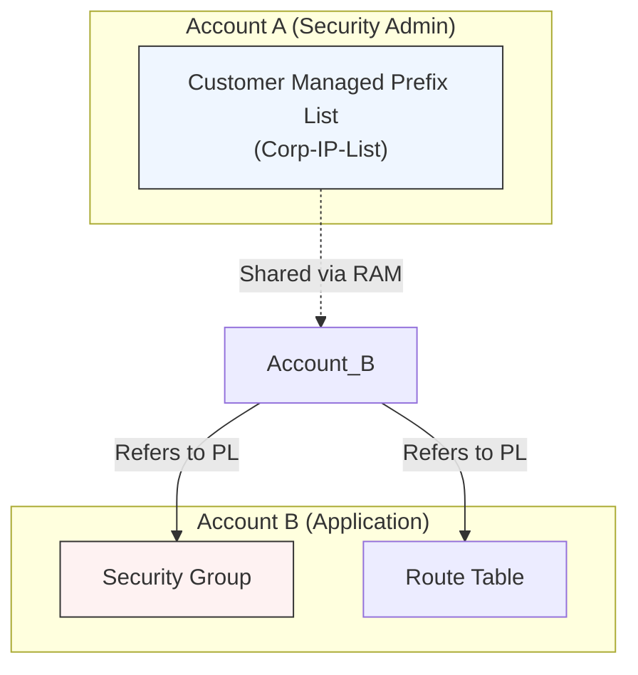

# Managed Prefix Lists

## Overview
A **Managed Prefix List** is a set of one or more CIDR blocks that makes it easier to configure and manage security groups and VPC route tables. Instead of manually entering and updating multiple CIDR blocks in multiple rules, you can reference a single prefix list. When the list is updated, the changes are automatically applied to all associated security groups and route tables.

## Key Concepts
- **AWS Managed Prefix List**: A set of CIDR blocks for AWS services (e.g., S3, CloudFront, DynamoDB). These are maintained by AWS, and you cannot create, modify, or delete them.
- **Customer Managed Prefix List**: A set of CIDR blocks that you define and manage. You can specify the maximum number of entries (max entries) and share them with other AWS accounts.
- **Weight / Count**: Each prefix list has an associated "weight" (number of CIDR entries). When using a prefix list in a security group or route table, it counts against the rule limit based on its **Max Entries** (not the current number of entries).

## Detailed Notes

### 1. Customer Managed Prefix Lists
- **Creation**: You define the list of CIDR blocks and assign a name.
- **Sharing**: Can be shared with other accounts or your entire AWS Organization using **AWS Resource Access Manager (RAM)**.
- **Maintenance**: Modifying the list in the owner account automatically updates all referencing rules across accounts.
- **Example Use Case**: A central security team maintains a list of corporate office CIDRs and shares it with all application accounts to allow administrative access.

### 2. AWS Managed Prefix Lists
- **Services Supported**: S3, CloudFront, DynamoDB, Ground Station, etc.
- **Usage**: Reference them in the **Destination** field of a security group outbound rule or the **Target** of a route table.
- **Consistency**: Ensures that your security rules stay up-to-date as AWS adds or changes IP ranges for its services.

### 3. Outbound Rules with Prefix Lists
By default, security group outbound rules allow all traffic (`0.0.0.0/0`). To improve security, you can restrict outbound traffic to specific AWS services.
- **Example**: An outbound rule allowing HTTPS (Port 443) only to the **S3 Managed Prefix List** ensures the instance can only talk to S3 and not other internet endpoints.

## Architecture / Flow

## Security Relevance
- **Centralized Management**: Reduces the risk of human error when updating IP ranges across many security groups.
- **Blast Radius**: Restricting outbound traffic to only necessary AWS services (via managed prefix lists) prevents data exfiltration to unauthorized internet endpoints.
- **Simplified Audit**: It is much easier to audit a single prefix list than hundreds of individual CIDR rules.

## Operational / Real-World Context
- **Version Control**: Customer managed prefix lists support versioning. You can see the history of changes to the CIDR blocks.
- **Rule Limits**: Be careful with the **Max Entries** setting. A prefix list with a Max Entries of 20 counts as 20 rules in your security group, even if it only contains 1 CIDR block.

## Common Pitfalls / Misconfigurations
- **Exceeding Limits**: Adding a large prefix list to a security group that is already near its rule limit (usually 60 rules per SG) can cause the association to fail.
- **Overlapping CIDRs**: Prefix lists do not prevent you from adding overlapping CIDR blocks, but AWS will consolidate them for evaluation.
- **RAM Sharing**: Forgetting to accept the share in the recipient account (if not using AWS Organizations auto-acceptance).

## Exam / Review Notes
- **AWS Managed**: You cannot modify these; they are for S3, DynamoDB, CloudFront, etc.
- **Customer Managed**: You create these; they are shareable across accounts.
- **Rule Count**: Prefix lists count toward your quotas based on their **Max Entries**.
- **Outbound Filtering**: Use them to restrict where your instances can send data.

## Summary
Managed Prefix Lists simplify the orchestration of network security by centralizing CIDR management. They are an essential tool for multi-account environments to ensure consistency and least-privilege outbound access.

## Quick Review Checklist
- [ ] AWS Managed Prefix Lists used for S3/DynamoDB/CloudFront outbound rules?
- [ ] Customer Managed Prefix Lists created for internal corporate ranges?
- [ ] Lists shared via RAM to member accounts?
- [ ] Max Entries setting checked against Security Group rule limits?
