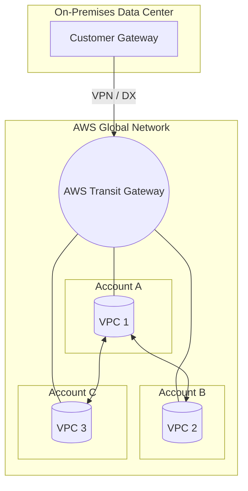

# AWS Transit Gateway

## Overview
**AWS Transit Gateway** acts as a central hub (hub-and-spoke model) that connects VPCs and on-premises networks. It simplifies network topology by replacing complex peering meshes with a single gateway that handles transitive routing between thousands of VPCs, **AWS Site-to-Site VPN** connections, and **AWS Direct Connect** gateways.

## Key Concepts
- **Hub-and-Spoke**: A star-shaped network topology where all traffic passes through a central hub (the Transit Gateway).
- **Transitive Routing**: Allows a VPC to communicate with another VPC or on-premises network through the Transit Gateway without direct peering.
- **Route Tables**: Used within the Transit Gateway to control how traffic is routed between attachments.
- **ECMP (Equal-Cost Multi-Path)**: A routing strategy that allows multiple paths to the same destination to be used simultaneously, increasing bandwidth.
- **RAM (Resource Access Manager)**: Used to share a Transit Gateway across multiple AWS accounts within an organization.

## Detailed Notes

### 1. Connectivity & Scaling
- **VPC Attachments**: Connect thousands of VPCs to a single gateway.
- **VPN & Direct Connect**: Consolidates hybrid cloud connectivity. You can connect a **Direct Connect Gateway** or multiple **Site-to-Site VPNs** to the Transit Gateway.
- **Multicast Support**: Transit Gateway is the only AWS service that supports **IP Multicast**, which is essential for certain legacy applications or media streaming.

### 2. Bandwidth Optimization (ECMP)
- **VPN Throughput**: A standard VPN connection to a Virtual Private Gateway is limited to 1.25 Gbps. By using a Transit Gateway with **ECMP** enabled, you can utilize both VPN tunnels in a single connection to achieve **2.5 Gbps**.
- **Horizontal Scaling**: You can add multiple VPN connections to a Transit Gateway to further scale throughput (e.g., 3 VPN connections = 7.5 Gbps).

### 3. Cross-Region and Cross-Account
- **Inter-Region Peering**: Transit Gateways in different regions can be peered together to create a global private network.
- **Sharing**: Use **AWS RAM** to share a central Transit Gateway with member accounts, allowing them to attach their VPCs to the hub.

## Architecture / Flow

### Transit Gateway Hub-and-Spoke

## Security Relevance
- **Network Segmentation**: By using multiple **Transit Gateway Route Tables**, you can isolate environments (e.g., preventing a "Dev" VPC from talking to a "Prod" VPC even if they are on the same hub).
- **Centralized Inspection**: You can route all traffic through a "Security VPC" containing firewalls or Intrusion Detection Systems (IDS) before it reaches its destination.
- **IAM Control**: Permissions to create attachments or modify route tables are managed via IAM, providing a control plane for global networking.

## Operational / Real-World Context
- **Cost**: There is a per-hour charge for each attachment and a data processing charge per GB.
- **Simplification**: Dramatically reduces the management overhead of "full-mesh" VPC peering (which requires $n(n-1)/2$ connections).

## Common Pitfalls / Misconfigurations
- **Asymmetric Routing**: Incorrectly configured route tables can lead to traffic entering via one path and attempting to return via another, causing drops.
- **MTU Size**: Traffic over VPN or TGW peering is limited to an MTU of 1500 bytes. Jumbo frames (9001 bytes) are only supported for VPC-to-VPC traffic within the same region.
- **Route Limits**: Be mindful of the number of routes supported in a TGW route table (thousands, but not infinite).

## Exam / Review Notes
- **IP Multicast**: If the question mentions multicast, the answer is **Transit Gateway**.
- **Bandwidth Scaling**: Use **TGW + ECMP** to exceed the 1.25 Gbps VPN limit.
- **Transitive Peering**: TGW is the solution for transitive connectivity.
- **Global Reach**: Supports Inter-Region Peering.

## Summary
AWS Transit Gateway is the premier solution for complex network architectures. It provides a centralized, scalable, and highly available hub for all network traffic, offering advanced features like ECMP for bandwidth scaling and support for IP Multicast.

## Quick Review Checklist
- [ ] Hub-and-spoke model implemented?
- [ ] Route tables configured for isolation/segmentation?
- [ ] ECMP enabled for high-bandwidth VPN?
- [ ] Shared across accounts via AWS RAM?
- [ ] Inter-region peering established if required?
