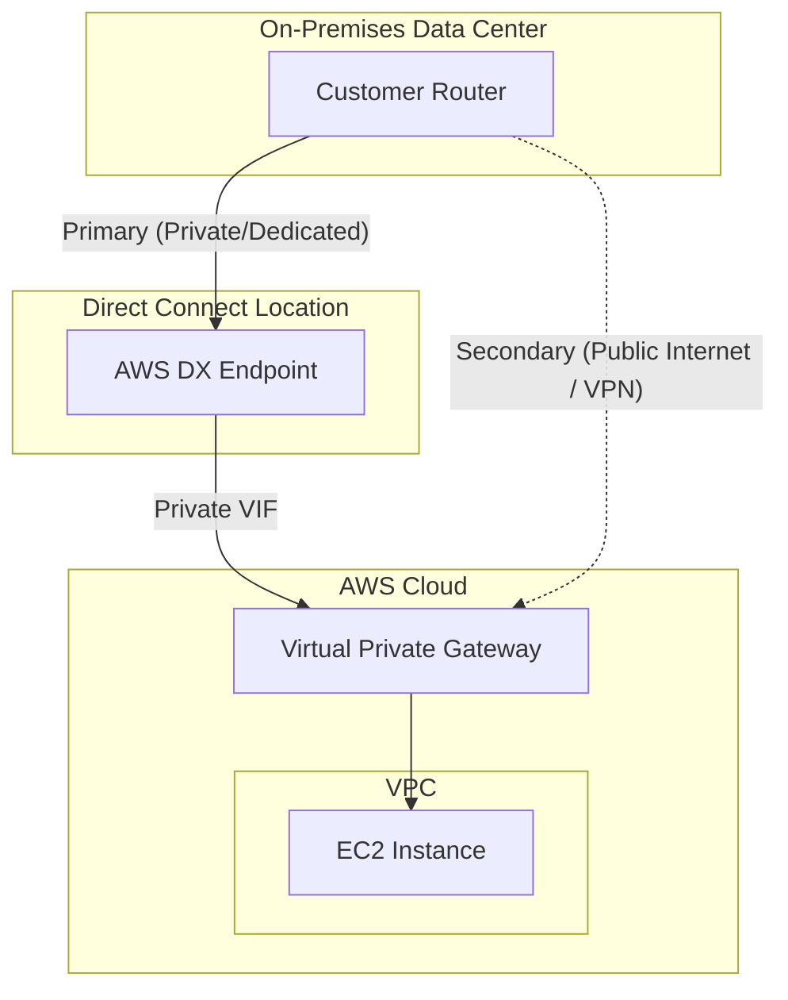

# AWS Direct Connect (DX) & VPN Integration

## Overview
**AWS Direct Connect (DX)** provides a dedicated, private network connection from your on-premises data center to AWS. Unlike a Site-to-Site VPN, which traverses the public internet, Direct Connect bypasses the internet entirely, offering more consistent network performance, increased bandwidth, and reduced egress costs.

## Key Concepts
- **Direct Connect Location**: Physical data centers where AWS has a presence. You establish a cross-connect from your router to an AWS router in this location.
- **Virtual Interface (VIF)**:
    - **Private VIF**: Accesses private resources within a VPC (e.g., EC2 instances) via a Virtual Private Gateway (VGW) or Direct Connect Gateway.
    - **Public VIF**: Accesses public AWS services (e.g., S3, DynamoDB, Glacier) using public IP addresses.
- **Direct Connect Gateway**: A global resource that allows you to connect a single Direct Connect connection to multiple VPCs in different AWS Regions.
- **Connection Types**:
    - **Dedicated Connection**: 1, 10, or 100 Gbps. A physical Ethernet port dedicated to a single customer.
    - **Hosted Connection**: 50 Mbps up to 10 Gbps. Capacity is provisioned by an AWS Direct Connect Partner.

## Detailed Notes

### 1. Security and Encryption
- **No Default Encryption**: Traffic over Direct Connect is **private but not encrypted** by default.
- **VPN over Direct Connect**: To achieve encryption (IPsec), you can establish a **AWS Site-to-Site VPN** on top of a Direct Connect public VIF. This provides an encrypted, private tunnel between your data center and AWS.

### 2. Resiliency Models
- **High Resiliency**: Achieved by using two separate Direct Connect locations, each with at least one connection.
- **Maximum Resiliency**: Achieved by using two separate Direct Connect locations, with two separate connections in each location (4 connections total), terminating on separate devices.

### 3. Backup Connectivity
- **Cost-Effective Backup**: For workloads where Direct Connect is the primary path, a **Site-to-Site VPN** can be configured as a secondary/backup path over the public internet.
- **Failover**: If the Direct Connect connection fails, traffic can be rerouted through the VPN tunnel.

## Architecture / Flow

### Direct Connect with VPN Backup

## Security Relevance
- **Data Privacy**: Bypassing the public internet reduces the risk of traffic interception or DDoS attacks at the ISP level.
- **Hybrid Identity**: Supports secure integration with on-premises Active Directory or LDAP for hybrid identity management.
- **Compliance**: Often required for workloads with strict regulatory requirements regarding data transit over the public internet.

## Operational / Real-World Context
- **Lead Time**: Establishing a new Direct Connect connection typically takes **more than one month**. If a project requires immediate connectivity, start with a Site-to-Site VPN while waiting for the DX installation.
- **Consistency**: Essential for real-time data feeds, voice/video applications, or large-scale data migrations.

## Common Pitfalls / Misconfigurations
- **Assuming Encryption**: Misunderstanding that DX is private but unencrypted, leading to a failure to meet compliance requirements.
- **Region Constraints**: Attempting to use a standard Private VIF to reach a VPC in another region without using a Direct Connect Gateway.
- **BGP Propagation**: Improperly configured BGP (Border Gateway Protocol) can lead to suboptimal routing or failover issues between DX and VPN paths.

## Exam / Review Notes
- **Encrypted DX**: Use VPN over DX (Public VIF).
- **Timeframe**: DX = > 1 month to set up.
- **Resiliency**: Max Resiliency = 2 locations + 2 connections each.
- **Public vs Private VIF**: Public for S3/DynamoDB; Private for VPC/EC2.
- **Direct Connect Gateway**: Required for multi-region or multi-VPC (across accounts) connectivity.

## Summary
AWS Direct Connect is the standard for high-performance, private hybrid cloud connectivity. While it provides privacy and consistency, security-conscious organizations must layer an IPsec VPN on top of it if data encryption in transit is required.

## Quick Review Checklist
- [ ] Direct Connect established (Lead time > 1 month)?
- [ ] VPN over DX configured if encryption is required?
- [ ] Site-to-Site VPN configured as a backup path?
- [ ] Direct Connect Gateway used for multi-region access?
- [ ] BGP weights/metrics configured to prioritize DX over VPN?
