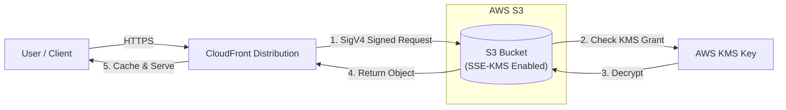
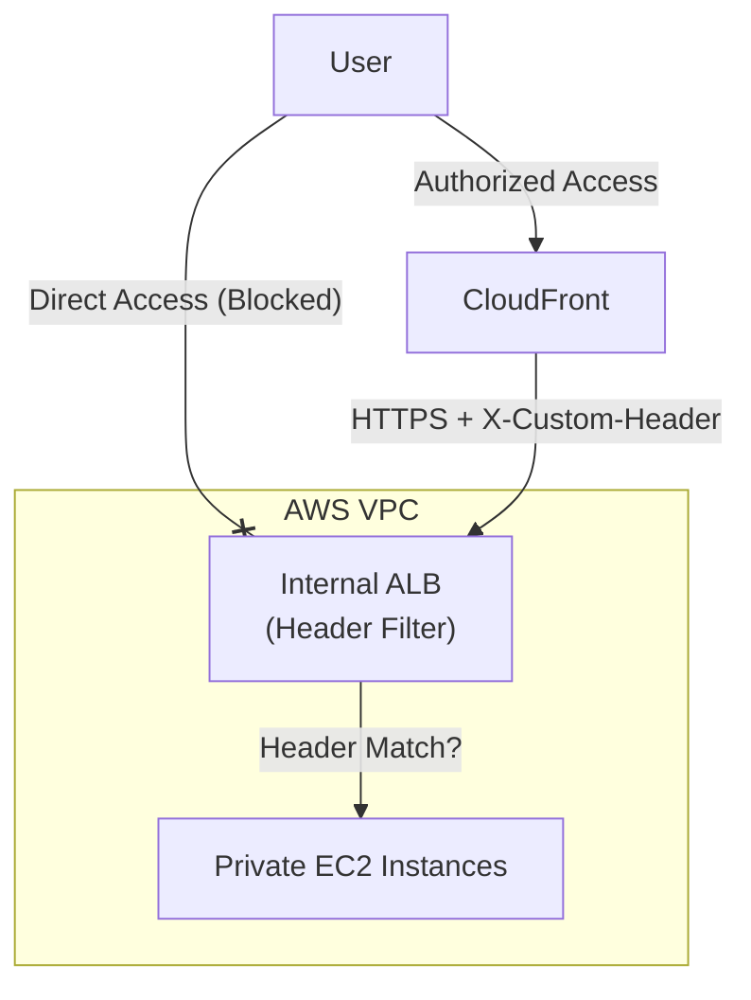

# Amazon CloudFront

## Overview
**Amazon CloudFront** is a fast Content Delivery Network (CDN) service that securely delivers data, videos, applications, and APIs to customers globally with low latency and high transfer speeds. It improves performance by caching content at **Edge Locations** and **Regional Edge Caches** closer to users.

## Key Concepts
- **Origin**: The source of the content (e.g., S3 bucket, ALB, EC2, or custom HTTP server).
- **Distribution**: A configuration that defines the origin and how CloudFront delivers content.
- **Cache Policy**: Defines how CloudFront caches content (TTL, headers, cookies, query strings).
- **Origin Access Control (OAC)**: The recommended way to secure S3 origins by ensuring only CloudFront can access the bucket.
- **VPC Origin**: A feature allowing CloudFront to connect to private resources (ALB, NLB, EC2) in a VPC without exposing them to the public internet.

## Detailed Notes

### 1. Security & Origin Protection
CloudFront provides several layers of security to protect your origins:

#### A. Origin Access Control (OAC) vs. Origin Access Identity (OAI)
- **OAI (Legacy)**: Used for S3. Does not support **SSE-KMS** natively. Requires custom workarounds (Lambda@Edge) for encrypted buckets.
- **OAC (Recommended)**: Supports **SSE-KMS** natively by signing requests with **SigV4**. 
- **KMS Policy**: When using OAC with SSE-KMS, the KMS key policy must allow `kms:Decrypt` for the CloudFront service principal with a condition on the `SourceArn`.

#### B. Restricting Access to Custom Origins (ALB/EC2)
- **Custom Headers**: Configure CloudFront to add a secret custom header (e.g., `X-Custom-Header`) to every request to the origin. The origin (e.g., ALB listener rule) is configured to only allow requests containing this header.
- **IP White-listing**: Use the AWS-managed **CloudFront Prefix List** in security groups to only allow inbound traffic from CloudFront IP ranges.
- **VPC Origin (Business/Enterprise)**: Securely connects CloudFront to private subnets without public IPs.

### 2. Access Control: Signed URLs vs. Signed Cookies
Used for providing temporary access to private content.
- **Signed URL**: Provides access to individual files (one URL per file).
- **Signed Cookies**: Provides access to multiple files or an entire folder (best for web applications).
- **Signers**:
    - **Trusted Key Groups (Recommended)**: Managed via IAM/APIs. Supports key rotation and doesn't require Root access.
    - **CloudFront Key Pairs (Legacy)**: Requires **Root Account** to manage. Not automatable via API.

### 3. Advanced Security Features
- **Geo Restriction**: Use an **Allow List** or **Block List** to restrict access based on the user's country (determined via Geo IP).
- **Field-Level Encryption**: Encrypts specific sensitive fields (e.g., credit card numbers) at the Edge using a **Public Key**. Only the origin web server, which holds the **Private Key**, can decrypt the field. This ensures sensitive data is never in plaintext within the AWS infrastructure (ALB, logs, etc.).
- **Cognito Integration**: Use **Lambda@Edge** to verify JWT tokens issued by **Cognito Hosted UI** before allowing access to content.

## Architecture / Flow

### S3 Origin with OAC & SSE-KMS

### ALB Security with Custom Headers

## Security Relevance
- **Edge Security**: CloudFront is the first line of defense, integrating with **AWS Shield** for DDoS protection and **AWS WAF** for Layer 7 filtering.
- **Data Integrity**: Signed URLs/Cookies prevent "hotlinking" and ensure only authorized users access premium or private content.
- **Minimal Exposure**: VPC Origins and OAC allow backends to remain completely private.

## Operational / Real-World Context
- **Cache Invalidation**: If content changes at the origin, you can manually invalidate the cache, but this incurs a cost if done frequently.
- **Latency**: CloudFront significantly reduces latency for global users, but the first request (Cache Miss) will still take longer as it fetches from the origin.

## Common Pitfalls / Misconfigurations
- **Authorization Header**: By default, CloudFront does **not** forward the `Authorization` header. You must explicitly allow it in the **Cache Policy** if your origin requires it (except for S3 origins).
- **Protocol Mismatch**: Origin set to HTTP only when the client expects HTTPS, or vice-versa.
- **OAC Misconfiguration**: Forgetting to update the S3 Bucket Policy to allow the new OAC principal.

## Exam / Review Notes
- **OAC over OAI**: Always prefer OAC for KMS support and security.
- **Field-Level Encryption**: Asymmetric encryption for up to 10 fields.
- **Trusted Key Groups**: The modern, secure way to sign URLs.
- **DDoS**: CloudFront + WAF + Shield is the standard "Edge Security" stack.
- **S3 Website**: If S3 is configured as a website, you must use a **Custom Origin** (HTTP), not an S3 origin (OAC).

## Summary
Amazon CloudFront is much more than a caching service; it is a critical security component that provides DDoS protection, geo-fencing, and deep integration with IAM/KMS to ensure that content is delivered securely and privately to authorized users.

## Quick Review Checklist
- [ ] OAC configured for S3 origins?
- [ ] KMS key policy allows CloudFront decryption?
- [ ] Custom headers/IP prefix lists used to protect ALBs?
- [ ] Trusted Key Groups used for Signed URLs/Cookies?
- [ ] Field-level encryption enabled for PII/PCI data?
