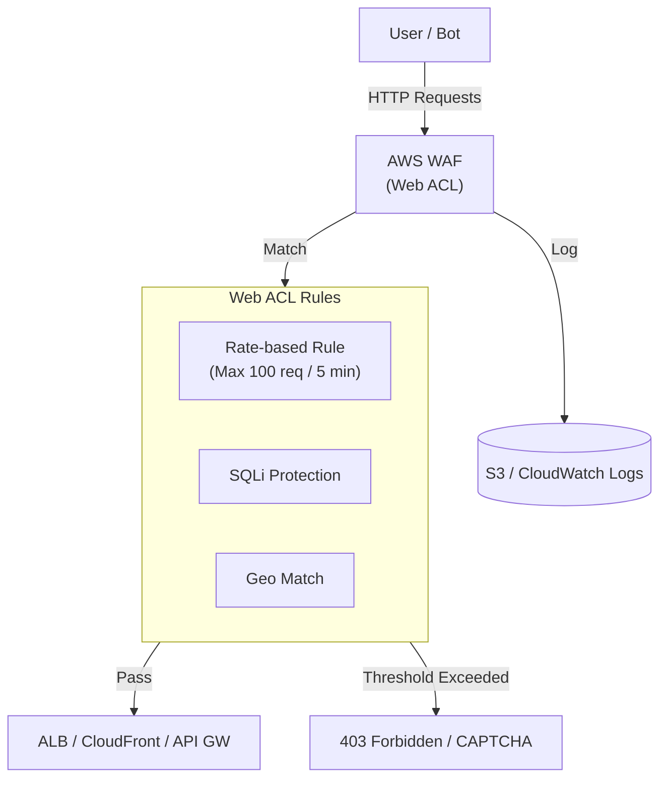

# AWS WAF (Web Application Firewall)

## Overview
**AWS WAF** is a web application firewall that helps protect your web applications or APIs against common web exploits and bots that may affect availability, compromise security, or consume excessive resources. It operates at **Layer 7** (HTTP/HTTPS) and allows you to control how traffic reaches your applications by defining customizable web security rules.

## Key Concepts
- **Web ACL (Web Access Control List)**: A central container for rules that you associate with your AWS resources.
- **Rules**: Conditions that define what to look for in web requests (IP addresses, HTTP headers, body, URI strings, etc.).
- **Actions**: The response taken when a rule matches: **Allow**, **Block**, **Count** (for monitoring), **CAPTCHA**, or **Challenge**.
- **Managed Rule Groups**: Pre-configured sets of rules managed by AWS or third-party sellers (Marketplace) to handle common threats (e.g., Core rule set, Admin protection, Known bad inputs, SQL injection).
- **IP Set**: A collection of IP addresses or ranges (CIDR) that you can reference in rules to allow or block traffic.
- **WCU (Web ACL Capacity Unit)**: A measurement of the processing power required to run your rules. A Web ACL has a maximum capacity (e.g., 5,000 units).
- **Rate-based Rules**: Rules that track the number of requests from a specific IP address and trigger an action if a threshold is exceeded within a 5-minute window.

## Detailed Notes

### 1. Supported Resources
WAF can be deployed on the following AWS services:
- **Global**: Amazon CloudFront (managed in `us-east-1`).
- **Regional**: Application Load Balancer (ALB), Amazon API Gateway, AWS AppSync (GraphQL), Amazon Cognito User Pools, AWS App Runner, AWS Verified Access, AWS Amplify, and AWS App Runner.

### 2. Rule Types & Protection
- **SQL Injection (SQLi) & Cross-Site Scripting (XSS)**: Built-in protection. Can be scoped to specific parts of the request like the **Body** or **Query Strings**.
- **Geo-Match**: Restrict access based on the country of origin. Useful for services like Cognito that don't have native geo-restriction.
- **IP Reputation & Anonymous IP**: Block known malicious IPs or traffic from VPNs/proxies.
- **Bot Control**: Specialized rules to identify and manage bot traffic (scrapers, scanners, etc.).
- **Size Constraints**: Ensure requests do not exceed specific size limits to prevent buffer overflow attacks.
- **Rule Builder**: Allows creating complex logic (e.g., "Block if request does NOT match IP Set").

### 3. Logging & Analytics
WAF logs provide detailed information about the traffic inspected:
- **Destinations**: CloudWatch Logs, Amazon S3, or Amazon Kinesis Data Firehose.
- **Analysis**: Use **Amazon Athena** to query logs stored in S3 using SQL.

## Architecture / Flow

### WAF Deployment & Rate-Limiting

## Security Relevance
- **Layer 7 Defense**: Specifically targets application-level attacks that traditional firewalls (Security Groups/NACLS) cannot detect.
- **Anti-Bot**: Prevents scrapers and automated tools from consuming resources or scraping sensitive data.
- **DDoS Mitigation**: While **AWS Shield** handles Layer 3/4 DDoS, WAF provides protection against **Layer 7 DDoS** (HTTP floods) via rate-based rules.

## Operational / Real-World Context
- **Global vs. Regional**: A Web ACL created for **CloudFront** is global and managed in `us-east-1`. All other resources (ALB, API GW, etc.) require a **Regional Web ACL** created in the same region as the resource.
- **Managed Rule Updates**: Using AWS Managed Rules ensures your application is protected against new vulnerabilities without manual rule tuning.

## Common Pitfalls / Misconfigurations
- **WAF vs. Shield**: Attempting to use WAF to stop a massive Layer 3 network flood. WAF is only for HTTP/HTTPS.
- **Rule Order**: Like NACLs, the first matching rule takes precedence. If a broad "Allow" rule is placed before a specific "Block" rule, the block rule may never trigger.
- **False Positives**: Overly aggressive SQLi or XSS rules can sometimes block legitimate user traffic. Use the **Count** action to test rules before enforcing them.

## Exam / Review Notes
- **WAF = Layer 7 (HTTP/HTTPS)**.
- **Shield = Layer 3/4 (DDoS)**.
- **Regional vs. Global**: CloudFront = Global Web ACL; ALB/API Gateway = Regional Web ACL.
- **Cognito + WAF**: Use WAF to add Geo-restriction or Rate-limiting to Cognito login endpoints.
- **Bot Control**: Use for managing scrapers and scanners.

## Summary
AWS WAF is the primary tool for securing web-facing infrastructure against application-level exploits. By combining custom rules with AWS Managed Rule groups, security teams can implement robust protection at the edge (CloudFront) or within the VPC (ALB) to ensure application availability and data integrity.

## Quick Review Checklist
- [ ] Web ACL created in the correct scope (Global vs. Regional)?
- [ ] Rate-based rules configured to prevent HTTP floods?
- [ ] Managed rule groups (e.g., Core Rule Set) enabled?
- [ ] Logging enabled to S3 or CloudWatch for auditing?
- [ ] Rules tested using the "Count" action first?
