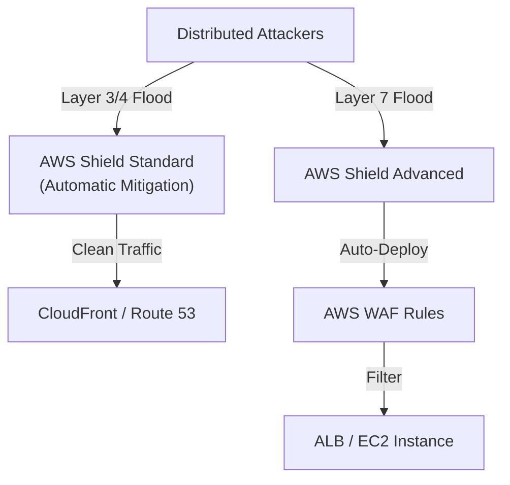

# AWS Shield

## Overview
**AWS Shield** is a managed Distributed Denial of Service (DDoS) protection service that safeguards applications running on AWS. It provides always-on detection and automatic inline mitigations that minimize application downtime and latency. AWS Shield comes in two tiers: **Standard** (included for all customers at no additional cost) and **Advanced** (a paid service for higher levels of protection and specialized support).

## Key Concepts
- **DDoS (Distributed Denial of Service)**: An attack that attempts to overwhelm an application's infrastructure (e.g., servers, network) by flooding it with requests from multiple distributed sources.
- **Layer 3/4 Attacks**: Network and transport layer attacks like SYN floods, UDP floods, and reflection attacks.
- **Layer 7 Attacks**: Application layer attacks like HTTP floods that target the web server or application logic.
- **DDoS Response Team (DRT)**: A 24/7 team available to Shield Advanced customers to help with complex attack mitigation.
- **Cost Protection**: A Shield Advanced feature that provides credits for spikes in usage (e.g., scaling of ALB or CloudFront) caused by a DDoS attack.

## Detailed Notes

### 1. AWS Shield Standard
- **Always-on**: Automatically protects all AWS customers at the entry point of the network.
- **Scope**: Protects against common Layer 3 and Layer 4 attacks (e.g., SYN/UDP floods).
- **Services**: Defends **Amazon CloudFront** and **Amazon Route 53** endpoints by default.
- **Cost**: Free for all AWS customers.

### 2. AWS Shield Advanced
- **Advanced Protection**: Safeguards **Amazon EC2**, **Elastic Load Balancing (ELB)**, **Amazon CloudFront**, **AWS Global Accelerator**, and **Amazon Route 53**.
- **DRT Support**: 24/7 access to the AWS DDoS Response Team for proactive or reactive assistance.
- **Financial Protection**: Covers scaling costs (ALB, CloudFront, etc.) resulting from a legitimate DDoS attack.
- **Automated L7 Mitigation**: Automatically creates and deploys **AWS WAF** rules to block malicious traffic during an application-layer attack.
- **Visibility**: Provides detailed real-time metrics and reports via the AWS Management Console and CloudWatch.
    - **DDoSDetected**: Indicates if a DDoS event is happening for a specific resource.
    - **DDoSAttackBitsPerSecond**: Volume of the attack in bits.
    - **DDoSAttackPacketsPerSecond**: Volume of the attack in packets.
    - **DDoSAttackRequestsPerSecond**: Volume of the attack in requests.
- **Cost**: Approximately $3,000 per month per organization, plus data transfer fees.

## Architecture / Flow

### DDoS Mitigation Layers

## Security Relevance
- **Availability**: The primary goal of Shield is to ensure that legitimate users can access your application even during a massive attack.
- **Resiliency**: Shield Advanced provides a much higher level of resiliency for critical workloads that are high-profile targets for attackers.

## Operational / Real-World Context
- **Organization-Wide**: A single Shield Advanced subscription covers all accounts in an organization (linked accounts).
- **WAF Dependency**: Shield Advanced's application-layer protection requires the use of **AWS WAF**.

## Common Pitfalls / Misconfigurations
- **Confusing Standard and Advanced**: Assuming Shield Standard provides protection against complex Layer 7 (HTTP) floods. Standard is primarily for Layer 3/4.
- **Not Contacting DRT**: Waiting too long to engage the Response Team during a sophisticated attack.
- **Cost Shock**: Not realizing that Shield Advanced has a significant monthly fixed cost ($3,000/month).

## Exam / Review Notes
- **Shield Standard**: Free, L3/L4 protection, for all customers.
- **Shield Advanced**: Paid ($3k/mo), L3/L4/L7 protection, includes DRT and cost protection.
- **WAF Integration**: Shield Advanced automatically manages WAF rules for L7 mitigation.
- **Multicast & Transit Gateway**: While TGW handles routing, Shield protects the endpoints.
- **Global Accelerator**: Shield Advanced can be attached to protect Global Accelerator endpoints.

## Summary
AWS Shield is the foundational DDoS protection layer for AWS. While Shield Standard provides essential protection for everyone, Shield Advanced is the enterprise-grade solution that offers 24/7 expert support, automated application-layer mitigation, and financial safeguards against attack-related costs.

## Quick Review Checklist
- [ ] Shield Advanced enabled for critical public-facing ALBs/CloudFront?
- [ ] AWS WAF associated with resources protected by Shield Advanced?
- [ ] 24/7 contact information for the DRT established?
- [ ] DDoS cost protection understood and accounted for in the budget?
- [ ] Shield Advanced visibility dashboard monitored for alerts?
