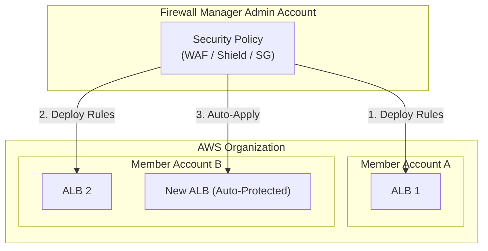

# AWS Firewall Manager

## Overview
**AWS Firewall Manager** is a security management service that allows you to centrally configure and manage firewall rules across your accounts and applications in **AWS Organizations**. It simplifies the task of maintaining consistent security policies across a large number of resources, ensuring that new resources are automatically protected according to your organizational standards.

## Key Concepts
- **Security Policy**: A set of configurations that define the security rules for a specific resource type (e.g., WAF rules for ALBs).
- **Organization-Wide Management**: Policies are created in a central administrative account and applied to all or a subset of accounts in the organization.
- **Automatic Compliance**: Firewall Manager automatically discovers and applies policies to new resources as they are created (e.g., a new ALB in a member account).
- **Regional Service**: Policies are defined at the region level but can be replicated across the organization.

## Detailed Notes

### 1. Supported Security Policies
Firewall Manager can manage several types of security rules:
- **AWS WAF**: Centrally manage Web ACLs and rules for Application Load Balancers, API Gateways, and CloudFront distributions.
- **AWS Shield Advanced**: Deploy Shield Advanced protection across multiple accounts for ALBs, ELBs, Elastic IPs, and CloudFront.
- **Amazon VPC Security Groups**: Audit and enforce standardized security group rules for EC2 instances, ALBs, and ENIs.
- **AWS Network Firewall**: Manage rules for the VPC-level managed firewall service.
- **Amazon Route 53 Resolver DNS Firewall**: Centrally manage rules for filtering DNS queries.

### 2. Comparison: WAF vs. Shield vs. Firewall Manager
| Service | Primary Use Case | Scope |
|---------|------------------|-------|
| **AWS WAF** | Protects web apps from Layer 7 exploits. | Individual resources or accounts. |
| **AWS Shield** | Protects against Layer 3/4 (Standard) and Layer 7 (Advanced) DDoS. | Specific endpoints; Advanced includes support & cost protection. |
| **Firewall Manager** | Centrally manages WAF, Shield, and SG policies at scale. | Cross-account, cross-resource within an Organization. |

## Architecture / Flow

### Centralized Security Policy Deployment

## Security Relevance
- **Consistency**: Eliminates "shadow IT" or misconfigured resources by enforcing a baseline security posture across every account.
- **Governance**: Allows a central security team to manage the organization's perimeter without requiring administrative access to every individual account.
- **Rapid Response**: Deploying a critical WAF rule via Firewall Manager ensures it is applied globally within minutes.

## Operational / Real-World Context
- **Prerequisites**: Requires **AWS Organizations** to be enabled and a designated **Firewall Manager Administrator** account.
- **Policy Scoping**: You can scope policies to specific accounts, organizational units (OUs), or resources with specific tags.

## Common Pitfalls / Misconfigurations
- **Policy Conflicts**: Overlapping rules between a Firewall Manager policy and a locally created Web ACL can cause unexpected traffic drops.
- **Administrative Account**: Using the Management (Root) account of the Organization as the Firewall Manager admin instead of a delegated security account.
- **Regionality**: Forgetting that Firewall Manager policies must be created in each region where you have resources (though they can be copied).

## Exam / Review Notes
- **Centralized Management**: If the question asks how to manage WAF/Shield across **multiple accounts**, the answer is Firewall Manager.
- **Automatic Protection**: Firewall Manager is the only service that automatically applies rules to **newly created** resources.
- **Supported Policies**: WAF, Shield Advanced, Security Groups, Network Firewall, and DNS Firewall.

## Summary
AWS Firewall Manager is the orchestration layer for AWS security services. It ensures that security best practices and rules are applied consistently across an entire AWS Organization, providing automated compliance and centralized governance for the network perimeter.

## Quick Review Checklist
- [ ] Delegated admin account for Firewall Manager designated?
- [ ] AWS Organizations fully enabled?
- [ ] WAF/Shield policies scoped to the correct OUs?
- [ ] "Auto-apply" enabled for new resources?
- [ ] Regional policies created for all active AWS regions?
