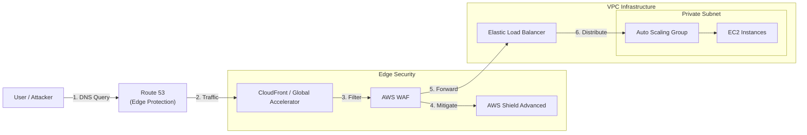

# DDoS Resiliency Best Practices

## Overview
AWS provides a set of architectural best practices to build applications that are resilient to **Distributed Denial of Service (DDoS)** attacks. These practices focus on using the scale of the AWS global infrastructure to absorb and filter malicious traffic before it impacts the backend application resources.

## Key Best Practices (BP)

### 1. Infrastructure Layer Defense (L3/L4)
Protects the network and transport layers from being overwhelmed.
- **BP1: Global Edge Network**: Use **Amazon CloudFront** and **AWS Global Accelerator** to distribute traffic across AWS's massive global network. This allows AWS to absorb SYN floods and UDP reflection attacks at the edge.
- **BP3: Scalability**: Use **Auto Scaling Groups (ASG)** to automatically scale EC2 instances to handle spikes in traffic.
- **BP6: Distributed Load Balancing**: Use **Elastic Load Balancing (ELB)** to distribute traffic across multiple instances, preventing a single instance from being a point of failure.

### 2. Application Layer Defense (L7)
Protects against attacks that target application logic (e.g., HTTP floods).
- **BP1: Caching**: Use **CloudFront** to serve static content from edge locations, reducing the load on the origin server.
- **BP2: Request Filtering**: Use **AWS WAF** on CloudFront or ALB to filter and block requests based on signatures, IP reputation, or geography.
- **Rate-Based Rules**: Implement WAF rate-limiting to automatically block IPs that exceed request thresholds (e.g., 100 requests per 5 minutes).
- **Shield Advanced**: Enable **Shield Advanced** to automatically deploy WAF rules in response to detected L7 attacks.

### 3. Attack Surface Reduction
Hides backend resources to prevent direct targeting.
- **BP1: Hiding Backend**: Use CloudFront, API Gateway, or ELB as the only entry points. Backend instances should be in private subnets with security groups allowing only traffic from the frontend service.
- **BP4: API Protection**: Use **Amazon API Gateway** to protect REST/HTTP endpoints. Enable burst limits, header filtering, and API key enforcement.
- **Security Groups & NACLs**: Use restrictive rules to allow only necessary traffic. **Elastic IPs** should be associated with resources protected by Shield Advanced.

## Architecture / Flow

### DDoS Resilient Architecture

## Security Relevance
- **Availability**: High resiliency ensures the application remains online for legitimate users during an attack.
- **Cost Management**: Using edge caching and filtering reduces the compute and data transfer costs associated with processing malicious requests.

## Operational / Real-World Context
- **Edge Optimized vs. Regional**: For API Gateway, the **Edge Optimized** mode is already global. Alternatively, use a **Regional** API Gateway behind CloudFront for more granular control over DDoS protection at the edge.
- **Managed Services**: Leverage managed services like CloudFront and Route 53 as much as possible, as they are architected to handle significantly more traffic than individual EC2 instances.

## Exam / Review Notes
- **L3/L4 Protection**: Shield Standard, CloudFront, Global Accelerator, Route 53.
- **L7 Protection**: WAF, Shield Advanced, CloudFront (Geo-blocking).
- **Surface Reduction**: Private subnets, Security Groups, API Gateway limits.
- **Multicast**: Not related to DDoS, but remember it's **Transit Gateway** only.

## Summary
Building for DDoS resiliency requires a "Defense in Depth" approach. By combining global edge services, automated scaling, and application-layer filtering, you can reduce the attack surface and ensure your infrastructure can withstand even the most sophisticated distributed attacks.

## Quick Review Checklist
- [ ] Application behind CloudFront or Global Accelerator?
- [ ] Auto Scaling and ELB configured for backend resources?
- [ ] WAF rate-based rules and managed rules enabled?
- [ ] Backend resources isolated in private subnets?
- [ ] Shield Advanced visibility metrics monitored?
