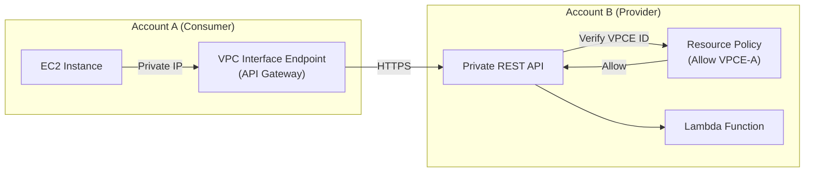

# Amazon API Gateway

## Overview
**Amazon API Gateway** is a fully managed service that makes it easy for developers to create, publish, maintain, monitor, and secure APIs at any scale. It acts as a "front door" for applications to access data, business logic, or functionality from backend services such as **AWS Lambda**, **Amazon EC2**, or any HTTP web service.

## Key Concepts
- **REST API**: A collection of HTTP resources and methods.
- **WebSocket API**: Supports two-way real-time communication.
- **Stages**: Deployment environments (e.g., `dev`, `test`, `prod`).
- **Usage Plans**: Allow you to provide API keys to customers and set throttling and quota limits.
- **Endpoint Types**:
    - **Edge-Optimized**: Routes traffic through CloudFront edge locations (Global).
    - **Regional**: Used for clients in the same region.
    - **Private**: Accessible only from a VPC using Interface VPC Endpoints.

## Detailed Notes

### 1. Integration Types
- **Lambda Proxy**: API Gateway passes the entire request to Lambda and interprets the Lambda response (Status, Headers, Body).
- **HTTP Proxy**: Proxy requests to any HTTP backend (on-premises or ALB).
- **AWS Service**: Expose any AWS API (e.g., start a Step Function or post to SQS) without managing servers.

### 2. Security & Authentication
- **IAM Roles**: Used for internal AWS applications (e.g., EC2 instances calling an API).
- **Amazon Cognito**: Used for authenticating external users (web/mobile).
- **Lambda Authorizers (Custom)**: Custom logic (Lambda function) to validate tokens or provide fine-grained access control.
- **Resource Policies**:
    - **Public APIs**: Restrict access based on source IP addresses or CIDR blocks.
    - **Private APIs**: Restrict access to specific VPCs or VPC Interface Endpoints.

### 3. Throttling & Limits
- **Account Limit**: 10,000 requests per second (RPS) by default (can be increased).
- **Error Code**: **429 Too Many Requests** is returned when limits are exceeded.
- **Granularity**: Throttling can be set at the Account, Stage, Method, or Client (via Usage Plans) level.

## Architecture / Flow

### Cross-Account Private API Access
You can access a private API in another account without VPC peering by using Interface VPC Endpoints and Resource Policies.

## Security Relevance
- **Attack Surface Reduction**: API Gateway hides your backend resources (EC2, Lambda) from direct internet exposure.
- **WAF Integration**: You can attach **AWS WAF** to your API Gateway to protect against Layer 7 attacks (SQLi, XSS).
- **DDoS Mitigation**: Edge-optimized endpoints leverage the CloudFront global network for improved resiliency.

## Operational / Real-World Context
- **Version Management**: API Gateway handles API versioning and multiple stages, allowing for safe rollouts.
- **Transformation**: You can use mapping templates to transform the request/response payload between the client and the backend.

## Common Pitfalls / Misconfigurations
- **Timeout Limit**: API Gateway has a hard timeout of **29 seconds**. If the backend (e.g., Lambda) takes longer, API Gateway returns a 504 Gateway Timeout.
- **Missing Auth Token**: If a client calls a protected API without credentials, it receives a **403 Forbidden** (Message: "Missing Authentication Token").
- **Resource Policy Omission**: Forgetting to update the Resource Policy on a private API will block all access, even if the VPC endpoint is correctly configured.

## Exam / Review Notes
- **Private API**: Requires an Interface VPC Endpoint.
- **Cross-Account Private Access**: No VPC peering needed; use VPCE ID in the Resource Policy.
- **IAM vs. Cognito**: IAM for internal/AWS services; Cognito for users.
- **Edge-Optimized Certs**: ACM certificates for edge-optimized endpoints must be in **us-east-1**.
- **Throttling**: Default is 10,000 RPS; returns 429 error.

## Summary
Amazon API Gateway is a scalable, serverless front-end for APIs. It provides robust security features including multiple authentication methods, WAF integration, and private VPC connectivity, making it a central component of secure serverless architectures.

## Quick Review Checklist
- [ ] Authentication (IAM/Cognito/Authorizer) configured?
- [ ] Resource policy applied for IP or VPC restriction?
- [ ] Throttling limits and usage plans defined?
- [ ] WAF attached for Layer 7 protection?
- [ ] Private APIs accessed via Interface VPC Endpoints?
