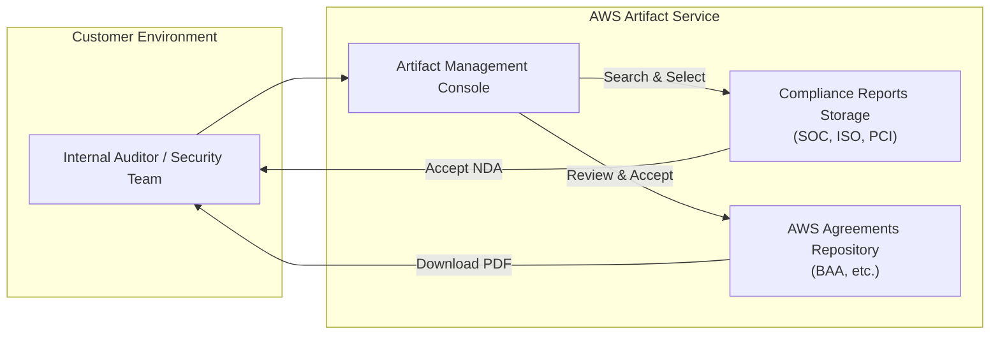

# AWS Artifact

## Overview
**AWS Artifact** is a central resource for compliance-related information that provides on-demand access to AWS’s security and compliance reports and select online agreements. It serves as a self-service portal for customers to download AWS's compliance documentation for their own internal audits or to provide to regulators.

## Key Concepts
- **AWS Artifact Reports**: Provides on-demand access to AWS's security and compliance reports (e.g., SOC, PCI, ISO, etc.).
- **AWS Artifact Agreements**: Allows you to review, accept, and track the status of agreements such as the **Business Associate Addendum (BAA)** for HIPAA compliance.
- **Global Service**: Artifact is a global service accessible from any AWS account.

## Detailed Notes

### 1. Artifact Reports
- Contains 60+ reports from third-party auditors who have validated AWS's compliance with various global, regional, and industry-specific security standards.
- **Common Reports**: SOC 1/2/3, PCI DSS, ISO 27001, FedRAMP, HIPAA, etc.
- **Usage**:
    1. Search for a report.
    2. Accept the **Non-Disclosure Agreement (NDA)** if required.
    3. Download the PDF for internal review or audit support.

### 2. Artifact Agreements
- Enables customers to enter into agreements with AWS for all accounts within their **AWS Organization** or for a single account.
- **Agreement Types**:
    - **Account Agreements**: Applied to a specific AWS account.
    - **Organization Agreements**: Managed by the management account and applied to all member accounts in the organization.
- **BAA (Business Associate Addendum)**: A critical document for customers handling Protected Health Information (PHI) under HIPAA regulations.

## Architecture / Flow

### Compliance Document Retrieval Workflow

## Security Relevance
- **Shared Responsibility Model**: Artifact provides the evidence needed to verify that AWS is fulfilling its "Security of the Cloud" responsibilities.
- **Third-Party Validation**: Gives customers confidence that AWS infrastructure meets rigorous security standards through independent audits.
- **Audit Preparedness**: Simplifies the process of gathering evidence for internal and external audits.

## Operational / Real-World Context
- **Centralized Compliance**: Instead of requesting documents via support tickets, security teams can download them instantly.
- **Organization-Wide Agreements**: Managing agreements at the organization level ensures consistent compliance across all member accounts without manual intervention in each account.

## Common Pitfalls / Misconfigurations
- **Confidentiality**: Reports downloaded from Artifact are often under NDA. Sharing them publicly or with unauthorized parties can violate the agreement.
- **Outdated Documents**: Compliance reports are issued for specific periods. Auditors should ensure they are using the most recent version available in Artifact.
- **IAM Permissions**: Users need specific IAM permissions (`artifact:GetReport`, `artifact:DownloadAgreement`) to access and download documents.

## Exam / Review Notes
- **AWS Artifact vs. AWS Audit Manager**: Artifact provides **AWS's** compliance reports; Audit Manager helps you collect evidence for **your own** resource compliance.
- **BAA**: If an exam question mentions HIPAA compliance or the Business Associate Addendum, **AWS Artifact** is the place to go.
- **Global Scope**: Artifact is a global service, not restricted by regions.
- **Cost**: There is no additional cost to use AWS Artifact.

## Summary
AWS Artifact is the primary portal for accessing AWS's own compliance documentation and entering into legal agreements with AWS. It is an essential tool for any organization that needs to demonstrate the security posture of the underlying AWS infrastructure to auditors or regulators.

## Quick Review Checklist
- [ ] Need a SOC or ISO report for an audit? Check **AWS Artifact Reports**.
- [ ] Need to sign a BAA for HIPAA? Check **AWS Artifact Agreements**.
- [ ] Managing multiple accounts? Use **Organization Agreements**.
- [ ] Restricted access? Ensure IAM users have `artifact:*` permissions.
