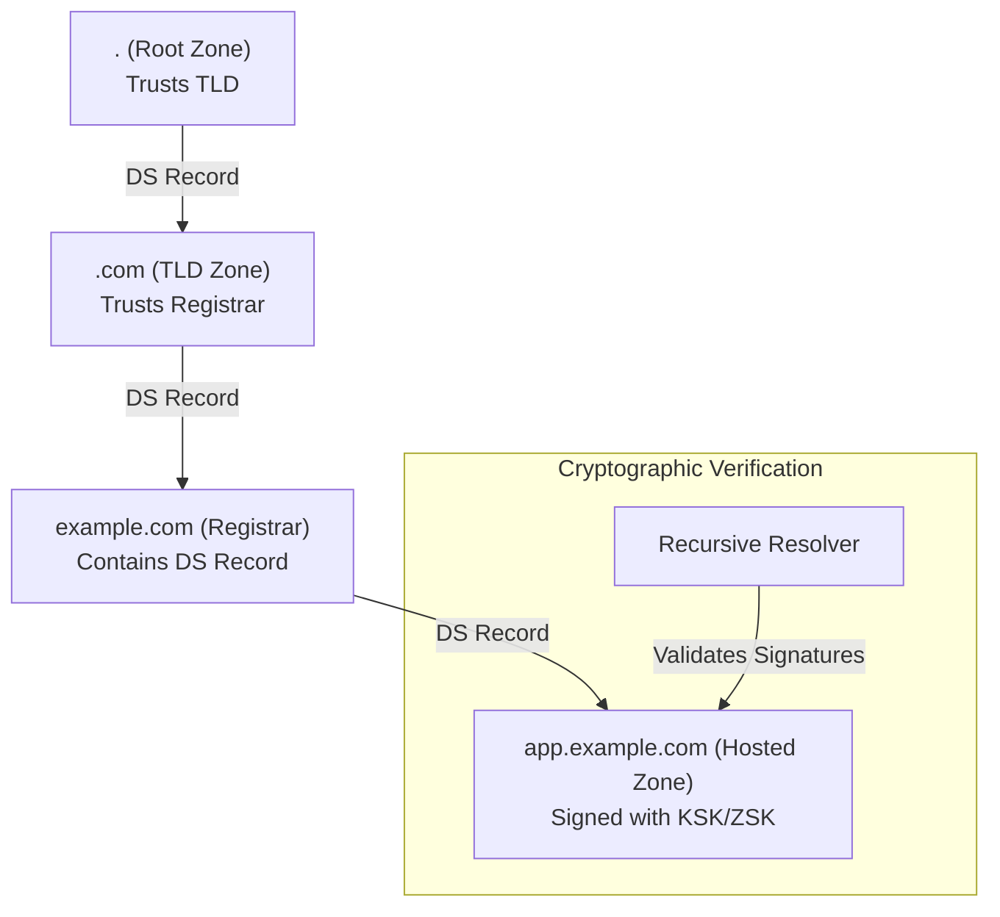
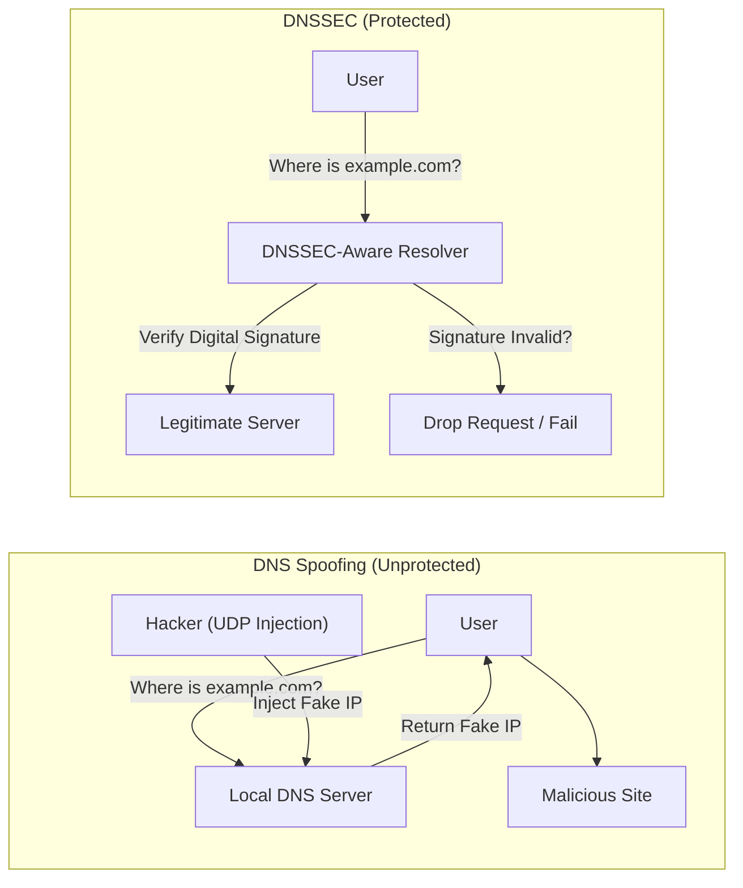

# Route 53 DNSSEC

## Overview
**Route 53 DNSSEC (Domain Name System Security Extensions)** is a protocol used to secure DNS traffic by providing a way to verify the integrity and origin of DNS data. It protects against **DNS Spoofing** and **DNS Cache Poisoning** attacks by cryptographically signing DNS records.

## Key Concepts
- **DNS Spoofing/Poisoning**: An attack where a malicious actor injects false DNS data into a recursive resolver's cache, redirecting users to a fraudulent website.
- **KSK (Key Signing Key)**: A customer-managed asymmetric CMK in **AWS KMS** used to sign the Zone Signing Key.
- **ZSK (Zone Signing Key)**: An AWS-managed key used by **Route 53** to sign the actual DNS records in the hosted zone.
- **DS (Delegation Signer) Record**: A record in the **parent zone** that contains a hash of the child zone's public KSK, establishing a "Chain of Trust."
- **Chain of Trust**: A sequence of DS records and public keys from the Root DNS server down to the specific hosted zone.

## Detailed Notes

### 1. How DNSSEC Works
DNSSEC adds digital signatures to existing DNS records. When a DNSSEC-aware resolver requests a record, it also receives the digital signature (RRSIG). The resolver then uses the public key to verify that the record matches the one signed by the authoritative server.

### 2. Key Management
Route 53 uses a two-tiered key structure:
- **KSK (Customer Managed)**: 
    - You create an asymmetric CMK in **AWS KMS** (ECC_NIST_P256).
    - You manage the lifecycle (rotation, deletion) and permissions.
- **ZSK (Route 53 Managed)**:
    - Automatically managed by Route 53 to sign the records.
    - Simplified management as Route 53 handles the heavy lifting of signing individual records.

### 3. Enabling DNSSEC (Step-by-Step)
1.  **Preparation**: 
    - Ensure zone availability is stable.
    - Lower TTLs to facilitate fast propagation (e.g., 1 hour for records, 5 minutes for SOA minimum).
2.  **Enable Signing**:
    - Use the Route 53 console or CLI to enable DNSSEC signing.
    - Create/Select a **KSK** and link it to a **KMS CMK**.
3.  **Establish Chain of Trust**:
    - Retrieve the DS record information from Route 53.
    - Manually add the **DS Record** to the **parent zone** (e.g., if your zone is `example.com`, the parent is the TLD registrar for `.com`).
4.  **Monitor**: 
    - Set up CloudWatch Alarms for failures.

## Architecture / Flow

### DNSSEC Chain of Trust

### DNS Spoofing Mitigation

## Security Relevance
- **Integrity**: Ensures that the DNS data received by the client is exactly what the domain owner configured.
- **Origin Authentication**: Confirms that the DNS response actually originated from the authoritative Route 53 name servers.
- **Public Zones Only**: DNSSEC support in Route 53 is currently limited to **Public Hosted Zones**.

## Operational / Real-World Context
- **TTL Constraint**: When DNSSEC is enabled, Route 53 limits the maximum TTL for records to **1 week**.
- **Monitoring**: Essential to monitor KSK health, as an expired or deleted KMS key will break DNS resolution for the entire zone.
- **CloudWatch Metrics**:
    - `DNSSECInternalFailure`: Indicates a service-side issue.
    - `DNSSECKeySigningKeyNeedsAction`: Indicates a problem with your KMS key (e.g., disabled or deleted).

## Common Pitfalls / Misconfigurations
- **Missing DS Record**: Enabling signing without adding the DS record to the parent zone means clients won't trust your signatures, effectively providing no security.
- **KMS Policy**: The KMS key policy must allow Route 53 to use the key for signing operations.
- **Incompatible Resolvers**: If a client uses a non-DNSSEC-aware resolver, they remain vulnerable to spoofing even if the zone is signed.

## Exam / Review Notes
- **KSK vs. ZSK**: Remember that **you** manage the KSK (via KMS) and **AWS** manages the ZSK.
- **Chain of Trust**: The DS record always goes into the **parent zone**.
- **Protocol**: DNS operates on **UDP**, making it susceptible to spoofing; DNSSEC uses cryptography to mitigate this.
- **Monitoring**: Know the two specific CloudWatch metrics for DNSSEC health.

## Summary
Route 53 DNSSEC provides a critical layer of security for public domain names by cryptographically signing DNS records. By establishing a Chain of Trust from the parent zone down to the hosted zone, it ensures that users are not redirected to malicious sites through DNS cache poisoning.

## Quick Review Checklist
- [ ] KSK created using asymmetric KMS CMK?
- [ ] DNSSEC signing enabled in Route 53 console?
- [ ] DS record added to the parent hosted zone or registrar?
- [ ] TTLs lowered before enabling for smooth rollout?
- [ ] CloudWatch Alarms configured for DNSSEC metrics?
